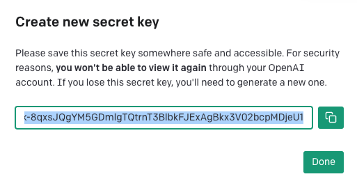

## Overview

<iframe width="560" height="315" src="https://www.youtube.com/embed/wM0rLXCWom0" title="YouTube video player" frameborder="0" allow="accelerometer; autoplay; clipboard-write; encrypted-media; gyroscope; picture-in-picture; web-share" allowfullscreen></iframe>

## OpenAI
### Obtaining the API Key

In order to communicate with an LLM using Griptape, we'll need a key. To do this, we'll grab an API key from OpenAI.
!!! tip
    Griptape can work with many large language models, but to keep things simple for now, we'll just focus on OpenAI's gpt model.


1. Go to the [OpenAI](https://beta.openai.com/account) website and sign up for an account if you don't have one already.
2. After logging in, navigate to the [API](https://beta.openai.com/account/api-keys) section of your dashboard.

    

3. Choose **Create a new secret key** in order to create a key for your use.

4. Give your key a name. Example: `griptape`

    

5. Choose **Create secret key**

6. You will see a window with your new key highlighted. **You will not be able to view this key again** so it's very important to **copy** the key and save it somewhere safe.

    

7. Choose **Done**

!!! warning
    Remember, this API key is like your secret key to the city of LLMs. _Don't share it with anyone!_

### Installing python-dotenv
Understanding and using environment variables is a key aspect of programming. In order to use the API key we just received, we will need to be able to access it from with our python script. We'll use a package called python-dotenv to handle environment variables in our project.

In the terminal, run the command `pip install python-dotenv` to install the package.


### Creating the .env File and Setting the OpenAI API Key

Now that we have our OpenAI API key, we need to make it available for our Python code to use. The best and safest way to do this is using a `.env` file, which allows us to define environment variables. We can then use the `load_dotenv` library to access any of those environment variables..

1. In the root of your project folder (`griptape-starter`), create a new file and name it `.env`.
2. Open the `.env` file and write `OPENAI_API_KEY=your_openai_api_key_here`, replacing `your_openai_api_key_here` with your actual OpenAI API key.
3. Save the file.

``` py title=".env" 

OPENAI_API_KEY=your_openai_api_key_here 

```
## Your first app
### Creating app.py
Now we're going to create our Python file and use the `python-dotenv` library to load the `OPENAI_API_KEY` environment variable.
First things first, let's create a Python file where we will write our code.

1. In your project directory (`griptape-starter`), create a new file called `app.py`. You can do this in VS Code by clicking `File -> New File`
2. Save the file by choosing `File -> Save As...`
3. Entering `app.py` as the filename.

!!! Success
    Nice, you've created your first Python file! 

### Importing the Library
Next, we're going to import the `load_dotenv` function from the `dotenv` library we installed earlier.

Enter the following code in app.py.

```py title="app.py" linenums="1"
from dotenv import load_dotenv

```

### Loading the variables

Now we'll use the `load_dotenv` function. Update your `app.py` with the highlighted line:
```py title="app.py" linenums="1" hl_lines="3"
from dotenv import load_dotenv

load_dotenv() # Load the environment variables
```

If you save and run your script, you shouldn't get any errors in your Terminal. If you received no errors.. you win! You've loaded your environment variable that was specified in the `.env` file!

--- 
## Next Steps

Congratulations! Your environment is set, and your application is ready. You're ready to start using Griptape! In the [next section](03_griptape.md), we'll install Griptape and send our first message to the LLM. I wonder what it'll say...
