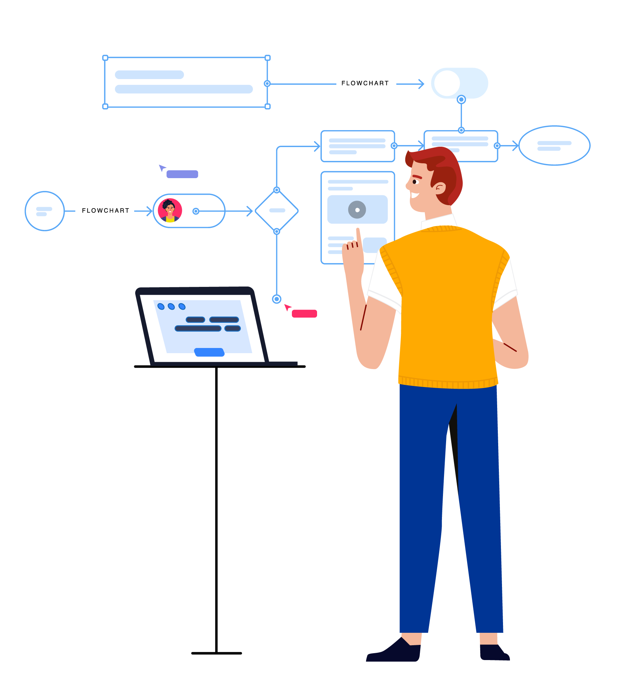
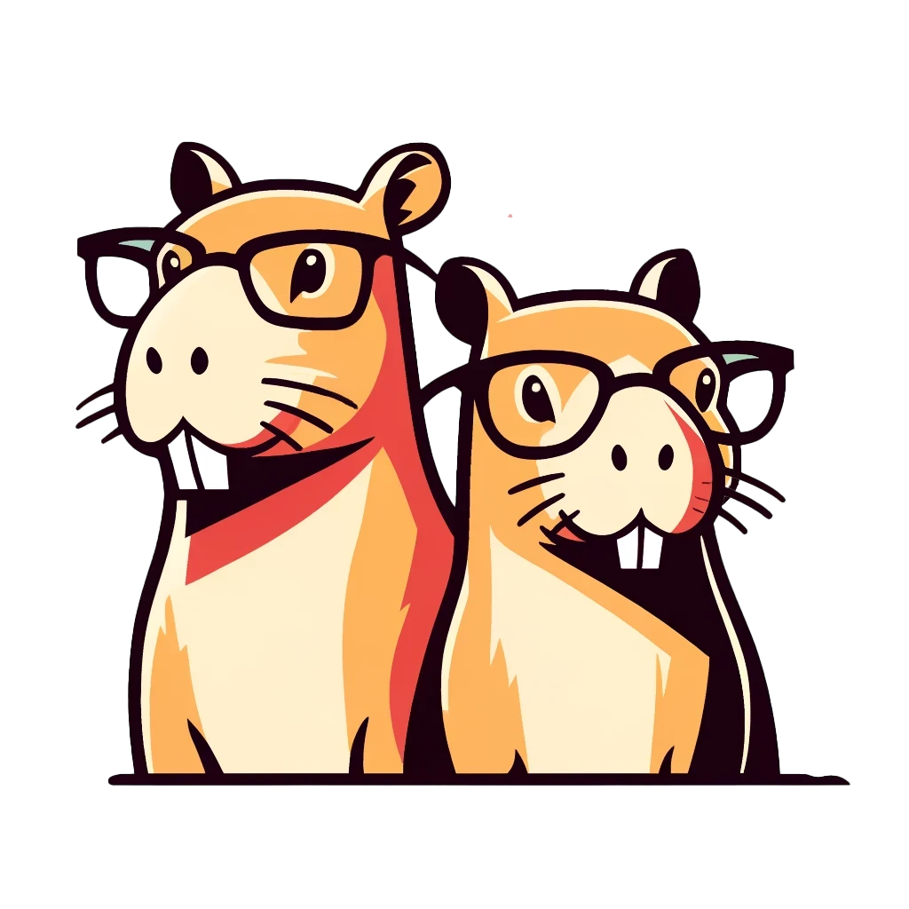

-   # Create a Chatbot using Griptape Rulesets

    
    
    Take a deep dive into creating a **conversational chatbot** with an Agent using Griptape's Rulesets. Not only will our chatbot be able to engage in conversation, but it will also have the unique ability to embody different personalities.
    
    [:octicons-arrow-right-24: Take the course](courses/chatbot-rulesets/index.md)

-   # Compare Movies using Griptape Workflows

    
    
    Learn how to work with Griptape Workflow Structures to create flexible and powerful hierarchies of tasks. This course demonstrates these concepts by comparing movies, utilizing PromptTasks and ToolkitTasks to analyze text and search the web.
    
    [:octicons-arrow-right-24: Take the course](courses/compare-movies-workflow/index.md)

-   # Image Generation with Griptape Pipelines

    
    
    Explore Griptape Pipelines through the practical example of image generation. In this course, you'll learn how to seamlessly link together various tasks to create a consistent and repeatable pipeline.
    
    [:octicons-arrow-right-24: Take the course](courses/create-image-pipeline/index.md)

-   # Griptape and ShotGrid: A Practical Approach to Tool Integration

    
    
    Discover the power of Griptape Tools in our dynamic course, where you'll learn to construct your own specialized ShotGrid Client. Through hands-on sessions, you'll transform chatbot commands into automated, practical tasks. Equip yourself with the skill to create and customize tools that enhance Language Learning Models' interaction with real-world data and APIs.
    
    [:octicons-arrow-right-24: Take the course](courses/shotgrid-client/index.md)

-   # ImageQuery SEO Bonanza!

    
    
    Buried under a metric ton of images you need to label and classify to make your SEO-hungry marketing pals happy? This course demonstrates how to automate image classification using the Griptape ImageQuery functionality.
    
    [:octicons-arrow-right-24: Take the course](courses/image-query/index.md)

-   # Structures Calling Structures

    
    
    Griptape Structures aren’t just standalone players—they’re team collaborators. Learn how to make Agents and Pipelines pass the baton in a relay of tasks, setting them up to trigger their specialized colleagues. It’s less like herding cats, and more like herding intelligent capybaras.
    
    [:octicons-arrow-right-24: Take the course](courses/image-query/index.md)

