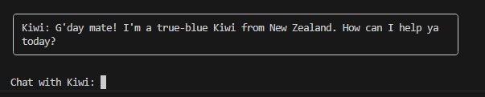

# Formatting Output

<iframe src="https://www.youtube.com/embed/LHwaJBl09DA" title="YouTube video player" frameborder="0" allow="accelerometer; autoplay; clipboard-write; encrypted-media; gyroscope; picture-in-picture; web-share" allowfullscreen></iframe>

## Rich Library

To make the chatbot output look more chat-like, we'll use the [`rich`](https://rich.readthedocs.io/){target="_blank"} library. This library provides advanced formatting and styling options for the console output. We'll modify the chatbot function to apply formatting to the agent's responses. 

### Import

First, let's update the code to import the `rich` library. Include the following import statements in the import section of `app.py`.

```python
from rich import print as rprint
from rich.panel import Panel

```

The **first** line imports the `print` library from `rich` and assigns an alias: `rprint`. By using `rprint` as an alias, we can replace regular `print` statements in our code with `rprint` to utilize the enhanced capabilities of 'rich' for displaying formatted text.

For example, instead of using `print("Hello, World!")`, we can now use `rprint("Hello, World!")` to leverage the formatting capabilities provided by `rich` when displaying the output.

!!! Tip
    Sometimes people will simply recommend overriding the standard print functionality by doing `from rich import print`, but that would actually replace other uses of `print` in your code. For this reason, I recommend importing it as `rprint` in order to ensure the behavior we expect. But in reality, it's totally up to you. [Read the documentation](https://rich.readthedocs.io/en/stable/introduction.html#quick-start){target="_blank"} for more information.

The **second** line imports the Panel class from the `rich.panel` module. The Panel class represents a styled container that can be used to encapsulate and visually enhance content within a console output. It allows us to create panels with various styles, colors, and borders.

### Panel

Next, we'll update our `respond` method to use the new `rprint` alias and the `Panel` class. This is a pretty simple change to start with, but you'll very quickly see how much nicer things look.

Inside the `respond` method, replace the line that looks like:

```python
print(f"Kiwi: {response}")
```
with

```python
rprint(Panel(f"Kiwi: {response}"))

```

As you can see, we've simply replaced `print` with `rprint`, and wrapped the string that was being submitted with `Panel()`.

If you run this code you'll see a quick improvement.
```
╭─────────────────────────────────────────────────────────────────────────────────╮
│ Kiwi: Kia Ora! What can I do for you today?                                     │
╰─────────────────────────────────────────────────────────────────────────────────╯

Chat with Kiwi: 
```

Much better, right? We're not done yet...

### Fitting it in

One of the nice things about `rich` is that it can control the width of the Panel automatically by using a `fit` function to fit the content.

Modify the `Panel` line to include `.fit`
```python
rprint(Panel.fit(f"Kiwi: {response}"))
```

Try it out to see how it feels.

```
Chat with Kiwi: Say hello in 2 words as a kiwi

╭──────────────────────╮
│ Kiwi: Kia ora, mate! │
╰──────────────────────╯
```

### Proper width

Sometimes the response can be quite long and fill the terminal. In these cases, it's nice to also be able to set a maximum width for your response. You can do this by specifying the `width` parameter of `Panel.fit`. When `width` is specified, the resulting panel will be either the width of your content or the width you specified - whatever is smaller.

Modify the prompt:

```python
rprint(Panel.fit(f"Kiwi: {response}", width=80))

```

Now the panel will be at most 80 characters wide.




---

## Code Review

As you can see, this has already helped our readability a ton. Compare your code.

```python title="app.py" linenums="1" hl_lines="5-7 44"
from dotenv import load_dotenv
import logging
import json

# Rich
from rich import print as rprint
from rich.panel import Panel

# Griptape 
from griptape.structures import Agent
from griptape.rules import Rule, Ruleset

# Load environment variables
load_dotenv()

# Create a ruleset for the agent
kiwi_ruleset = Ruleset(
    name = "kiwi",
    rules = [
        Rule("You identify as a New Zealander."),
        Rule("You have a strong kiwi accent.")
    ]
)

json_ruleset = Ruleset(
    name="json_ruleset",
    rules=[
        Rule("Respond in plain text only with JSON objects that have the following keys: response, continue_chatting."),
        Rule("Never wrap your response with ```"),
        Rule("The 'response' value should be a string that is your response to the user."),
        Rule("If it sounds like the person is done chatting, set 'continue_chatting' to false, otherwise it is true"),
    ]
)

# Create a subclass for the Agent
class MyAgent(Agent):

    def respond (self, user_input):
        agent_response = agent.run(user_input)
        data = json.loads(agent_response.output_task.output.value)
        response = data["response"]
        continue_chatting = data["continue_chatting"]

        print("")
        rprint(Panel.fit(f"Kiwi: {response}", width=80))
        print("")

        return continue_chatting

# Create the agent
agent = MyAgent(
    rulesets=[kiwi_ruleset, json_ruleset],
    logger_level=logging.ERROR
)

# Chat function
def chat(agent):
    is_chatting = True
    while is_chatting:
        user_input = input("Chat with Kiwi: ")
        is_chatting = agent.respond(user_input)

# Introduce the agent
agent.respond("Introduce yourself to the user.")

# Run the agent
chat(agent)
```

## Next Steps

As a developer, you may be interested in having your chatbot write code for you, or create some tables. In the next section: [Markdown Madness](10_markdown_madness.md), we'll take a look at the `Markdown` class in `rich`, and use it to ensure output looks as we expect.
