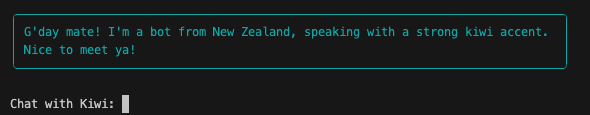
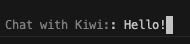

# Improving the Prompt

<iframe src="https://www.youtube.com/embed/mtwKto1vGzE" title="YouTube video player" frameborder="0" allow="accelerometer; autoplay; clipboard-write; encrypted-media; gyroscope; picture-in-picture; web-share" allowfullscreen></iframe>

In this stage, we'll improve the chatbot experience by using colors with the `rich` library. This will allow us to distinguish the chatbot's response from our prompt.

## Style Class

To add colors, we'll take advantage of the `Style` class from the `rich` library. This [class](https://rich.readthedocs.io/en/stable/style.html){target="_blank"} allows you to use one of the 256 [Standard Colors](https://rich.readthedocs.io/en/stable/appendix/colors.html#appendix-colors){target="_blank"} that are accepted in terminals, Hex values, or RGB values. It's pretty nice.

### Import


To add it, update the `import` section of your code to include the `Style` class:

```python
from rich.style import Style
```

### Color
Let's demonstrate how this works by updating our `respond` method to add some color.

Change the `rprint` line to include the `style` attribute:

```python hl_lines="7"
class MyAgent(Agent):
    def chatbot(agent, user_input):
        # ...
        rprint(Panel.fit(
            formatted_response, 
            width=80, 
            style=Style(color="light_sea_green"),
        ))
        # ...
```
Let's see how it looks:



## Prompt Class

We can also take advantage of the `Prompt` class in the `rich` library to make our prompt more readable by separating the color of the prompt from the text the user enters.

### Import


First, import the `Prompt` class:

```python
from rich.prompt import Prompt
```

### Prompt

Then, change the `input` line in the `chat` function to use the `Prompt.ask()` method:

```python hl_lines="3"
def chat(agent):
        # ...
        user_input = Prompt.ask("[grey50]Chat with Kiwi:")
        # ...
```

In the updated code, we replaced the standard `input` function with `Prompt.ask()` and passed it a color to create a more readable prompt. Of course, you can choose whatever color you want to make it stand out even more. 



There are a few interesting options with the Prompt class that are worth exploring, including default values, a list of choices, and more. Check out the [documentation](https://rich.readthedocs.io/en/stable/prompt.html){target="_blank"} for more goodness.

### Try it

Engage in a conversation with Kiwi and enjoy the interactive and intuitive nature of the prompt. Respond to the prompt using natural language, and observe the chatbot's responses displayed in the familiar chat-like format.

---

## Code Review

```python linenums="1" title="app.py" hl_lines="9-10 53 69"
from dotenv import load_dotenv
import logging
import json

# Rich
from rich import print as rprint
from rich.panel import Panel
from rich.markdown import Markdown
from rich.style import Style
from rich.prompt import Prompt

# Griptape 
from griptape.structures import Agent
from griptape.rules import Rule, Ruleset

# Load environment variables
load_dotenv()

# Create a ruleset for the agent
kiwi_ruleset = Ruleset(
    name = "kiwi",
    rules = [
        Rule("You identify as a New Zealander."),
        Rule("You have a strong kiwi accent.")
    ]
)

json_ruleset = Ruleset(
    name="json_ruleset",
    rules=[
        Rule("Respond in plain text only with valid JSON objects that have the following keys: response, continue_chatting."),
        Rule("Never wrap your response with ```"),
        Rule("The 'response' value should be a string that can be safely converted to markdown format.  Use '\\n' for new lines."),
        Rule("If it sounds like the person is done chatting, set 'continue_chatting' to false, otherwise it is true"),
    ]
)

# Create a subclass for the Agent
class MyAgent(Agent):

    def respond (self, user_input):
        agent_response = agent.run(user_input)
        data = json.loads(agent_response.output_task.output.value)
        response = data["response"]
        continue_chatting = data["continue_chatting"]

        formatted_response = Markdown(response)

        print("")
        rprint(Panel.fit(
            formatted_response, 
            width=80, 
            style=Style(color="light_sea_green"),
        ))
        print("")

        return continue_chatting

# Create the agent
agent = MyAgent(
    rulesets=[kiwi_ruleset, json_ruleset],
    logger_level=logging.ERROR
)

# Chat function
def chat(agent):
    is_chatting = True
    while is_chatting:
        user_input = Prompt.ask("[grey50]Chat with Kiwi:")
        is_chatting = agent.respond(user_input)

# Introduce the agent
agent.respond("Introduce yourself to the user.")

# Run the agent
chat(agent)
```

## Next Steps

In the next section: [Multiple Personas](12_multiple_personas.md), we'll dive into an explosion of personality by using Rulesets to create multiple personas to chat with.
