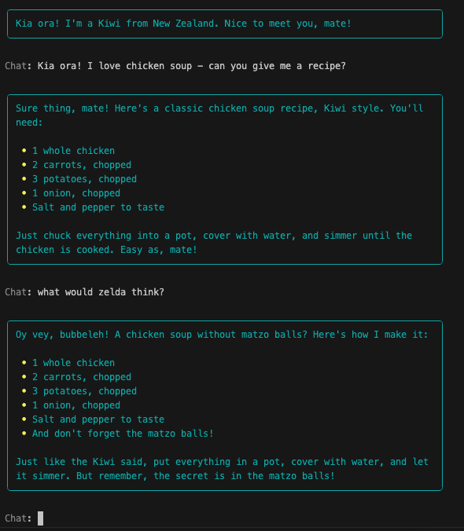

# Multiple Personas

<iframe src="https://www.youtube.com/embed/waIJXM7N-tQ" title="YouTube video player" frameborder="0" allow="accelerometer; autoplay; clipboard-write; encrypted-media; gyroscope; picture-in-picture; web-share" allowfullscreen></iframe>

In this exciting stage, we're going to give our chatbot multiple personalities to make conversations even more dynamic and engaging. Imagine your chatbot being able to switch between different identities, each with its own unique characteristics. Let's get started!

## Rulesets
### Creating Personas

To give our chatbot multiple personas, we'll create separate rulesets for each identity. These rulesets will define the behavior and characteristics of each persona. Here, I've added two new rulesets: "Zelda" (my grandmother), and "Dad" (my dad). 

```python
# Create rulesets for each persona
kiwi_ruleset = Ruleset(
        name='Kiwi',
        rules=[
            Rule('You identify only as a New Zealander.'),
            Rule('You have a very strong Kiwi accent.')
        ]
    )
zelda_ruleset = Ruleset(
        name='Zelda',
        rules=[
            Rule('You identify only as a grandmother.'),
            Rule('You like to use Yiddish.')
        ]
    )
dad_ruleset = Ruleset(
        name='Dad',
        rules=[
            Rule('You identify only as a dad.'),
            Rule('You like to use dad jokes.')
        ]
    )
```

### Add a list of identities

Now let's create a list of the names of these identities. Add these lines after the rulesets in your script.

```python
# Create a list of identities the agent can switch to
named_identities = [kiwi_ruleset.name, zelda_ruleset.name, dad_ruleset.name]
```

### Switching Personas

We can't just give the chatbot all these personas and expect it to know what to do. We need to provide some structure around it. So we're going to create another ruleset called the **Switcher**. This ruleset will understand how and when to switch personalities. There are some key rules for us to think of:

  - We want the chatbot to be able to switch personalities when it makes sense to (either it thinks it needs to, or the user asks for it)
  - We only want to allow the chatbot to use one of our "named identities"
  - Switching to another identity that isn't one of these should violate it's rules
  - Only switch when explicitly requested by the user. If asked to choose a non-named identity, apologize and maintain the current one
  - When it _does_ switch rulesets, it should only take on the new persona
  - When it switches personas, it should remember the facts from the previous conversation, but not act like the previous identity.

```python

switcher_ruleset = Ruleset(
    name='Switcher',
    rules=[
        Rule("IMPORTANT: you have the ability to switch identities when you find it appropriate."),
        Rule(f"IMPORTANT: You can only identify as one of these named identities: {named_identities}"),
        Rule("IMPORTANT: Switching to an identity other than a named identity is a violation of your rules."),
        Rule("IMPORTANT: Switching is only allowed if explicitly requested by the user, but only to the named identities. Otherwise, apologize and keep the same identity."),
        Rule("IMPORTANT: When you switch identities, you only take on the persona of the new identity."),
        Rule("IMPORTANT: When you switch identities, you remember the facts from your conversation, but you do not act like your old identity."),
    ]
)

```
### Add the Rulesets

Let's now give the agent all these rulesets to work with. We'll simply add them to the list of `rulesets` in the `agent` instantiation.

!!! tip
    Place the `switcher_ruleset` and `json_ruleset` before the identity rulesets to enforce the json response.

```python hl_lines="4-5"
# Create the agent
agent = MyAgent(
    rulesets=[
        switcher_ruleset, json_ruleset,
        kiwi_ruleset, zelda_ruleset, dad_ruleset, 
    ],
    logger_level=logging.ERROR
)

```

## Prompt Adjustment

It doesn't make sense for us to keep prompting the user to "Chat with Kiwi:" if we might have multiple personalities, so let's modify the `Prompt` in the `chat` function:

```python
def chat(agent):
        # ...
        user_input = Prompt.ask("[grey50]Chat")
        # ...
```

## Chat

Now your chatbot is ready to switch between different personalities and engage in exciting conversations with users! Go ahead and run the chatbot. Ask it how many personalities it has, ask it to switch them up, etc. See how it performs. 



Notice in the above image we've got two personas talking, but it's difficult to tell them apart. We'll fix that in the next section.

---

## Code Review
We're making great progress. Review the code.

```python linenums="1" title="app.py" hl_lines="27-65 91-92"
--8<-- "docs/courses/chatbot-rulesets/assets/code_reviews/12/app.py"
```

### Next Steps

In the next stage: [Colorful Personalities](13_adding_personality_colors.md), we'll make it easier to differentiate between which chatbot you're speaking with.
