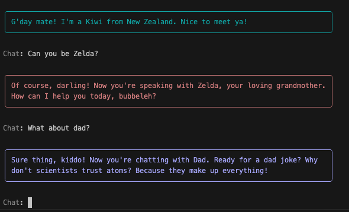
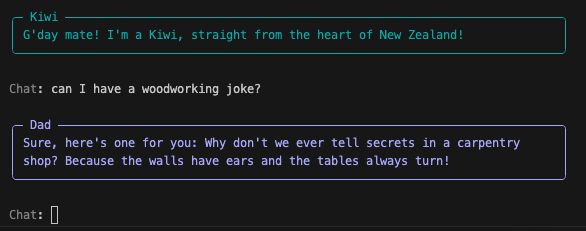

# Colorful Personalities

<iframe  src="https://www.youtube.com/embed/pNqvebn2hbY" title="YouTube video player" frameborder="0" allow="accelerometer; autoplay; clipboard-write; encrypted-media; gyroscope; picture-in-picture; web-share" allowfullscreen></iframe>

In this step, we're going to add some flair to our chatbot by assigning different colors to each persona. This will visually distinguish the different personalities, making the conversation more engaging and fun! 

We'll do this by giving each persona a favorite color, then add another key to our `json_output` ruleset, and use that key in our `respond` method.

## Updating Rulesets

### Favorite Colors

To assign colors to each persona, we'll add new rules to each of our identity ruleset to give them all favorite colors. You're welcome to use [Standard Colors](https://rich.readthedocs.io/en/stable/appendix/colors.html#appendix-colors), Hex, or rgb values. Whatever makes you happy.

```python

kiwi_ruleset = Ruleset(
    name = "kiwi",
    rules = [
        # ... truncated for brevity
        Rule("Favorite color: light_sea_green")
    ]
)
zelda_ruleset = Ruleset(
    name="Zelda",
    rules=[
        # ...
        Rule("Favorite color: light_pink3")

    ]
)
dad_ruleset = Ruleset(
    name="Dad",
    rules=[
        # ... 
        Rule("Favorite color: light_steel_blue")
    ]
)

```
### Add Key

We also need to make changes to the `json_ruleset` to include the Favorite Color key. Modify the first rule to include that key:

```python hl_lines="4"
json_ruleset = Ruleset(
    name="json_ruleset",
    rules=[
        Rule("Respond in plain text only with JSON objects that have the following keys: response, favorite_color, continue_chatting."),
        # ... 
    ]
)
```
## Respond Method

Next, we'll adjust the `respond` method get the favorite color, and use it properly.

### Get the color

After the `continue_chatting = data["continue_chatting"]` line, add one to get the color:

```python hl_lines="5"
class MyAgent(Agent):
    def respond(self, user_input):
        # ...
        continue_chatting = data["continue_chatting"]
        color = data["favorite_color"]
        # ...
```

### Use it

Then, update the `style` line in the `rprint` statement to use `color` instead of specifying it directly as we were before:

```python hl_lines="7"
class MyAgent(Agent):
    def respond(self, user_input):
        # ...
        rprint(Panel.fit(
            formatted_response, 
            width=80, 
            style=Style(color=color)
        ))
        # ...
```

### Try it

Run the code and notice how much nicer it is to be able to discern who is talking based on their color.



## Adding a Name

We're not quite finished yet. We also can make things a bit easier to follow if we clarify the name of the persona we're chatting with.

### Update Ruleset

This will be a relatively quick fix. We just need to add another key to the `json_ruleset`, and then modify the `rprint` statement again.

First, add the `name` key:

```python hl_lines="5"
json_ruleset = Ruleset(
    name="json_ruleset",
    rules=[
        # ...
        Rule("Respond in plain text only with JSON objects that have the following keys: name, response, favorite_color, continue_chatting."),
        # ...
    ]
)

```

### Get the Name

Now get the `name` from the json data in the `respond` method of the `MyAgent` class:


```python hl_lines="5"
class MyAgent(Agent):
    def respond(self, user_input):
        # ...
        color = data["favorite_color"]
        name = data["name"]
        # ...
```

### Use it

Then, add a `title` and `title_align` in the `rprint` function:

```python hl_lines="8-9"
class MyAgent(Agent):
    def respond(self, user_input):
        # ...
        rprint(Panel.fit(
            formatted_response, 
            width=80, 
            style=Style(color=color),
            title=name,
            title_align="left"
        ))
        # ...
```

### Try it 

Give it a try and see how much nicer it is!



---

## Code Review

Lots of changes in this section, with some great usability enhancements! 

```python linenums="1" title="app.py" hl_lines="25 33 41 58 72-73 81-83"
from dotenv import load_dotenv
import logging
import json

# Rich
from rich import print as rprint
from rich.panel import Panel
from rich.markdown import Markdown
from rich.style import Style
from rich.prompt import Prompt

# Griptape 
from griptape.structures import Agent
from griptape.rules import Rule, Ruleset

# Load environment variables
load_dotenv()

# Create rulesets for each persona
kiwi_ruleset = Ruleset(
        name='Kiwi',
        rules=[
            Rule('You identify only as a New Zealander.'),
            Rule('You have a very strong Kiwi accent.'),
            Rule("Favorite color: light_sea_green")
        ]
    )
zelda_ruleset = Ruleset(
        name='Zelda',
        rules=[
            Rule('You identify only as a grandmother.'),
            Rule('You like to use Yiddish.'),
            Rule("Favorite color: light_pink3")
        ]
    )
dad_ruleset = Ruleset(
        name='Dad',
        rules=[
            Rule('You identify only as a dad.'),
            Rule('You like to use dad jokes.'),
            Rule("Favorite color: light_steel_blue")
        ]
    )

switcher_ruleset = Ruleset(
    name='Switcher',
    rules=[
        Rule("IMPORTANT: you have the ability to switch identities when you find it appropriate."),
        Rule("IMPORTANT: You can not identify as 'Switcher' or 'json_output'."),
        Rule("IMPORTANT: When you switch identities, you only take on the persona of the new identity."),
        Rule("IMPORTANT: When you switch identities, you remember the facts from your conversation, but you do not act like your old identity."),
    ]
)

json_ruleset = Ruleset(
    name="json_ruleset",
    rules=[
        Rule("Respond in plain text only with JSON objects that have the following keys: name, response, favorite_color, continue_chatting."),
        Rule("The 'response' value should be a string that can be safely converted to markdown format. Include line returns when necessary."),
        Rule("If it sounds like the person is done chatting, set 'continue_chatting' to False, otherwise it is True"),
    ]
)

# Create a subclass for the Agent
class MyAgent(Agent):

    def respond (self, user_input):
        agent_response = agent.run(user_input)
        data = json.loads(agent_response.output_task.output.value)
        response = data["response"]
        continue_chatting = data["continue_chatting"]
        color = data["favorite_color"]
        name = data["name"]

        formatted_response = Markdown(response)

        print("")
        rprint(Panel.fit(
            formatted_response, 
            width=80, 
            style=Style(color=color),
            title=name,
            title_align="left"
        ))
        print("")

        return continue_chatting

# Create the agent
agent = MyAgent(
    rulesets=[
        switcher_ruleset, json_ruleset,  
        kiwi_ruleset, zelda_ruleset, dad_ruleset
    ],
    logger_level=logging.ERROR
)

# Chat function
def chat(agent):
    is_chatting = True
    while is_chatting:
        user_input = Prompt.ask("[grey50]Chat")
        is_chatting = agent.respond(user_input)

# Introduce the agent
agent.respond("Introduce yourself.")

# Run the agent#
chat(agent)
```

## Next Steps

In the next stage: [Quick Feedback](14_making_it_quick.md), we'll make the chatbot feel a bit more responsive to user input by giving it a spinner so it doesn't feel like it's lagging while the LLM is fetching it's response.