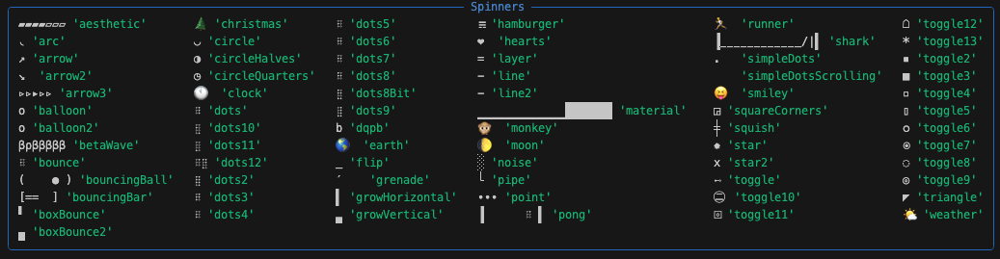
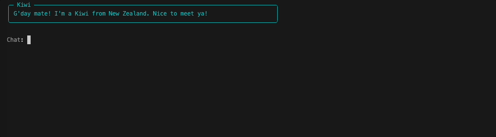

# Quick Feedback

<iframe src="https://www.youtube.com/embed/Qi09TRhCh4k" title="YouTube video player" frameborder="0" allow="accelerometer; autoplay; clipboard-write; encrypted-media; gyroscope; picture-in-picture; web-share" allowfullscreen></iframe>

## UX Enhancement

The UX of our application can be enhanced by letting the user know that the application is working after they execute a command. At the moment, it _is_ processing, but it just doesn't let the user know. We'll use the Spinner functionality from the Rich library to make the application a little more user-friendly and  visually appealing.

## Spinner

The `Console` class has a `status` method which will allow us to display a `Spinner` to the user while Griptape is waiting for the LLM response.

!!! abstract
    There are lots of spinners available. You can check them out by running the following in your terminal:
    
    ```shell
    python -m rich.spinner
    ```
    
    

### Importing the Console

```python
from rich.console import Console
```

Importing the Console class from the `rich` library is simple and straightforward, and should be familliar to you by this point in the lesson.

### Modify Respond

We will add a spinner to our `respond` method in the `MyAgent` subclass. This will show an animated spinner in the console while our agent is processing the user's input. This makes the app feel more responsive.

Update the `respond` method as follows:

```python hl_lines="4-6"
class MyAgent(Agent):
    def respond(self, user_input):

        console = Console()
        with console.status(spinner="simpleDotsScrolling", status=""):
            agent_response = self.run(user_input)
        
        # ...
```

In the code above, `console.status(spinner="simpleDotsScrolling", status="")` starts an animated spinner in the console that will run until the block of code it is wrapping (the agent's processing of user input) completes. 

!!! note
    We've left `status` blank - because we don't really need to send any text. However, feel free to add some text here if you desire.

Now when you run the chat, you'll notice the animated spinner right after you ask the chatbot a question!



---
## Code Review

Double-check your code to make sure the spinner is working as expected.

```python linenums="1" title="app.py" hl_lines="11 74-77"
--8<-- "docs/courses/chatbot-rulesets/assets/code_reviews/14/app.py"
```

## All Done!

!!! success
    You did it!

That's it! We've come a long way in this tutorial series and now you have a multi-persona chat application written with Griptape. Hopefully you've been able to see how using Rulesets can be used for both creative and structural control of your applications.

Congratulations on making it through! We're thrilled you decided to join us for this course and we hope you've enjoyed it as much as we have. We'd love to hear your feedback, so please don't hesitate to let us know what you thought.

More importantly, we wish you all the best as you continue your journey with Griptape and Python. Remember to have fun, experiment, and keep on learning. Happy coding! 🚀