# Workflow Displaying the Graph

## Overview
Throughout the course you've been creating Workflows by adding and inserting various tasks.

We've been displaying those workflow structures in this documentation by using the extremely helpful [Mermaid javascript library](http://mermaid.js.org/){target="_blank"}.

``` mermaid
graph TB 
    subgraph " "
        direction TB
        A("PromptTask: Start"):::main 
        B("PromptTask: Movie Task 1")
        G("PromptTask: Movie Task <i>n</i>" ):::dash
        C("ToolkitTask: Summary Task 1"):::tool
        H("ToolkitTask: Summary Task <i>n</i>" ):::tool-dash
        I("PromptTask: End"):::main
        J(["\n  Incredible movie insights. \n\n"]):::output
        A --> B --> C --> I --> J
        A --> G --> H --> I
    end
    
    classDef main fill:#4274ff1a, stroke:#426eff
    classDef dash stroke-dasharray: 5 5
    classDef tool stroke:#f06090
    classDef tool-dash stroke:#f06090,stroke-dasharray: 5 5
    classDef output fill:#333,stroke:#555

```




While this is handy to help visualize Workflows while we discuss them, it would certainly be helpful to be able to get a better understanding of Workflows *while you create them*.

!!! tip
    There is a new Griptape Utility called `StructureVisualizer` which makes displaying the graph much easier. Please visit the [updated documentation](07_workflow_structure_visualizer.md) to use it.
    
## The to_graph method 

The Workflow class has a method on it called `to_graph`. This method outputs the graph you created as a Python dict.

Let's modify our code slightly to print out the dictionary.

## Displaying the graph

### Import rich rprint

Since we're going to be printing a dict, it would be nice to make it relatively easy to read. We can use the `rich` library's `rprint` function to do this.

At the top of your script, add the following import statement:
```python hl_lines="2"
from dotenv import load_dotenv
from rich import print as rprint

# ...
```

### Comment out workflow.run()

In order to see the graph hierarchy, you don't need to run the workflow. So let's temporarily comment it out in our code. Find the `workflow.run()` line at the bottom of your script and comment it out.

```python hl_lines="4"
# ...

# Run the workflow
# workflow.run()

```
### Use the to_graph method

After the commented out `workflow.run()` line, add the following lines:

```python hl_lines="4-8"
# ...
# workflow.run()

# use the to_graph method to return the graph
graph = workflow.to_graph()

# print the graph
rprint(graph)
```

### Test

Run your code to see the result. It should look something like:
```shell
{
    'START': set(),
    '31d300f8678c41f7ad31ff62cc58d95a': {'START'},
    '4072265abb64464f816fd15383c82020': {'31d300f8678c41f7ad31ff62cc58d95a'},
    'aea3bb1b14d74298bf32fa91e9ad2815': {'START'},
    '8549fa7954014b0eb13099a6a0612517': {'aea3bb1b14d74298bf32fa91e9ad2815'},
    'acf4926d80f14a0f84d813ceef1ff3c0': {'START'},
    '7224e9aef92e40728828d7e9a2304ef2': {'acf4926d80f14a0f84d813ceef1ff3c0'},
    'END': {'7224e9aef92e40728828d7e9a2304ef2', '8549fa7954014b0eb13099a6a0612517', '4072265abb64464f816fd15383c82020'}
}
```

Now this probably isn't what you were expecting - it's not super clear what the node hierarchy is, and those numbers don't give a lot of context.

Essentially what you're looking at is a list of `task ids` and their `parent task ids`.

For example, this line: `'acf4926d80f14a0f84d813ceef1ff3c0': {'START'},` says that the Task with id `acf4926d80f14a0f84d813ceef1ff3c0` has a parent of the  task with the id `START`.

Notice the `END` task has *3* nodes that are it's parent: `'7224e9aef92e40728828d7e9a2304ef2', '8549fa7954014b0eb13099a6a0612517', '4072265abb64464f816fd15383c82020'`.

Still not making sense? That's okay, let's clean up these task id names and things will become a little clearer.

## Clean up the node IDs

The first thing we'll want to do is make sure that each Task has a unique ID that's a little clearer to understand. This means we'll be adding an `id` attribute to the `movie_task` and the `summary_task`.

Find the section of the code where we create the `movie_task`. We're going to add an `id` attribute to it. However, we can't just give it a value of "movie_task" - or *each movie PromptTask will have the same id*. This is not allowed with Workflows - each task needs to be unique.

We could label the tasks something like "movie_task_1", "movie_task_2", etc.. but it might be nicer to make it a little clearer what each one does.

So what if we used a bit of the description to describe the task? Something like:

* `TITLE: A princes...`
* `TITLE: A shark at...`

So we can tell just by glancing at what each task represents.

```python hl_lines="7"
# ...
# Iterate through the movie descriptions
for description in movie_descriptions:
    movie_task = PromptTask(
        "What movie title is this? Return only the movie name: {{ description }}",
        context={"description": description},
        id=f"TITLE: {description[:10]}..", # Use the first 10 characters of the description
    )

# ...
```

Execute that and look at the result:

```shell
{
    'START': set(),
    'TITLE: A princess...': {'START'},
    'c9ce1d1f7da54fa299dba9a84ebe7ccb': {'TITLE: A princess...'},
    'TITLE: A shark at...': {'START'},
    '69c2b414649d42e690a505981ef4979f': {'TITLE: A shark at...'},
    'TITLE: A boy disc...': {'START'},
    '08ef43cfda28416c91fedf2d3b43cdd5': {'TITLE: A boy disc...'},
    'END': {'c9ce1d1f7da54fa299dba9a84ebe7ccb', '69c2b414649d42e690a505981ef4979f', '08ef43cfda28416c91fedf2d3b43cdd5'}
}
```

Notice how it's a little easier to understand? Let's do the same for the `summary_task`. Modify that ToolkitTask to have an id as well, and this time use the same description so we can see how the tasks are related:

```python hl_lines="9"
# ...
# Iterate through the movie descriptions
for description in movie_descriptions:
    # ...

    summary_task = ToolkitTask(
        "Use metacritic to get a summary of this movie: {{ parent_outputs.values() | list |last }}",
        tools=[WebScraper(), TaskMemoryClient(off_prompt=False)],
        id=f"SUMMARY: {description[:10]}..."
    )

# ...
```

The results are definitely clearer:

```shell
{
    'START': set(),
    'TITLE: A princess...': {'START'},
    'SUMMARY: A princess...': {'TITLE: A princess...'},
    'TITLE: A shark at...': {'START'},
    'SUMMARY: A shark at...': {'TITLE: A shark at...'},
    'TITLE: A boy disc...': {'START'},
    'SUMMARY: A boy disc...': {'TITLE: A boy disc...'},
    'END': {'SUMMARY: A boy disc...', 'SUMMARY: A shark at...', 'SUMMARY: A princess...'}
}
```

So looking at this, you can see that `START` is the first item because it has no parents (identified with: `set()`).

The three `TITLE: ...` tasks are a parent of `START` and the `SUMMARY` tasks are children of their respective `TITLE` tasks.

The `END` task has 3 parents - the `SUMMARY` tasks.

## Display with nodes

This is fine for quick cases, but wouldn't it be better if you could actually display the graph in an easier to read way - similar to how we're using mermaid.js in this course?

That's exactly what we're going to do. We'll create a utility we can use on Workflows to display the nodes just like we would with mermaid.

### Create a display_graph.py file

Save the following Python file as `display_graph.py` in the same directory as your `app.py`.

```python
"""
Mermaid Graph Display Utility

This utility allows for the visualization of Workflow Graphs
using Mermaid.js. It generates an HTML page with a Mermaid graph based on a
given graph data structure and opens it in the default web browser.

Usage:
    from display_graph import display_graph
    display_graph(your_data)

Requirements:
    - Internet connection for Mermaid.js CDN.
    - A web browser to view the generated graph.

Author: jason@griptape.ai
Date: Nov 15, 2023
Version: 1.0
"""

import webbrowser
import os
import string
from typing import Dict, Set


# Create unique identifiers for each node in the graph
def generate_identifiers(nodes):
    id_generator = iter(string.ascii_uppercase)
    return {node: next(id_generator) for node in nodes}


# Convert the graph data to mermaid format
def convert_to_mermaid(data: Dict[str, Set[str]], identifiers: Dict[str, str]) -> str:
    mermaid_graph = "graph TD\n"
    for child, parents in data.items():
        child_id = identifiers[child]
        if not parents:
            mermaid_graph += f'    {child_id}("{child}")\n'
        for parent in parents:
            parent_id = identifiers[parent]
            mermaid_graph += f'    {parent_id}("{parent}") --> {child_id}("{child}")\n'
    return mermaid_graph


# Create the HTML content for the graph
def html_content(mermaid_graph: str) -> str:
    return f"""
    <!DOCTYPE html>
    <html>
    <head>
        <title>Mermaid Graph</title>
        <script src="https://cdn.jsdelivr.net/npm/mermaid/dist/mermaid.min.js"></script>
        <script>mermaid.initialize({{ theme: 'dark', startOnLoad: true }});</script>
        <style>
            body {{
        background-color: rgb(30, 33, 41);
        color: rgba(226, 228, 233, 0.82);
            }}
        </style>
    </head>
    <body>
        <div class="mermaid">
            {mermaid_graph}
        </div>
    </body>
    </html>
    """


# Display the graph in a web browser
def display_graph(data: Dict[str, Set[str]]):
    identifiers = generate_identifiers(data.keys())
    mermaid_graph = convert_to_mermaid(data, identifiers)

    file_path = "graph.html"
    with open(file_path, "w") as file:
        file.write(html_content(mermaid_graph))

    webbrowser.open("file://" + os.path.realpath(file_path))

```

### Use display_graph to display your workflow graph

Inside your `app.py`, you will need to first `import` the `display_graph` function.

At the top of your script, add the following import:
```python

from display_graph import display_graph

```

Now at the bottom of your script, instead of using `rprint` to print out your graph, use `display_graph`

```python
# ...
# workflow.run()

# use the to_graph method to return the graph
graph = workflow.to_graph()

# print the graph
display_graph(graph)

```

Execute your script and you should see an html page appear with your graph!


Feel free to use this any time you need to quickly display your graph as it's being built.

## Finished

!!! success
    Congratulations! You have created a successful Griptape Workflow!

Well done, you've successfully created a Griptape Workflow that allows you to execute complex and interesting dependency graphs.

You have learned how to:

* Create tasks that can handle prompts and tools.
* Learned a bit about Jinja2 templates.
* Create parent/child relationships.
* Create tasks that are depending on multiple incoming tasks.
* Get the output from a workflow for integration with other applications.
* Understand the graph being created by displaying it with various methods.

We hope you enjoyed this course, and look forward to seeing what you're able to create with these new skills.
