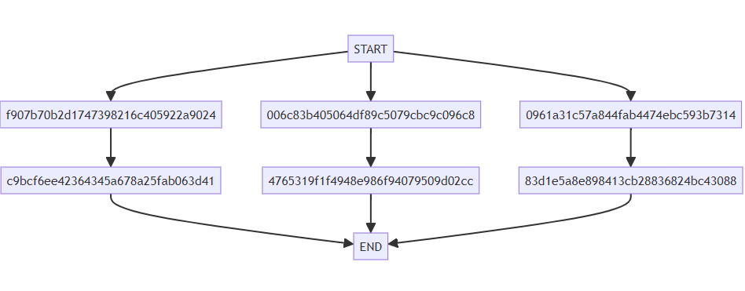
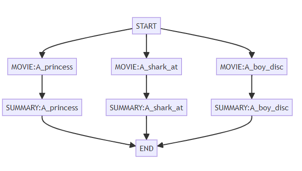
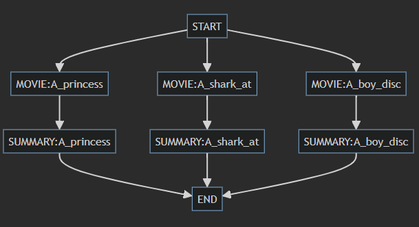

# Workflow Structure Visualizer

## Overview
Throughout the course you've been creating Workflows by adding and inserting various tasks.

We've been displaying those workflow structures in this documentation by using the extremely helpful [Mermaid javascript library](http://mermaid.js.org/){target="_blank"}.

``` mermaid
graph TB 
    subgraph " "
        direction TB
        A("PromptTask: Start"):::main 
        B("PromptTask: Movie Task 1")
        G("PromptTask: Movie Task <i>n</i>" ):::dash
        C("ToolkitTask: Summary Task 1"):::tool
        H("ToolkitTask: Summary Task <i>n</i>" ):::tool-dash
        I("PromptTask: End"):::main
        J(["\n  Incredible movie insights. \n\n"]):::output
        A --> B --> C --> I --> J
        A --> G --> H --> I
    end
    
    classDef main fill:#4274ff1a, stroke:#426eff
    classDef dash stroke-dasharray: 5 5
    classDef tool stroke:#f06090
    classDef tool-dash stroke:#f06090,stroke-dasharray: 5 5
    classDef output fill:#333,stroke:#555

```




While this is handy to help visualize Workflows while we discuss them, it would certainly be helpful to be able to get a better understanding of Workflows *while you create them*.

## The `StructureVisualizer` utility

As of Griptape v0.27, there's a new utility that allows you to visualize a structure using the `mermaid.js` library. It's called the [StructureVisualizer](https://docs.griptape.ai/stable/reference/griptape/utils/#griptape.utils.StructureVisualizer) and it outputs a url which will display a graph of your workflow.

!!! note
    In previous versions of this series, we used a different method of displaying the graph which required you download and install some extra code. This new method is much more efficient, but if you're interested in seeing the old code, you can still visit that page [here](07_workflow_display_graph.md).

### Import

To use the utility, you'll need to import it in the `imports` section of your script. Add the following line:

```python
from griptape.utils import StructureVisualizer
```

### Using the Visualizer

To display the graph, you'll use the `StructureVisualizer`'s method `to_url`. This will output a url you can click on that will display the graph.

At the end of your script, comment out `worfklow.run()` and instead get the url using the `StructureVisualizer` class, then print it.

```python
# Run the workflow
# workflow.run()

# Visualize the workflow
url = StructureVisualizer(workflow).to_url()
print(url)
```

### Test

Run your script, and you should see the output for a url something that looks something like the following. Note - I've truncated it for the documentation, but clicking on it will bring up the workflow.

[https://mermaid.ink/svg/23JhcGggg...](https://mermaid.ink/svg/Z3JhcGggVEQ7CglTVEFSVC0tPiAwOTYxYTMxYzU3YTg0NGZhYjQ0NzRlYmM1OTNiNzMxNCAmIDAwNmM4M2I0MDUwNjRkZjg5YzUwNzljYmM5YzA5NmM4ICYgZjkwN2I3MGIyZDE3NDczOTgyMTZjNDA1OTIyYTkwMjQ7CglmOTA3YjcwYjJkMTc0NzM5ODIxNmM0MDU5MjJhOTAyNC0tPiBjOWJjZjZlZTQyMzY0MzQ1YTY3OGEyNWZhYjA2M2Q0MTsKCWM5YmNmNmVlNDIzNjQzNDVhNjc4YTI1ZmFiMDYzZDQxLS0+IEVORDsKCTAwNmM4M2I0MDUwNjRkZjg5YzUwNzljYmM5YzA5NmM4LS0+IDQ3NjUzMTlmMWY0OTQ4ZTk4NmY5NDA3OTUwOWQwMmNjOwoJNDc2NTMxOWYxZjQ5NDhlOTg2Zjk0MDc5NTA5ZDAyY2MtLT4gRU5EOwoJMDk2MWEzMWM1N2E4NDRmYWI0NDc0ZWJjNTkzYjczMTQtLT4gODNkMWU1YThlODk4NDEzY2IyODgzNjgyNGJjNDMwODg7Cgk4M2QxZTVhOGU4OTg0MTNjYjI4ODM2ODI0YmM0MzA4OC0tPiBFTkQ7CglFTkQ7)



### Naming Tasks

One thing you'll notice right away is that our tasks aren't named, so it's a bit difficult to see what they're representing. This can be easily recitfied by giving them an `id`.

In this case, we'll create the ids based off a snippet of the description of the movie. One important note is that the visualizer will tend to break if there's a space in the id, so we'll trim the description and replace spaces with underscores in it.

In your code where you're creating the tasks, create a variable called `trimmed_description` and then give it as part of the `id` for each task.

```python hl_lines="6-7 12 17"
# ...

# Iterate through the movie descriptions
for description in movie_descriptions:
    
    # Create a nice trimmed description for the first 10 characters
    trimmed_description = description[0:10].strip().replace(" ", "_")

    # Create the tasks and add ids for them
    movie_task = PromptTask(
        "What movie title is this? Return only the movie name: {{ description }}",
        context={"description": description},
        id=f"MOVIE:{trimmed_description}",
    )
    summary_task = ToolkitTask(
        "Use metacritic to get a summary of this movie: {{ parent_outputs.values() | list |last }}",
        tools=[WebScraper(), TaskMemoryClient(off_prompt=False)],
        id=f"SUMMARY:{trimmed_description}",
    )

    workflow.insert_tasks(start_task, [movie_task], end_task)
    workflow.insert_tasks(movie_task, [summary_task], end_task)

# ...

```

### Test Names

Run it again and review the resulting graph.



As you can see, the result is much easier to understand.

### Style

For some people, this light view may be a bit hard to read. You can adjust this by adding a theme and background color to the url. [Mermaid.ink](https://mermaid.ink/) comes with a few themes for the nodes we can use: `default`, `neutral`, `dark`, and `forest`.

Personally, I'm a fan of the `dark` theme. It's why all my t-shirts are black.

Let's set the dark theme, and then also set the background color at the same time. Note - the themes only apply to the nodes themselves, which is why we want to set the background as well.

In your code, create some variables for the theme and the background color:, then construct the full url and run it again.

```python

# Visualize the workflow
url = StructureVisualizer(workflow).to_url()
theme = "dark"
bgColor = "2b2b2b"
full_url = f"{url}?theme={theme}&bgColor={bgColor}"

print(full_url)
```



Ah, that's much better!

## Automatically viewing in browser

Sometimes you may want to not have to copy and paste the URL to open it in a browser. Luckily, you can use the `webbrowser` library to do this automatically!

### Import webbrowser

Add an import statement to the top of your script to include the webbrowser.

```python
import webbrowser
```

### Open the URL

Replace the `print` statement at the end of your script with the `webbrowswer`.

```python hl_lines="7"
# Visualize the workflow
url = StructureVisualizer(workflow).to_url()
theme = "dark"
bgColor = "2b2b2b"
full_url = f"{url}?theme={theme}&bgColor={bgColor}"

webbrowser.open(full_url)
```

### Test run

Next time you run the script, it should automatically open a web browser with the workflow visible!

## Code Review

```python linenums="1" title="app.py" hl_lines="1 9 61-69"
import webbrowser

from dotenv import load_dotenv

# Griptape
from griptape.structures import Workflow
from griptape.tasks import PromptTask, ToolkitTask
from griptape.tools import TaskMemoryClient, WebScraper
from griptape.utils import StructureVisualizer

load_dotenv()

# Create the workflow object
workflow = Workflow()


# Create tasks
start_task = PromptTask("I will provide you a list of movies to compare.", id="START")
end_task = PromptTask(
    """
    How are these movies the same:
      
     {{ value }}
     
    """,
    id="END",
)

# Create a list of movie descriptions
movie_descriptions = [
    "A boy discovers an alien in his back yard",
    "A shark attacks a beach",
    "A princess and a man named Wesley",
]

# Add tasks to workflow
workflow.add_task(start_task)
workflow.add_task(end_task)

# Iterate through the movie descriptions
for description in movie_descriptions:
    # Create a nice trimmed description for the first 10 characters
    trimmed_description = description[0:10].strip().replace(" ", "_")

    # Create the tasks and add ids for them
    movie_task = PromptTask(
        "What movie title is this? Return only the movie name: {{ description }}",
        context={"description": description},
        id=f"MOVIE:{trimmed_description}",
    )
    summary_task = ToolkitTask(
        "Use metacritic to get a summary of this movie: {{ parent_outputs.values() | list |last }}",
        tools=[WebScraper(), TaskMemoryClient(off_prompt=False)],
        id=f"SUMMARY:{trimmed_description}",
    )

    workflow.insert_tasks(start_task, [movie_task], end_task)
    workflow.insert_tasks(movie_task, [summary_task], end_task)

# Run the workflow
# workflow.run()

# Visualize the workflow
url = StructureVisualizer(workflow).to_url()
theme = "dark"
bgColor = "2b2b2b"
full_url = f"{url}?theme={theme}&bgColor={bgColor}"

webbrowser.open(full_url)

```

---

## Finished

!!! success
    Congratulations! You have created a successful Griptape Workflow!

Well done, you've successfully created a Griptape Workflow that allows you to execute complex and interesting dependency graphs.

You have learned how to:

* Create tasks that can handle prompts and tools.
* Learned a bit about Jinja2 templates.
* Create parent/child relationships.
* Create tasks that are depending on multiple incoming tasks.
* Get the output from a workflow for integration with other applications.
* Understand the graph being created by displaying it with the StructureVisualizer.

We hope you enjoyed this course, and look forward to seeing what you're able to create with these new skills.

!!! fire

    But wait.. there's more!

    In a recent update for Griptape, there are new more intuitive ways to create workflows.. check them out in [Workflow Updates](08_updates_imperative_vs_desclarative.md)
