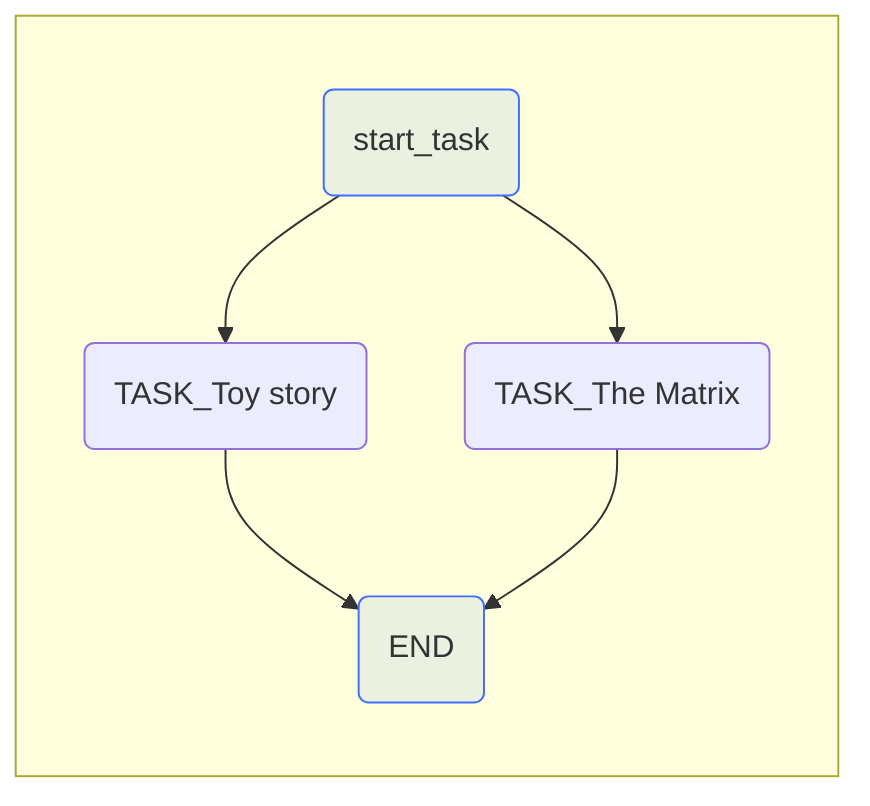
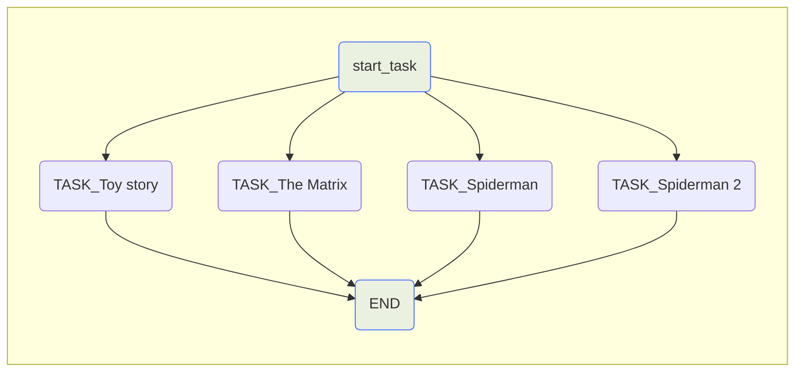
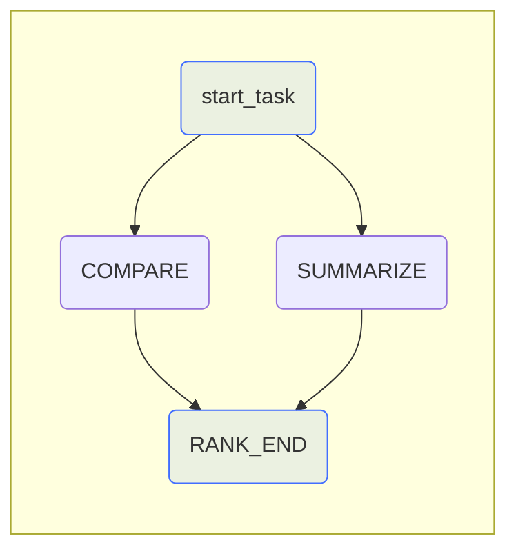
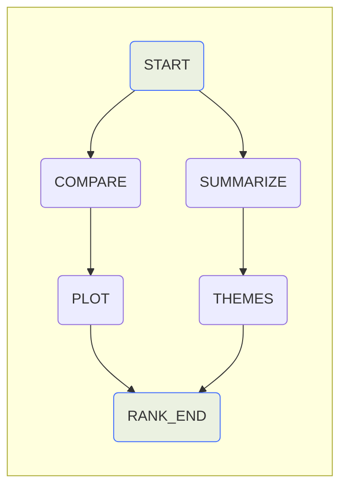

# Updates to Workflows


## New Features
 So far this course has been focused on how you could create Workflows with Griptape before v0.27.0. However, with some new features added in v0.27.0, it's now possible to use a more intuitive syntax for specifying parent-child relationships in workflow tasks. With Imperative declaration - you are defining a specific series of tasks and then define their relationship. With Declarative, we are defining the goal - the tasks are described in terms of their relationships instead of specifically calling the steps to create them. On this page, we'll take a look at these changes.
!!! note 
    Here is a [link](https://docs.griptape.ai/latest/griptape-framework/structures/workflows/#declarative-vs-imperative-syntax){target="_blank"} to the documentation for Workflows. This page will explain further what we are able to do with these new features.
The code below demonstrates how we've been creating workflows throughout the course - by creating a start and end task. Then inserting tasks between them. 
```python title="app.py" linenums="1"
from dotenv import load_dotenv
# Griptape
from griptape.tasks import PromptTask
from griptape.structures import Workflow

# Load env variables
load_dotenv()

# Create the Workflow
workflow = Workflow()

# Create the start task
start_task = PromptTask("This is the start", id="START")

# Create the end Task, and pass it the previous Task's results
end_task = PromptTask("What did we do? {{ parent_outputs }}", id="END")

# Add the Tasks to the Workflow
workflow.add_tasks(start_task, end_task)

# List of movies
movies = ["The Matrix", "Toy Story"]

# For loop that creates a Task for every movie in the movies list.
for movie in movies:

   # Creates a Task for every movie
   task = PromptTask(
       f"Create a prompt for the movie {movie}",
       context={"movie": movie},
       # Dynamically set id based on movie name.
       id=f"{movie}_task"
   )
   
 # Insert the Tasks into the Workflow
   workflow.insert_tasks(start_task, [task], end_task)

workflow.run()
```
While the above code gets you the output desired, there are better ways to create Workflows. Let's dive into those!


## A better way to build Workflows
There are now two ways to manage the hierarchy of the workflow.
One way is to use the `add_parent` and `add_child` commands to quickly add a hierarchy relationship to a task.
For example:
```python
my_task.add_parent(start_task)
```
This will add the `start_task` as a parent to `my_task`.
The second way is to declare the relationship while creating the Task. For example:
```python
my_task = PromptTask("Do a fun thing", parent_ids=["start_task"])
```
Here, we've used the `parent_ids` parameter to tell the task the `id` of the task that will be it's parent. Notice it's a list - you can have multiple parents for any task. The same is true of children.
Finally, once you've defined the relationships, you will need to add the tasks to the Workflow using the tasks parameter.
For example: 
```python
workflow = Workflow(tasks=[start_task, my_task, my_other_task, end_task])
```
We'll get into greater detail on all these updates in the following sections. Read along to learn more.

## Updates to Parent-Child relationships
Previously in Griptape v0.26.0, declaring parent-child relationships wasn't always very intuitive. First, you would’ve had to add the start and end Tasks, and then insert all children Tasks between the parent and the last child. With Griptape v0.27.0, this process is not only easier to visualize, but also easier to use. Let's take a look at imperatively declaring parent-children relationships.


### Imperatively specifying Parent-Child relationships(same as above):
```python hl_lines="23-24" linenums="1" title="app.py"
# Load env variables
load_dotenv()

start_task = PromptTask("This is the start", id="START")

end_task = PromptTask("What did we do? {{ parent_outputs }}", id="END")

movies = ["StarWars Episode V: The Empire Strikes Back", "Dune 2"]

# list to place Tasks into
tasks = []

# For loop that loops through the movies list
for movie in movies:
   # Creates the Task for every movie
   task = PromptTask(
       f"Create a prompt for the movie {movie}",
       context={"movie": movie},
       id=f"TASK_{movie}"
   )

# Specifically add the start_task as a parent to the current Task.
   task.add_parent(start_task)
   end_task.add_parent(task)

# Add the Task to the Tasks array for every movie.
   tasks.append(task)

# Create the Workflow and add the Tasks
workflow = Workflow(tasks=[start_task, *tasks, end_task])

# Run the Workflow
workflow.run()
```
You can specify children instead of parent relationships as well. That would look something like this:
```python hl_lines="23-24" linenums="1" title="app.py"
# Load env variables
load_dotenv()

start_task = PromptTask("This is the start", id="START")

end_task = PromptTask("What did we do? {{ parent_outputs }}", id="END")

movies = ["StarWars Episode V: The Empire Strikes Back", "Dune 2"]

# list to place Tasks into
tasks = []

# For loop that loops through the movies list
for movie in movies:
   # Creates the Task for every movie
   task = PromptTask(
       f"Create a prompt for the movie {movie}",
       context={"movie": movie},
       id=f"TASK_{movie}"
   )

# Specifically add the task as a child to the start_task
   start_task.add_child(task)
   task.add_child(end_task)

# Add the Task to the Tasks array for every movie.
   tasks.append(task)

# Create the movie
workflow = Workflow(tasks=[start_task, *tasks, end_task])

# Run the Workflow
workflow.run()
```
!!!tip
    The `*` in front of the Tasks list unpacks each element and inserts them into the new list as separate items. For example, if you had a list of tasks like this:
    `my_tasks = [task_1, task_2, task_3]`
    and then did something like:
    `tasks=[start_task, *my_tasks, end_task]`
    It would resolve to:
    `tasks=[start_task, task_1, task_2, task_3, end_task]`
As seen above, we declared the children of the `start_task`, then added the `end_task` as a child.
These both output the following graph:

If you added a few more movies, the graph would appear as:

Now that we've seen how we can imperatively declare Parent-Child relationships, let's learn how to do it declaratively! Remember, with Declarative, we are defining the goal - the Tasks are described in terms of their relationships instead of specifically calling the steps to create them. The example has been changed in order to better explain how this works.
## Declaratively specifying Parent-Child relationships
Declaratively specifying Parent relationships:
```python hl_lines="7-8 17 23 29" linenums="1" title="app.py"
# Load end variables
load_dotenv()

# Create the Workflow
workflow = Workflow(

   # Tasks now go within the Tasks list
   tasks = [
       PromptTask(
           "Generate two random movies from the 90's",
           id="START"
           ),

       PromptTask(
           "Given two movies, summarize them: {{parent_outputs}}",
            id="SUMMARIZE",
            parent_ids = ["START"]
            ),

       PromptTask(
           "Compare the two movies: {{parent_outputs}}",
           id="COMPARE",
           parent_ids = ["START"]
           ),

       PromptTask(
           "Rank the movies: {{parent_outputs}}",
           parent_ids=["SUMMARIZE", "COMPARE"] ,
           id="RANK_END"
           )
   ]
)

workflow.run()
```
!!!note
    Always remember to set ID's for your Tasks, if you don't, your Workflow can become discombobulated.
As you can see above, on line 8, we are now able to create Tasks within the Tasks list within the Workflow Structure! Awesome right? Similarly to above, we set the `parent_ids` of child Tasks as we create them. This allows for quick additions to your prompting of the LLM, with significantly less code.


Likewise, we can also specify children relationships within the Workflow:
```python hl_lines="7 13 19" linenums="1" title="app.py"
workflow = Workflow(
   tasks = [
       # Setting children ids
       PromptTask(
           "Generate two random movies from the 90's",
            id="START",
            child_ids=["SUMMARIZE", "COMPARE"]
       ),

       PromptTask(
           "Given two movies, summarize them: {{parent_outputs}}",
           id="SUMMARIZE",
           child_ids=["RANK_END"]
           ),

       PromptTask(
           "Compare the two movies: {{parent_outputs}}",
           id="COMPARE",
           child_ids=["RANK_END"]
        ),

       PromptTask(
           "Rank the movies 1 and 2 {{parent_outputs}}",
           id="RANK_END"
       )

   ]
)
```
Or even a mix of specifying Parent-Child relationships:
```python linenums="1" hl_lines="11-12 18-19" title="app.py"
workflow = Workflow(
   tasks = [
       PromptTask(
           "Generate two random movies from the 90's",
           id="START"
           ),

       PromptTask(
           "Given two movies, summarize them: {{parent_outputs}}",
           id="SUMMARIZE",
           parent_ids=["START"] ,
           child_ids=["RANK_END"]
           ),

       PromptTask(
           "Compare the two movies: {{parent_outputs}}",
           id="COMPARE",
           child_ids=["RANK_END"],
           parent_ids=["START"]
           ),

       PromptTask(
           "Rank the movies 1 and 2 {{parent_outputs}}}",
           id="RANK_END"
           )
   ]
)
```
All of the above code shares the same Workflow Structure. See the below graph:

## Full example
Start by emptying your file, all that should be left is the import statements and the load_dotenv().
```python
from dotenv import load_dotenv
# Griptape
from griptape.structures import Workflow
from griptape.tasks import PromptTask
# Load env variables
load_dotenv()
```
Let's get started by creating some Tasks!
```python hl_lines="3-7 9-13 15-19 21-25" linenums="1" title="app.py"
load_dotenv()

# Start Task, Generates two movies from the 90's
start_task = PromptTask(
   "Generate two movies from the 90's",
   id="START"
)

# Summary Task, Summarizes the previously generated movies
summary_task = PromptTask(
   "Summarize these movies: {{parent_outputs}}",
   id="SUMMARIZE"
)

# Compare Task, Compare the two movies.
compare_task = PromptTask(
   "Compare these movies: {{parent_outputs}}",
   id="COMPARE"
)

# Takes in the summary and compare Tasks to rank the movies
rank_end_task = PromptTask(
   "Rank the movies 1 or 2: {{parent_outputs}}",
   id="RANK_END"
)
```
Now that we have the Tasks, we need to create the workflow.
```python hl_lines="2-4"
# Under the rank_end_task
workflow = Workflow(
   tasks = [start_task, summary_task, compare_task, rank_end_task]
)
workflow.run()
```
If you chose to run this code now it wouldn't generate the desired output. That's because we haven't declared Parent-Children relationships. Let's do that now!
```python hl_lines="24-27" linenums="1" title="app.py"
start_task = PromptTask(
   "Generate two movies from the 90's",
   id="START"
)

# Summary Task, Summarizes the previously generated movies
summary_task = PromptTask(
   "Summarize these movies: {{parent_outputs}}",
   id="SUMMARIZE"
)

# Compare Task, Compare the two movies.
compare_task = PromptTask(
   "Compare these movies: {{parent_outputs}}",
   id="COMPARE"
)

# Takes in the summary and compare Tasks to rank the movies
rank_end_task = PromptTask(
   "Rank the movies 1 or 2: {{parent_outputs}}",
   id="RANK_END"
)

# Imperatively setting the parents
summary_task.add_parent(start_task)
compare_task.add_parent(start_task)
rank_end_task.add_parents([summary_task, compare_task])

# Create the Workflow
workflow = Workflow(
   tasks = [ start_task, summary_task, compare_task, rank_end_task ],
)

# Run the Workflow
workflow.run()
```
!!!note
    With the `add_parents()` command, you can specify multiple parents. Remember to put brackets within the parentheses. For example:
    `add_parents([parent_task1, parent_task2]).`

After having set the Parent-Child relationships, run the Workflow and see what you get. The responses are very interesting.
## Code Checkpoint
This is what your code should look like:
```python linenums="1" title="app.py"
from dotenv import load_dotenv
# Griptape
from griptape.tasks import PromptTask
from griptape.structures import Workflow

# Load Env Variables
load_dotenv()

# Start Task, Generates two movies from the 90's
start_task = PromptTask(
   "Generate two movies from the 90's",
   id="START"
)

# Summary Task, Summarizes the previously generated movies
summary_task = PromptTask(
   "Summarize these movies: {{parent_outputs}}",
   id="SUMMARIZE"
)

# Compare Tasks, Compare the two movies.
compare_task = PromptTask(
   "Compare these movies: {{parent_outputs}}",
   id="COMPARE"
)

# Takes in the summary and compare Tasks to rank the movies
rank_end_task = PromptTask(
   "Rank the movies 1 or 2: {{parent_outputs}}",
   id="RANK_END"
)

# Specify parent-child relationships imperatively
summary_task.add_parent(start_task)
compare_task.add_parent(start_task)
rank_end_task.add_parents([summary_task, compare_task])

# Create the Workflow
workflow = Workflow(
   tasks = [ start_task, summary_task, compare_task, rank_end_task ],
)

# Run the Workflow
workflow.run()
```
Let's add a couple more Tasks and see the power of Workflows on display.
```python hl_lines="24-33 38-39" linenums="1" title="app.py"
# Start task, Generates two movies from the 90's
start_task = PromptTask(
   "Generate two movies from the 90's",
   id="START"
)

# Summary Task, Summarizes the previously generated movies
summary_task = PromptTask(
   "Summarize these movies: {{parent_outputs}}",
   id="SUMMARIZE"
)

# Compare Tasks, Compare the two movies.
compare_task = PromptTask(
   "Compare these movies: {{parent_outputs}}",
   id="COMPARE"
)

themes_task = PromptTask(
   "given the summary, Identify themes and expand on them: {{parent_outputs}}",
   id="THEMES"
)

plot_task = PromptTask(
   "Given the comparison, Identify plot holes: {{parent_outputs}}",
   id="PLOT"
)

# Takes in the summary and compare Tasks to rank the movies
rank_end_task = PromptTask(
   "Rank the movies 1 or 2: {{parent_outputs}}",
   id="RANK_END"
)

# Declare parent child relationships
summary_task.add_parent(start_task)
compare_task.add_parent(start_task)
themes_task.add_parent(summary_task)
plot_task.add_parent(compare_task)
rank_end_task.add_parents([themes_task, plot_task])
```
!!!tip
    Don't forget to declare the Parents of the new Tasks. Once you do that, add them to the Workflow:
```python
   workflow = Workflow(
   tasks = [
       themes_task,
       compare_task,
       plot_task,
       summary_task,
       rank_end_task,
       start_task
   ],
)
workflow.run()
```
!!!note
    You can now place Tasks in whatever order you see fit within the Tasks list inside of the Workflow Structure call. This is because we are declaring the Parent-Child relationships Imperatively.
Your output should be something like this:
```bash
Based on the provided summaries, here is a ranking of the movies from 1 to 2,          
considering the depth of their themes and the significance of their plot holes:                
                                                                                              
1. **The Matrix (1999)**                                                                       
- **Themes:** "The Matrix" delves into profound philosophical questions about reality versus
illusion, the impact of technology on humanity, and the journey of self-discovery and          
enlightenment. These themes are deeply interwoven into the narrative, making the film a        
thought-provoking experience that challenges viewers' perceptions of reality.                  
- **Plot Holes:** While "The Matrix" has some notable plot holes, such as the scientifically
questionable concept of humans as batteries and the inconsistent abilities of the Agents, these
do not significantly detract from the film's overall impact. The film's exploration of complex 
themes and its groundbreaking visual effects have cemented its status as a seminal work in     
science fiction cinema.                                                                        
                                                                                              
2. **Jurassic Park (1993)**                                                                    
- **Themes:** "Jurassic Park" explores themes of human hubris, the ethical implications of  
genetic engineering, and the unpredictability of nature. It also touches on the double-edged   
sword of technological advancement and the primal instinct for survival. These themes are      
compelling and relevant, contributing to the film's enduring appeal.                           
- **Plot Holes:** The plot holes in "Jurassic Park," such as the inadequate security systems,
lack of backup systems, and scientifically dubious concept of DNA preservation, are more glaring
and can be more distracting to the narrative. However, the film's thrilling adventure and      
groundbreaking special effects have made it a beloved classic.                                 
                                                                                              
In conclusion, while both films have their narrative inconsistencies, "The Matrix" edges out   
"Jurassic Park" due to its deeper thematic exploration and the less distracting nature of its  
plot holes.    
```
!!!note
    Output edited for brevity.
Here's what your Workflow looks like in a graph:

## Finished
Great job! Now we are done with going over the updates to Workflows. These updates will undoubtedly help you create larger, more complex Workflows.
We covered:


* Creating complex relationships between Tasks
* Imperative Syntax.
* Declarative Syntax.
* The new way to create Workflows(The old way still works).


We hope you enjoyed this course! Go out and create some cool stuff!


