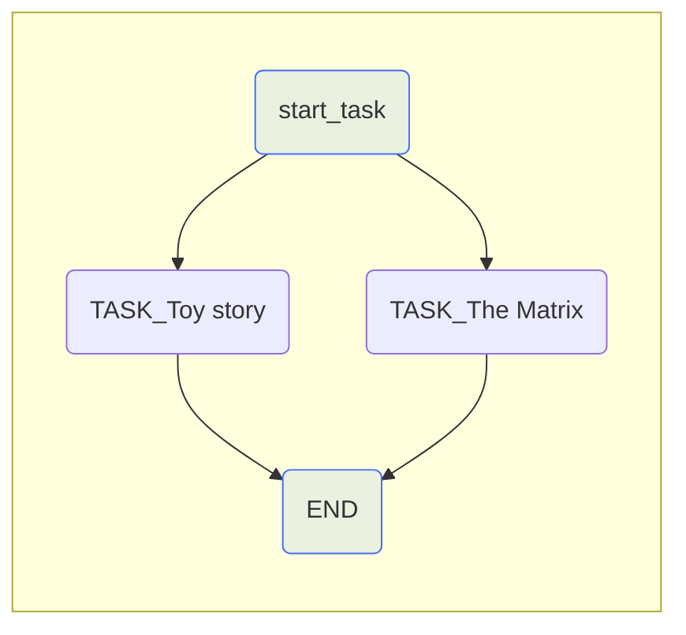
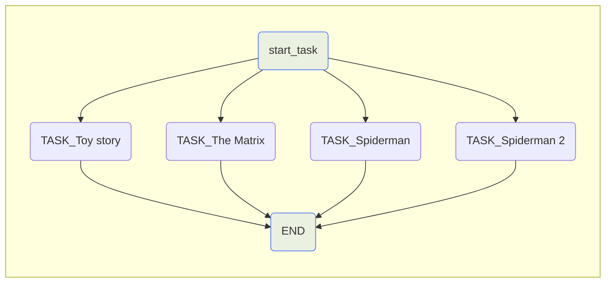
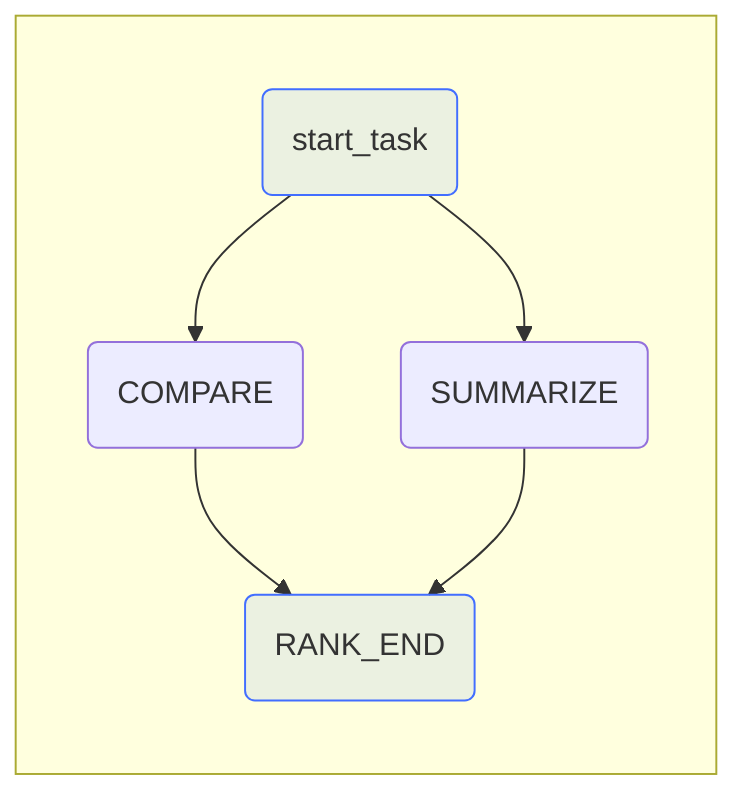
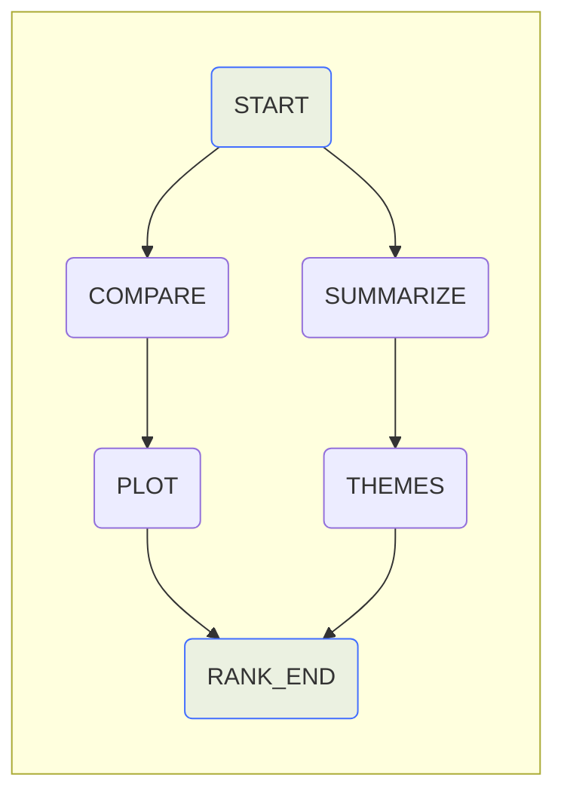

# Updates to Workflows

## New Features
 So far this course has been focused on how you could create Workflows with Griptape before v0.27.0. However, with some new features added in v0.27.0, it's now possible to use a more intuitive syntax for specifying parent-child relationships in workflow tasks. With Imperative declaration - you are defining a specific series of tasks and then define their relationship. With Declarative, we are defining the goal - the tasks are described in terms of their relationships instead of specifically calling the steps to create them. On this page, we'll take a look at these changes.
!!! note 
    Here is a [link](https://docs.griptape.ai/latest/griptape-framework/structures/workflows/#declarative-vs-imperative-syntax){target="_blank"} to the documentation for Workflows. This page will explain further what we are able to do with these new features.
The code below demonstrates how we've been creating workflows throughout the course - by creating a start and end task. Then inserting tasks between them. 
```python title="app.py"
from dotenv import load_dotenv
# Griptape
from griptape.tasks import PromptTask
from griptape.structures import Workflow

# Load env variables

load_dotenv()

# Create the workflow

workflow = Workflow()

# Create the start task

start_task = PromptTask("This is the start", id="START")

# Create the end task, and pass it the previous task's results

end_task = PromptTask("What did we do? {{ parent_outputs }}", id="END")

# Add the tasks to the workflow

workflow.add_tasks(start_task, end_task)

# List of movies

movies = ["The Matrix", "Toy Story"] 

# Empty tasks list 

tasks = []
for movie in movies:

    # Creates a task for every movie

    task = PromptTask(
        f"Create a prompt for the movie {movie}",
        context={"movie": movie},

        # Dynamically set id based on movie name.

        id=f"{movie}_task"
    )
    # Append the tasks to the list

    tasks.append(task)

    # Insert the tasks into the workflow

workflow.insert_tasks(start_task, [*tasks], end_task)

workflow.run()
```
While the above code gets us the output we desired, there are better ways to create workflows. Let's dive into those! 

## A better way to build Workflows
Instead of inserting tasks, we are going to specifically declare parent relationships. 
```python hl_lines="23-24 30" title="app.py" linenums="1"
# Load env variables
load_dotenv()

start_task = PromptTask("This is the start", id="START")

end_task = PromptTask("What did we do? {{ parent_outputs }}", id="END")

movies = ["StarWars Episode V: The Empire Strikes Back", "Dune 2"]

# list to place tasks into
tasks = []

# For loop that loops through the movies list
for movie in movies:
    # Creates the task for every movie
    task = PromptTask(
        f"Create a prompt for the movie {movie}",
        context={"movie": movie},
        id=f"TASK_{movie}"
    )

# Adding parent relationships 
    task.add_parent(start_task)
    end_task.add_parent(task)

# Add the task to the tasks array for every movie.
    tasks.append(task)

# Create the movie 
workflow = Workflow(tasks=[start_task, *tasks, end_task])

# Run the workflow
workflow.run()
```
!!!note
    These two workflows create the same output, the only thing that is different is what syntax we use to define Parent-Child relationships.
Notice how we utilized the .add_parent command to add a parent to the task? This is new in Griptape v0.27.0, and is known as imperative syntax for specifying Parent-Child relationships. Also you may notice on line 30 that we add the tasks into a list within the workflow structure. This is new to Griptape v0.27.0, and allows you to create the workflow and add the tasks all at once. 
!!!tip
    The asterisk in front of the tasks list unpacks each element of the tasks list and inserts them into the new list as separate items.

In this example we are going to create the parent-child relationships while creating the tasks: 
```python hl_lines="20-21" linenums="1"
# Load env variables
load_dotenv()

start_task = PromptTask("This is the start", id="START")

end_task = PromptTask("What did we do? {{ parent_outputs }}", id="END")

movies = ["StarWars Episode V: The Empire Strikes Back", "Dune 2"]

# list to place tasks into
tasks = []

# For loop that loops through the movies list
for movie in movies:
    # Creates the task for every movie
    task = PromptTask(
        f"Create a prompt for the movie {movie}",
        context={"movie": movie},
        id=f"TASK_{movie}",
        parent_ids=['START'],
        child_ids=['END']
    )

# Add the task to the tasks array for every movie.
    tasks.append(task)

# Create the movie 
workflow = Workflow(tasks=[start_task, *tasks, end_task])

# Run the workflow
workflow.run()
```
Notice above that within the PromptTask structure, we are setting the parent and child ids. This is also new Griptape v0.27.0, and is known as declarative syntax for specifying Parent-Child relationships
## Summary
In Griptape v0.26.0 this is most likely how your code would've looked: 
```python
workflow = Workflow()

workflow.add_tasks(start_task, end_task)
 
workflow.insert_tasks(start_task, [*tasks], end_task)
```
     
Now in Griptape v0.27.0 the syntax for creating workflows is much lighter, and leads to a better dev experience.
```python
workflow = Workflow(tasks=[start_task, *tasks, end_task])
```
Let's move on and look at the updates to declaring parent-child relationships!

## Updates to Parent-Child relationships
Previously in Griptape v0.26.0 declaring parent-child relationships wasn't always very intuitive. You first would have to add the start and end tasks, then all children tasks were inserted between the parent and last child. With Griptape v0.27.0 this process not only easier to visualize, but also easier to use. Let's take a look at imperatively declaring parent-children relationships.

### Imperatively specifying Parent-Child relationships(same as above):
```python hl_lines="22-24" linenums="1"
# Load env variables
load_dotenv()

start_task = PromptTask("This is the start", id="START")

end_task = PromptTask("What did we do? {{ parent_outputs }}", id="END")

movies = ["StarWars Episode V: The Empire Strikes Back", "Dune 2"]

# list to place tasks into
tasks = []

# For loop that loops through the movies list
for movie in movies:
    # Creates the task for every movie
    task = PromptTask(
        f"Create a prompt for the movie {movie}",
        context={"movie": movie},
        id=f"TASK_{movie}"
    )

# Specifically add the start_task as a parent to the current task.
    task.add_parent(start_task)
    end_task.add_parent(task)

# Add the task to the tasks array for every movie.
    tasks.append(task)

# Create the workflow and add the tasks 
workflow = Workflow(tasks=[start_task, *tasks, end_task])

# Run the workflow
workflow.run()
```
If you wanted to you could also specify children, instead of parent relationships like this:
```python hl_lines="22-24" linenums="1"
# Load env variables
load_dotenv()

start_task = PromptTask("This is the start", id="START")

end_task = PromptTask("What did we do? {{ parent_outputs }}", id="END")

movies = ["StarWars Episode V: The Empire Strikes Back", "Dune 2"]

# list to place tasks into
tasks = []

# For loop that loops through the movies list
for movie in movies:
    # Creates the task for every movie
    task = PromptTask(
        f"Create a prompt for the movie {movie}",
        context={"movie": movie},
        id=f"TASK_{movie}"
    )

# Adding child relationships 
    start_task.add_child(task)
    task.add_child(end_task)

# Add the task to the tasks array for every movie.
    tasks.append(task)

# Create the movie 
workflow = Workflow(tasks=[start_task, *tasks, end_task])

# Run the workflow
workflow.run()
``` 
As you can see above we declared the children of the start task, and added the end task as a child to the task.
These both output the following graph: 

If you added a few more movies the graph would be: 

Now that we've seen how we can imperatively declare Parent-Child relationships, let's learn how to do it declaratively! Remember, with Declarative, we are defining the goal - the tasks are described in terms of their relationships instead of specifically calling the steps to create them. I've changed around the example in order to better explain how this works.
## Declaratively specificying Parent-Child relationships 
Declaratively specifying Parent relationships:
```python hl_lines="7 17 23 28" linenums="1"
# Load end variables
load_dotenv()

# Create the workflow
workflow = Workflow(
    # Tasks now go within the tasks list
    tasks = [
        PromptTask(
            "Generate two random movies from the 90's", 
            id="START"
            ),

        PromptTask(
            "Given two movies, summarize them: {{parent_outputs}}",
             id="SUMMARIZE",
            #  Declaratively setting the parent_ids
             parent_ids = ["START"]
             ),

        PromptTask(
            "Compare the two movies: {{parent_outputs}}", 
            id="COMPARE", 
            parent_ids = ["START"]
            ),

        PromptTask(
            "Rank the movies: {{parent_outputs}}",
            parent_ids=["SUMMARIZE", "COMPARE"] ,
            id="RANK_END"
            )
    ]
)

workflow.run()
```
!!!note
    Always remember to set ID's for your tasks, if you don't your workflow can become discombobulated. 
As you can see above, on line 7, we are now able to create tasks within the task list within the Workflow Structure! Awesome right? Let me explain what's going on here. Similar to above, we are setting the parent_ids of child task as we create them. This allows for quick additions to your prompting of the LLM, and leads to much less code.

Similarly we could also specify Children relationships within the Workflow:
```python hl_lines="7 12 17" linenums="1"
workflow = Workflow(
    tasks = [
        # Setting children ids
        PromptTask(
            "Generate two random movies from the 90's",
             id="START", 
             child_ids=["SUMMARIZE", "COMPARE"]
        ),
        PromptTask(
            "Given two movies, summarize them: {{parent_outputs}}", 
            id="SUMMARIZE", 
            child_ids=["RANK_END"]
            ),
        PromptTask(
            "Compare the two movies: {{parent_outputs}}",
            id="COMPARE", 
            child_ids=["RANK_END"]
         ),
        PromptTask(
            "Rank the movies 1 and 2 {{parent_outputs}}",
            id="RANK_END"
        )
    ]
)
``` 
Or even a mix of specifying Parent-Child relationships:
```python linenums="1" hl_lines="10-11 16-17"
workflow = Workflow(
    tasks = [
        PromptTask(
            "Generate two random movies from the 90's", 
            id="START"
            ),
        PromptTask(
            "Given two movies, summarize them: {{parent_outputs}}", 
            id="SUMMARIZE", 
            parent_ids=["START"] ,
            child_ids=["RANK_END"]
            ),
        PromptTask(
            "Compare the two movies: {{parent_outputs}}", 
            id="COMPARE", 
            child_ids=["RANK_END"], 
            parent_ids=["START"]
            ),
        PromptTask(
            "Rank the movies 1 and 2 {{parent_outputs}}}",
            id="RANK_END"
            )
    ]
)
```
All of the above code shares the same workflow structure, see the below graph: 

## Full example
Start by emptying your file, all that should be left is the import statements and the load_dotenv().
```python
from dotenv import load_dotenv
# Griptape
from griptape.structures import Workflow
from griptape.tasks import PromptTask

load_dotenv()
```
Let's get started by creating some tasks! 
```python
load_dotenv()

# Start task, Generates two movies from the 90's
start_task = PromptTask(
    "Generate two movies from the 90's",
    id="START"
)

# Summary task, Summarizes the previously generated movies
summary_task = PromptTask(
    "Summarize these movies: {{parent_outputs}}",
    id="SUMMARIZE"
)

# Compare task, Compares the two movies.
compare_task = PromptTask(
    "Compare these movies: {{parent_outputs}}",
    id="COMPARE"
)

# Takes in the summary and compare tasks to rank the movies
rank_end_task = PromptTask(
    "Rank the movies 1 or 2: {{parent_outputs}}",
    id="RANK_END"
)
```
Now that we have the tasks, we need to create the workflow.
```python
# Under the rank_end_task
workflow = Workflow(
    tasks = [start_task, summary_task, compare_task, rank_end_task]
)
workflow.run()
```
If you chose to run this code now it wouldn't generate the desired output. That's because we haven't declared the Parent-Children relationships. Let's do that now! 
```python hl_lines="24-27 29-32"
start_task = PromptTask(
    "Generate two movies from the 90's",
    id="START"
)

# Summary task, Summarizes the previously generated movies
summary_task = PromptTask(
    "Summarize these movies: {{parent_outputs}}",
    id="SUMMARIZE"
)

# Compare task, Compares the two movies.
compare_task = PromptTask(
    "Compare these movies: {{parent_outputs}}",
    id="COMPARE"
)

# Takes in the summary and compare tasks to rank the movies
rank_end_task = PromptTask(
    "Rank the movies 1 or 2: {{parent_outputs}}",
    id="RANK_END"
)

# Imperatively setting the parents
summary_task.add_parent(start_task)
compare_task.add_parent(start_task)
rank_end_task.add_parents([summary_task, compare_task])

# Create the workflow
workflow = Workflow(
    tasks = [ start_task, summary_task, compare_task, rank_end_task ],
)

# Run the workflow
workflow.run()
```
!!!note
    You can now place tasks in whatever order you see fit within the tasks list inside of the workflow strucure call.
Now that we have set the Parent-Child relationships, run the workflow and see what you get. The responses are very interesting. 
## Code Checkpoint 
This is what your code should look like currently.
```python linenums="1"
from dotenv import load_dotenv
# Griptape
from griptape.tasks import PromptTask
from griptape.structures import Workflow

# Load Env Variables
load_dotenv()

# Start task, Generates two movies from the 90's
start_task = PromptTask(
    "Generate two movies from the 90's",
    id="START"
)

# Summary task, Summarizes the previously generated movies
summary_task = PromptTask(
    "Summarize these movies: {{parent_outputs}}",
    id="SUMMARIZE"
)

# Compare task, Compares the two movies.
compare_task = PromptTask(
    "Compare these movies: {{parent_outputs}}",
    id="COMPARE"
)

# Takes in the summary and compare tasks to rank the movies
rank_end_task = PromptTask(
    "Rank the movies 1 or 2: {{parent_outputs}}",
    id="RANK_END"
)

# Specify parent-child relationships imperitavely
summary_task.add_parent(start_task)
compare_task.add_parent(start_task)
rank_end_task.add_parents([summary_task, compare_task])

# Create the workflow
workflow = Workflow(
    tasks = [ start_task, summary_task, compare_task, rank_end_task ],
)

# Run the workflow
workflow.run()
```
Let's add a couple more tasks, and see the power of workflows on display. 
```python hl_lines="19-27 37-38"
# Start task, Generates two movies from the 90's
start_task = PromptTask(
    "Generate two movies from the 90's",
    id="START"
)

# Summary task, Summarizes the previously generated movies
summary_task = PromptTask(
    "Summarize these movies: {{parent_outputs}}",
    id="SUMMARIZE"
)

# Compare task, Compares the two movies.
compare_task = PromptTask(
    "Compare these movies: {{parent_outputs}}",
    id="COMPARE"
)

themes_task = PromptTask(
    "given the summary, Identify themes and expand on them: {{parent_outputs}}",
    id="THEMES"
)

plot_task = PromptTask(
    "Given the comparison, Identify plot holes: {{parent_outputs}}",
    id="PLOT"
)

# Takes in the summary and compare tasks to rank the movies
rank_end_task = PromptTask(
    "Rank the movies 1 or 2: {{parent_outputs}}",
    id="RANK_END"
)
# Declare parent child relationships
summary_task.add_parent(start_task)
compare_task.add_parent(start_task)
themes_task.add_parent(summary_task)
plot_task.add_parent(compare_task)
rank_end_task.add_parents([themes_task, plot_task])

```
!!!tip 
    Don't forget to declare the parents of the new tasks.
Then add them to the workflow:
```python
    workflow = Workflow(
    tasks = [
        themes_task,
        compare_task,
        plot_task,
        summary_task,
        rank_end_task, 
        start_task
    ],
)
workflow.run()
```
!!!note
    With the add_parents() command, you can specify multiple parents. Don't forget to put brackets within the parentheses. Like this: 
    add_parents([parent_task1, parent_task2]).
Your output should be something similar to this:
```bash 
Based on the provided summaries, here is a ranking of the movies from 1 to 2,           
considering the depth of their themes and the significance of their plot holes:                 
                                                                                                
1. **The Matrix (1999)**                                                                        
- **Themes:** "The Matrix" delves into profound philosophical questions about reality versus 
illusion, the impact of technology on humanity, and the journey of self-discovery and           
enlightenment. These themes are deeply interwoven into the narrative, making the film a         
thought-provoking experience that challenges viewers' perceptions of reality.                   
- **Plot Holes:** While "The Matrix" has some notable plot holes, such as the scientifically 
questionable concept of humans as batteries and the inconsistent abilities of the Agents, these 
do not significantly detract from the film's overall impact. The film's exploration of complex  
themes and its groundbreaking visual effects have cemented its status as a seminal work in      
science fiction cinema.                                                                         
                                                                                                
2. **Jurassic Park (1993)**                                                                     
- **Themes:** "Jurassic Park" explores themes of human hubris, the ethical implications of   
genetic engineering, and the unpredictability of nature. It also touches on the double-edged    
sword of technological advancement and the primal instinct for survival. These themes are       
compelling and relevant, contributing to the film's enduring appeal.                            
- **Plot Holes:** The plot holes in "Jurassic Park," such as the inadequate security systems,
lack of backup systems, and scientifically dubious concept of DNA preservation, are more glaring
and can be more distracting to the narrative. However, the film's thrilling adventure and       
groundbreaking special effects have made it a beloved classic.                                  
                                                                                                
In conclusion, while both films have their narrative inconsistencies, "The Matrix" edges out    
"Jurassic Park" due to its deeper thematic exploration and the less distracting nature of its   
plot holes.     
```
!!!note 
    Output edited for brevity
And here's what your workflow looks like in a graph:

## Finished
Great job! Now we are all done with going over the updates to Workflows. These updates will undoubtedly help you create larger and more complex Workflows.
We covered:

* Creating complex relationships between tasks
* Imperative Syntax.
* Declarative Syntax.
* The new way to create Workflows(The old way still works).

We hope you enjoyed this course! Go out and create some cool stuff!


