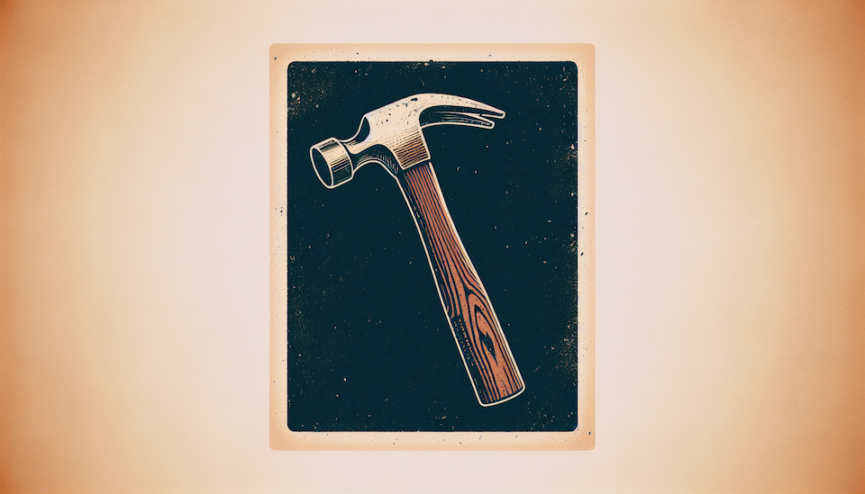

As with any project, the first step is setting up your environment. Let's get started by ensuring you have a project structure ready to work with.

!!! Tip "Important"
    Since this is an intermediate-level course, please ensure you've gone through the [Griptape Setup](../../setup/index.md) course to set up your environment. We will be starting from the code at that point.

### Create a Project

Following the instructions in [Griptape Setup - Visual Studio Code ](../../setup/01_setting_up_environment.md) please:

1. Create your project folder. Example: `griptape-image-pipeline`
2. Set up your virtual environment
3. Ensure you `pip install griptape python-dotenv`
4. Create a `.env` file with your `OPENAI_API_KEY`

    !!! tip
        If you are using **Leonardo.Ai** or **Stable Diffusion on Amazon Bedrock**, be sure to set the appropriate environment variables in the `.env` file as well.

5. Create your `app.py` file with the following code:

```python title="app.py" linenums="1"
from dotenv import load_dotenv

load_dotenv() # Load your environment
```

---
## Next Steps
Your environment is all set up! In the [next section](02_concepts.md), we will dive into the concepts of Griptape Pipelines.