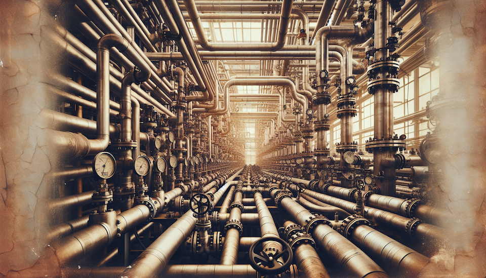
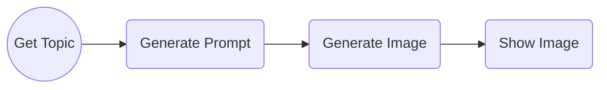
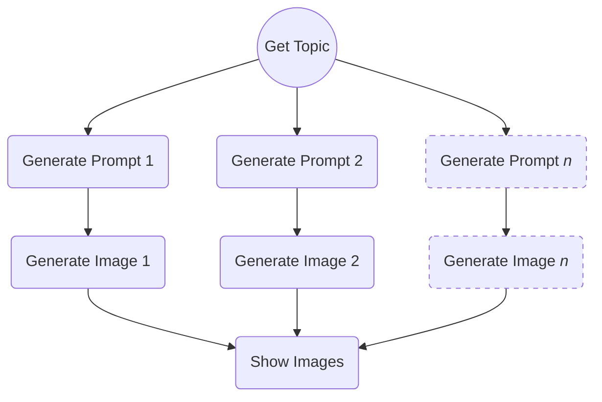

# Main Concepts



## Understanding Pipelines and Workflows

Pipelines and Workflows are both Griptape Structures that execute a series of tasks. 

### Pipelines
[Pipelines](https://docs.griptape.ai/en/latest/griptape-framework/structures/pipelines/){target="_blank"} are always a **sequential** series of steps - one task after another until it is finished. 

In this course, we're going to be taking a topic to draw, and then execute a consistent series of tasks until we have the image. Every time the Pipeline is run, it will _always_:

1. Use an LLM to generate an Image Generation prompt.
    * If the input given is "a butterfly", the result of this task might be a text string "Create a watercolor painting of a butterfly.".
    * This will allow us to ensure the output from this task will always be in the correct format for an Image Generation Engine.
3. Generate an image
    * Using the output from the previous step, we'll give that to an Image Generation Model
4. View the image
    * Once the image is generated, we'll want to do something with it. In this case, we can open the image to view it.

The flow of tasks will look like:



### Workflows
[Workflows](https://docs.griptape.ai/en/latest/griptape-framework/structures/workflows/){target="_blank"} allow for complex interactions, resembling tree branches.

Workflows are **non-sequential**, and individual tasks can depend on **multiple input tasks**. This allows you to create a single task that waits for all other tasks to complete before it can begin.

If we wanted to generate _multiple_ images, perhaps in different styles we'd be able to set up a workflow like the following:

!!! Note
    The graph is drawn top to bottom for this example because it's easier to understand the flow of data, but it can be drawn in either direction.



Notice how the images can be generated in parallel, but the **Show Images** task will wait until all its **parent** tasks are completed. Workflows always require a **start task** and an **end task**.

## Tasks

Before we dive in and start setting up our own Pipeline, it's important to review the concepts of Tasks. With Griptape, there are many types of tasks you'll be working with, including:

| Task Type | Description | Example |
|-----------|-------------|---------|
| **PromptTask** | General purpose prompting to the LLM. | `PromptTask("Tell me a story about skateboards")` |
| **ToolkitTask** | Uses Griptape Tools to complete a task with Chain of Thought (CoT) reasoning. | `ToolkitTask("Summarize griptape.ai", tools=[WebScraper()])` |
| **TookTask** | Similar to ToolkitTask, but only uses a single tool and no CoT. | `ToolTask("Give me the answer for 52-10", tool=Calculator())` |
| **Extraction Tasks** | Various tasks associated with extracting information from text. | See examples in the [documentation](https://griptape.readthedocs.io/griptape-framework/structures/tasks/#extraction-task){target="_blank"}. 
| **TextSummaryTask** | Summarizes text very efficiently | `TextSummaryTask("Imagine this is a massive amount of text.")` |
| **TextQueryTask** | Can be used to query large bodies of text, for example a vector database. | See examples in the [documentation](https://griptape.readthedocs.io/griptape-framework/structures/tasks/#text-query-task){target="_blank"} |
| **ImageGenerationTask** | Can be used to generate images. | `ImageGenerationTask("watercolor butterfly"), image_generation_engine=image_engine`|

In this course, we will be focusing mostly on **Prompt Tasks**, **Toolkit Tasks**, and **Image Generation Tasks**. 


```python
# Example PromptTask to create a Image Generation Prompt
#
image_prompt_task = PromptTask(
    "Create a prompt for an image generation engine that will make a watercolor painting of: {{ topic }}",
    context = {                        
        "topic": "butterfly" 
    },
    id="image_prompt_task"   # task id can be referenced by other tasks
)

# This Image Generation task works with the output of the parent task.
#
image_generation_task = ImageGenerationTask(
    "{{ parent_output }}", # The output of the parent task
    image_generation_engine=ImageGenerationEngine(
        image_generation_driver=OpenAiDalleImageGenerationDriver(
            model="dall-e-3", api_type="open_ai", image_size="1024x1024"
        ),
    ),
    output_dir="./images",
    id="image_generation_task"
)
```

---

## Next Steps
Let's move on to the next section where we'll create our [First Pipeline](03_first_pipeline.md), and get an understanding of the basics of how parent/child relationships can work.
