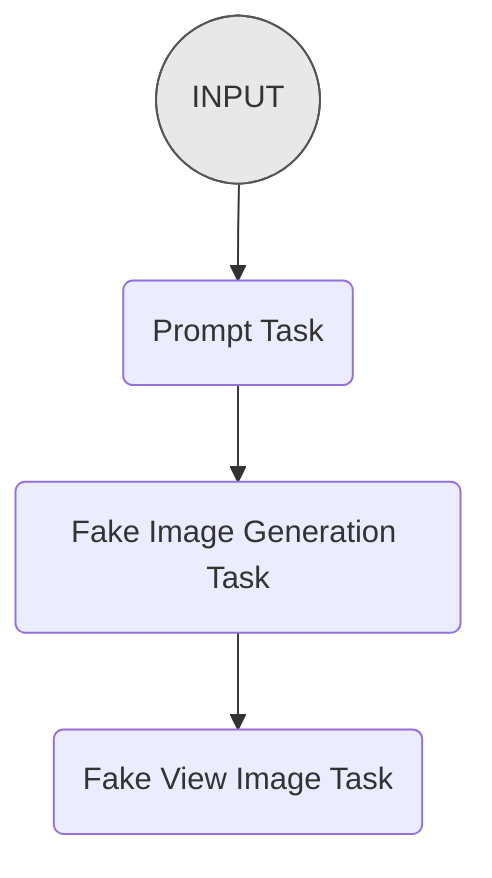
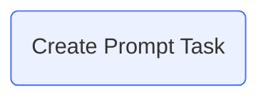
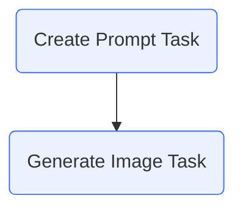
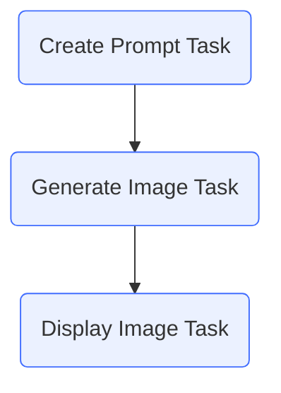

# First pipeline


## Overview
In this section, we're going to create a "pseudocode" pipeline for our image generation application. When finished you will have a pipeline that walks through each step of the image generation process, without actually generating an image. 

For example, if you pass the topic: "a skateboard"

It will do the following steps:

1. Take a topic as an input.
2. Create an image generation prompt based on the topic in a particular style.
3. Pretend to generate the image
4. Pretend to display the image

The pipeline we will create looks like the following:



As you can see, there is a `Pipeline` Structure and three tasks that will be created. The two final "Fake" tasks will be replaced with real ones in future sections.

To generate this structure, we create the Pipeline and then add tasks one at a time.

Let's get started.

## Importing Required Modules

Before starting, we need to import the necessary modules. Open the `app.py` file you created in the [setup](01_setup.md) section and import the two Griptape classes you'll need: `Pipeline` and `PromptTask`:

```python linenums="1" hl_lines="3-5"
from dotenv import load_dotenv

# Griptape
from griptape.structures import Pipeline
from griptape.tasks import PromptTask

load_dotenv() # Load your environment

```

!!! Note
    You might recall that `Agent` was also imported through `griptape.structures`. That's because `Agent`, `Workflow`, and `Pipeline` are all Griptape's ways of working with LLMs. 

## Create Pipeline Structure
### Initialize the Pipeline

Now, let's create the foundation for our Pipeline. After the line `load_dotenv()`, create an instance of the Pipeline class:

```python hl_lines="4-5"
# ... truncated for brevity
load_dotenv() # Load your environment

# Create the pipeline object
pipeline = Pipeline()
```

### Create our first task

First, we'll create our "create prompt" task. This will be a `PromptTask` that tells the LLM to generate a prompt for an image generation model in a particular style.

After the `pipeline` line, add:

```python hl_lines="3-13"
# ...

# Create tasks
create_prompt_task = PromptTask(
    """
    Create a prompt for an Image Generation pipeline for the following topic: 
    {{ args[0] }}
    in the style of {{ style }}.
    """,
    context = {
        "style": "a 1970s polaroid"
    },
    id="Create Prompt Task")

```

Quite a few things are happening in this `PromptTask` generation that are important to point out.

The initial prompt contains two variables that are being replaced in the text. `{{ args[0] }}` and `{{ style }}`.

!!! tip
    Griptape uses the [Jinja2](https://jinja.palletsprojects.com/en/3.1.x/){target="_blank"} template engine, which allows you to insert data into the prompt. There's a lot of power available with Jinja templates, but in this course, we'll keep our focus rather small. Jinja templates access variables using the `{{ }}` syntax. **Tasks** can take advantage of this.

### Understanding `{{ args[0] }}`

`{{ args[0] }}` will always be the initial input sent to the `Pipeline`. If we were to call the pipeline with:
        
    ```python
    pipeline.run("cow")
    ```

    The `{{ args[0] }}` would be replaced with "cow". 
    
### Additional context

The `context` argument allows you to pass more variables to the prompt. In this case, we used `{{ style }}` to specify "a 1970s polaroid".
You can add as many items as you like to the `context` to make your prompt as interesting as possible.

Here is an example of setting a few context variables:

```python title="example contexts"
context = {
    'style': 'a 1970s polaroid',
    'color': 'lime green',
    'additional_items': 'car, apple, sheep'
}
```
When using it in a prompt, you would simply substitute the `key` between `{{ }}`. For example:

```python
prompt = """
    Generate an image to look like {{ style }}. 
    It should have a {{ color }} hue, and add some of 
    these items in it: {{ additional_items }}. """
```

This would generate:
```text
    Generate an image to look like a 1970s polaroid.
    It should have a lime green hue, and add some of
    these items in it: car, apple, sheep.
```
Based on these substitutions in our _actual_ example, the prompt sent to the LLM would be:

```text
Create a prompt for an Image Generation pipeline for the following topic:
cow
in the style of a 1970s polaroid.
```

### Add Task to the Pipeline

You have created the task, but it's not yet part of the pipeline. To do that, we'll need to use the `add_task` method.

After the PromptTask line, add:

```python hl_lines="3-4"
# ...

# Add tasks to pipeline
pipeline.add_task(create_prompt_task)
```

At this point, your pipeline flow graph looks like:




However, if you execute your script, nothing will happen. That's because you need to tell the pipeline graph to run.

### Run the Pipeline

To run a pipeline, you simply need to call the method `run`, and give it a prompt:

```python
# ...

# Run the pipeline
pipeline.run("a cow")
```

Here's the result. Notice in the logs you can see the Task inputs and outputs:
``` text
[12/16/23 05:02:05] INFO    PromptTask Create Prompt Task
                            Input:
                                Create a prompt for an Image Generation pipeline for the following topic:
                                a cow
                                in the style of a 1970s polaroid.

[12/16/23 05:02:09] INFO    PromptTask Create Prompt Task
                            Output: "Generate an image of a cow, styled and framed as if it was taken with a 1970s Polaroid camera."

```

The fun thing about this task is that you can ensure the text leading to the Image Generation task will be formatted in a way that will provide the best results. You can experiment with different types of prompts, and see how the LLM will turn them into a proper prompt.

Here are a few examples:

* **A Cow**: "Generate an image of a cow, styled and framed as if it were taken with a 1970s Polaroid camera"

* **An ice cream cone on a hot day**: "Generate an image of an ice cream cone on a hot day, capturing the essence of a 1970s polaroid photograph. The image should evoke nostalgia and the unique aesthetic of the 70s era, with its warm, faded colors and soft focus"      

* **laughter**: "Generate an image that encapsulates the theme of 'laughter', styled and framed as if it was taken with a 1970s Polaroid camera. The image should evoke a sense of nostalgia and joy, capturing a candid moment of genuine laughter."

At the moment, this isn't a very exciting pipeline - it only has a single task. To make this a _true_ pipeline, we need to add more tasks for it to execute, and send the output of the previous tasks "downstream" - i.e. to the successive task.

## Create the first "Fake Task"

The next two tasks we create will be "fake" ones - meaning they are simply there as placeholders until we create the actual tasks They're like scaffolding, allowing us to build the pipeline to ensure it works before replacing them with the real image generation and image display tasks.

### Fake Image Generation

The fake image generation task will be another `PromptTask` that will tell the LLM to "pretend" to generate an image. It will take the `output` from the parent task, and feed it to this task using the Jinja2 `{{ }}` syntax. If you've taken the [Compare Movies - Workflows](../compare-movies-workflow/index.md) course you've seen this before.

Create the task in your `app.py` file by inserting the following code after the `create_prompt_task` but before the section of the code where you add the tasks to the pipeline.

```python hl_lines="8-16"
# ...

# Create tasks
create_prompt_task = PromptTask(
    # ...
)

generate_image_task = PromptTask(
    """
    Pretend to create an image using this prompt, 
    and return the filename of the generated image: 
    {{ parent_output }}
    
    """,
    id="Generate Image Task",
)

# Add tasks to pipeline
# ...
```

Notice we're using `{{ parent_output }}` to give the LLM the output from the parent task. This is a very handy way to feed data from one task to the next.

### Add to the Pipeline

If we run the pipeline at the moment, this new task won't be run. We need to add it to the pipeline.

Find the `add_task` line in your code. We're going to modify it to add _multiple_ tasks at once, and then provide all the tasks.

Modify this line:

```python
pipeline.add_task(create_prompt_task)
```

Turn it to:
```python
pipeline.add_tasks(create_prompt_task, generate_image_task)

```

Notice we have switched `add_task` to `add_tasks`, and provided tasks in the order we want them to evaluate.

Here's the full code for our `app.py` so far.

```python linenums="1"
from dotenv import load_dotenv

# Griptape
from griptape.structures import Pipeline
from griptape.tasks import PromptTask

load_dotenv()  # Load your environment

# Create the pipeline object
pipeline = Pipeline()

# Create tasks
create_prompt_task = PromptTask(
    """
    Create a prompt for an Image Generation pipeline for the following topic: 
    {{ args[0] }}
    in the style of {{ style }}.
    """,
    context={"style": "a 1970s polaroid"},
    id="Create Prompt Task",
)

generate_image_task = PromptTask(
    """
    Pretend to create an image using this prompt, 
    and return the filename of the generated image: 
    {{ parent_output }}
    """,
    id="Generate Image Task",
)

# Add tasks to pipeline
pipeline.add_tasks(create_prompt_task, generate_image_task)

# Run the pipeline
pipeline.run("a cow")
```

This is the current pipeline:



As you can see, it contains the two tasks we specified, in the order we added them to the pipeline.

### Test it out

Run your app.py, and review the output.
```text
[12/16/23 05:26:45] INFO    PromptTask Create Prompt Task
                            Input:
                                Create a prompt for an Image Generation pipeline for the following topic:
                                a cow
                                in the style of a 1970s polaroid.
                                
[12/16/23 05:26:49] INFO    PromptTask Create Prompt Task
                            Output: "Generate an image of a cow, styled as if it was taken with a 1970s Polaroid camera."
                    INFO    PromptTask Generate Image Task              
                            Input:
                                Pretend to create an image using this prompt, 
                                and return the filename of the generated image:
                                "Generate an image of a cow, styled as if it was taken with a 1970s Polaroid camera"

[12/16/23 05:26:51] INFO    PromptTask Generate Image Task
                            Output: "1970s_Polaroid_Style_Cow_Image.jpg"
```

### Review the output
Notice there are two `PromptTask`s that are run - both have an `Input` and an `Output`. Let's review them individually.

First the `Create Prompt Task` - notice the input where we take the topic and the style and ask it to generate the prompt to use for image generation. The `Output` shows that new prompt.

```text title="Create Prompt Task" hl_lines="1-8"
[12/16/23 05:26:45] INFO    PromptTask Create Prompt Task
                            Input:
                                Create a prompt for an Image Generation pipeline for the following topic:
                                a cow
                                in the style of a 1970s polaroid.
                                
[12/16/23 05:26:49] INFO    PromptTask Create Prompt Task
                            Output: "Generate an image of a cow, styled as if it was taken with a 1970s Polaroid camera."
                    INFO    PromptTask Generate Image Task              
                            Input:
                                Pretend to create an image using this prompt, 
                                and return the filename of the generated image:
                                "Generate an image of a cow, styled as if it was taken with a 1970s Polaroid camera"

[12/16/23 05:26:51] INFO    PromptTask Generate Image Task
                            Output: "1970s_Polaroid_Style_Cow_Image.jpg"
```

Now let's look at the `Generate Image Task`, where it takes the output from the _parent task_ and uses it to return the name of the "generated" image.

```text title="Generate Image Task" hl_lines="9-16"
[12/16/23 05:26:45] INFO    PromptTask Create Prompt Task
                            Input:
                                Create a prompt for an Image Generation pipeline for the following topic:
                                a cow
                                in the style of a 1970s polaroid.
                                
[12/16/23 05:26:49] INFO    PromptTask Create Prompt Task
                            Output: "Generate an image of a cow, styled as if it was taken with a 1970s Polaroid camera."
                    INFO    PromptTask Generate Image Task              
                            Input:
                                Pretend to create an image using this prompt, 
                                and return the filename of the generated image.:
                                "Generate an image of a cow, styled as if it was taken with a 1970s Polaroid camera"

[12/16/23 05:26:51] INFO    PromptTask Generate Image Task
                            Output: "1970s_Polaroid_Style_Cow_Image.jpg"
```

You're making great progress. Let's continue by adding the next task to display the image.

## Create Second "Fake Task"

In this task, we'll "display" the image to the user. Later in the course, we'll use the `CodeExecutionTask` to execute a function to do this and swap that into the pipeline.

### Fake View Image

The fake view image task will also be a PromptTask that tells the LLM to pretend to display the image to the viewer. Just like before, it will take the `output` from the parent task, and feed it to this one.

Update the `app.py` file by inserting a new `display_image_task` after the previous `generate_image_task`.

```python hl_lines="12-18"
# ...

# Create tasks
create_prompt_task = PromptTask(
    # ...
)

generate_image_task = PromptTask(
    # ...
)

display_image_task = PromptTask(
    """
    Pretend to display the image to the user. 
    {{ parent_output }}.
    """,
    id="Display Image Task"
)

# Add tasks to pipeline
# ...
```

### Add to the Pipeline

Just as before, if we run the pipeline at the moment, this new task won't be run. We need to add it to the pipeline.

Add the new task to the line where we `add_tasks` to the pipeline.

```python
# ...

# Add tasks to the pipeline
pipeline.add_tasks(create_prompt_task, generate_image_task, display_image_task)

# ...
```

Again, let's review the new pipeline:



### Test

Run the code and let's look at the new output:

```text title="Display Image Task" hl_lines="18-19"
[12/16/23 12:54:13] INFO    PromptTask Create Prompt Task
                            Input:
                                Create a prompt for an Image Generation pipeline for the following topic:
                                a cow
                                in the style of a 1970s polaroid.
                                
[12/16/23 12:54:17] INFO    PromptTask Create Prompt Task
                            Output: "Generate an image of a cow, styled as if it was taken with a 1970s Polaroid camera."
                    INFO    PromptTask Generate Image Task              
                            Input:
                                Pretend to create an image using this prompt, 
                                and return the filename of the generated image.:
                                "Generate an image of a cow, styled as if it was taken with a 1970s Polaroid camera"

[12/16/23 12:54:18] INFO    PromptTask Generate Image Task
                            Output: "1970s_Polaroid_Style_Cow_Image.jpg"

[12/16/23 12:54:20] INFO    PromptTask Display Image Task 
                            Output: [Displaying Image: "1970s_Polaroid_Style_Cow_Image.png"]
```

Notice now we have three distinct tasks, one that generates a prompt, one that creates an image, and one that displays the image. I mean, they don't _actually_ create and display the image yet - we'll start adding those tasks shortly. But for now, our scaffolding is working beautifully.

---

## Code Review

We created the scaffolding for our application. Let's review the code and make sure it's working as expected.

```python linenums="1" title="app.py"
--8<-- "docs/courses/create-image-pipeline/assets/code_reviews/03/app.py"
```

## Next Step
In the next section, we are going to replace our fake Image Generation task with a real one. Check out [Creating Images](04_creating_images.md) when you're ready to continue.
