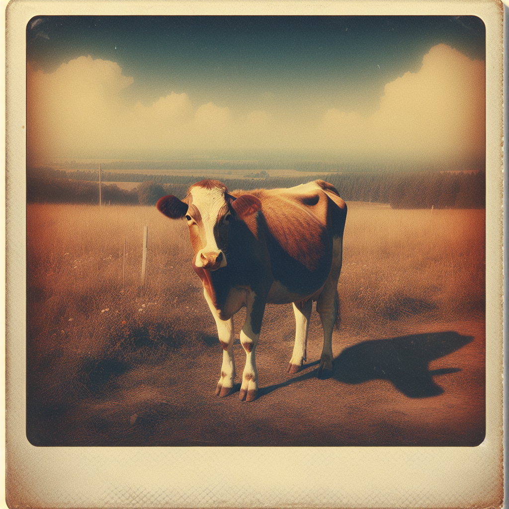
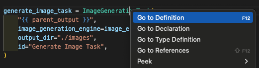

# Creating Images


## Overview
Image Generation via Griptape is handled via a few components.

* **Image Generation Driver** - Determines the model to be used. For example, [OpenAI DALL·E 3](https://openai.com/dall-e-3){target="_blank"} or [Leonardo.AI](https://leonardo.ai/){target="_blank"}.
* **Image Generation Engines** - The engine that facilitates the use of the Driver.
* **Image Generation Task** or **Image Generation Tool**. The Task or Tool is what will be provided to the Griptape Structure. Pipelines and Workflows can use `PromptImageGenerationTask` directly. You can provide an `PromptImageGenerationTool` to an Agent, to a ToolTask, or to a ToolkitTask.

For example, to create an image with OpenAI DALL·E 3 as a **task** you could do something like:

```python

# Create an Image Generation Driver
driver = OpenAiDalleImageGenerationDriver(
    model="dall-e-3", api_type="open_ai", image_size="1024x1024"
)

# Create an Image Generation Engine
engine = PromptImageGenerationEngine( image_generation_driver=driver )

# Create an Image Generation Task
task = PromptImageGenerationTask(
    "Create a drawing of a pineapple",
    image_generation_engine=engine,
    output_dir="./images"
)
```

Once you generate the task, you will add it to the pipeline or workflow.

You can also use the `PromptImageGenerationClient` tool and assign it to an Agent. It takes many of the same arguments. If you had previously created the `driver` and `engine` as specified above, you would do something like:

```python
agent = Agent(
    tools=[PromptImageGenerationClient(
        image_generation_engine=engine,
        output_dir="./images",
        off_prompt=False,
    )]
)
```

The main thing to be aware of is that you must use _both_ components - Driver and Engine. You choose the model with the **Driver**, use the **Engine** to facilitate the use of the model, and then access the engine with either a **Task** or a **Tool**.

In this course, because we're focusing on image generation as part of a _Pipeline_, we'll generate images using a _Task_.

## The Image Task

To get started, we'll begin by replacing the Fake Image Generation task with a real one, using OpenAI DALL·E 3. We'll start with the basics, and adjust settings in a future step. For now, we just want to get things working.

### Imports

To use the Driver, Engine, and Task we'll need to add them to our `imports` section in `app.py`. You'll modify `griptape.tasks` to include `PromptImageGenerationTask`, and add imports for the Driver and Engine.

```python hl_lines="5-7"
# ...

# Griptape
from griptape.structures import Pipeline
from griptape.tasks import PromptTask, PromptImageGenerationTask
from griptape.drivers import OpenAiDalleImageGenerationDriver
from griptape.engines import PromptImageGenerationEngine

# ...
```

### Create the Driver

Now we'll create our image generation driver. We'll dive into detail about some of the settings on the driver later, but first we'll get everything hooked up and working. Remember, the Driver controls what Image Generation Model we'll be using.

In `app.py`, create the driver before you create the pipeline.

```python hl_lines="5-8"
# ...

load_dotenv()  # Load your environment

# Create the driver
image_driver = OpenAiDalleImageGenerationDriver(
    model="dall-e-3", api_type="open_ai", image_size="1024x1024"
)

# Create the pipeline object
# ...
```

### Create the Engine

The engine facilitates the use of the particular model. It will be what we pass to the task or tool. After the creation of the driver, create the engine:

```python hl_lines="8-9"
# ...

# Create the driver
image_driver = OpenAiDalleImageGenerationDriver(
    model="dall-e-3", api_type="open_ai", image_size="1024x1024"
)

# Create the engine
image_engine = PromptImageGenerationEngine(image_generation_driver=image_driver)

# Create the pipeline object
# ...
```

### Replace the ImageTask

Next, we'll replace our fake image generation task with a _real_ image generation task. Find the section of the code where we're creating the image task with `generate_image_task` and replace it with `PromptImageGenerationTask`.

```python
# ...

generate_image_task = PromptImageGenerationTask(
    "{{ parent_output }}",
    image_generation_engine=image_engine,
    output_dir="./images",
    id="Generate Image Task",
)

# ...
```

Notice we're giving it the `image_generation_engine` we defined earlier as `image_engine`. We're also specifying an `output_dir` of `./images`. This will ensure the image is generated in that directory. 

!!! tip
    With the `PromptImageGenerationTask`, if you want to save the file to disk you must specify specify _either_ the output file name (`output_file`) or the directory you want the images to appear in (`output_dir`). If you don't, the image generated will only exist in the `ImageArtifact`. 
    
    I recommend saving the file using `output_dir`, as we'll be able to retrieve the name of the image artifact in the next task.

### Test

Give your application a test run. In the results you will see an ImageGenerationTask getting run, and then information on the image size and where it's written out. Here's a section of the resulting log. I've highlighted the log information of the file being written and the Output. 

!!! info
    Notice the image name _is not_ in the `Output` text. It's part of the INFO, but not in Output - therefore not getting passed back from the Image Generation Task. I'll demonstrate how to get it later in this section.

```text hl_lines="5-8"
[12/16/23 17:58:27] INFO     PromptTask Create Prompt Task                                                                            
                             Output: "Generate an image of a cow, styled and framed as if it were taken with a 1970s Polaroid camera."
                    INFO     ImageGenerationTask Generate Image Task                                                                  
                             Input: "Generate an image of a cow, styled and framed as if it were taken with a 1970s Polaroid camera." 
[12/16/23 17:58:41] INFO     Saving [Image, dimensions: 1024x1024, type: image/png, size: 3147861 bytes] to                           
                             /Users/jason/Documents/courses/griptape-image-pipeline/images/image_artifact_231216175841_iuy3.png       
                    INFO     PromptImageGenerationTask Generate Image Task                                                                  
                             Output: Image, dimensions: 1024x1024, type: image/png, size: 3147861 bytes                               
```

As you can see, the image has been written to the `./images` directory. Let's take a look at it!



Beautiful! 

## The Display Image Task

At the moment if you look at the output from the `Display Image task`, we're using `{{ parent_output }}` to get the data from the `PromptImageGenerationTask`. However, looking at the logs you can see the information does not contain the information we want - the path to the actual file. I've highlighted the `Output` from the `PromptImageGenerationTask`, and the `input` for the `Display Image Task`. Notice the image name isn't there.

```text hl_lines="4 6-8"
[12/17/23 05:16:32] INFO    Saving [Image, dimensions: 1024x1024, type: image/png, size: 3147861 bytes] to
                            /Users/jason/Documents/courses/griptape-image-pipeline/images/image_artifact_231217051632_wazr.png
                    INFO    PromptImageGenerationTask Generate Image Task
                    Output: Image, dimensions: 1024x1024, type: image/png, size: 3147861 bytes
                    INFO    PromptTask Display Image Task
                    Input:
                        Pretend to display the image to the user.
                        Image, dimensions: 1024x1024, type: image/png, size: 3147861 bytes.     

[12/17/23 05:16:35] INFO    PromptTask Display Image Task                         
                    Output: [Displaying Image]   
                    Image Details:
                        - Dimensions: 1024x1024
                        - Type: image/png  
                        - Size: 3147861 bytes                                  
```

So how do we get the name of the image? 

Fortunately, there is more information you can get from the `parent` task in a pipeline.

### Pipeline Context

Take a look at the [Context](https://docs.griptape.ai/latest/griptape-framework/structures/pipelines/#context){target="_blank"} section of the Griptape Pipeline documentation. It points out that Pipelines have access to a few context variables:

* `parent_output` : output from the parent. We've been using this one.
* `parent` : parent task.
* `child` : child task.

We know the `parent_output` doesn't include the information we want - but what about the `parent`? What attributes are available in the task itself?

In order to discover that, we need to know what kind of `Artifact` the task outputs. This will tell us the attributes we can get. For example, the `BaseArtifact` contains attributes like `id`, `name`, `value`, and `type`. This means any type of artifact based on the `BaseArtifact` will have those attributes, and you can get them by using something like `{{ parent.output.value }}`, `{{ parent.output.id}}`, `{{parent.output.name}}`, etc.

!!! tip
    Artifacts are used for passing different types of data between Griptape components. 

However, if we do this with our code you'll see that the `value` being passed back from the ImageGenerationTask are the _raw bytes of the image_. It's _way_ too big for the LLM, and isn't what we want anyway. 

To demonstrate (and so you don't need to do it yourself), I'm going to replace the `{{ parent_output }}` in the `display_image_task` with `{{ parent.output.value }}` and show the results.

```python hl_lines="6"
# ...

display_image_task = PromptTask(
    """
    Pretend to display the image to the user. 
    {{ parent.output.value }}
    """,
    id="Display Image Task",
)

# ...
```

The result is a giant wall of text like:

```text
02\x03\x02\x02\xfb\xfd\xfc\xfc\xfb\x01\x01\x02\xff\x04\x06\x02\x01\x00\x01\xff\x00\xff\xff\xfb\xfb\x03\x06\x05\xff\xfc\x01\xfd\x02\xfd\n\x06\x08\xef\xf2\xf3\x0b\x0b\x07\xff\xff
\x02\xfb\xfb\xfc\x05\x06\x03\xfa\xfc\xff\xf8\xf9\xfb\x06\x07\x06\x02\x00\x00\xfb\xfb\xfc\x03\x04\x04\xfe\xff\xfe\x02\x03\x03\xff\xfb\xfc\xff\x00\x00\x03\x05\x02\x02\x01\x00\xfa
\xf7\xfd\xff\x01\x02\xfb\xfe\xfe\x07\x08\x04\xfa\xfc\xfe\x01\xff\x02\x03\x01\xfc\xfe\xfa\xfb\x00\x05\x06\xfe\x00\x01\x02\x00\x02\xff\xfd\xff\xfa\xfb\xfc\x01\x04\x02\xee\xf3\xf6
\x01\x04\x04\xfc\xff\x01\xf7\xf9\xf9\x01\x01\x03\x05\x03\x03\t\n\x06\x01\xff\xfe\x03\x01\x02\x01\xfe\xff\x04\x02\x00\x0b\x06\x04\x00\x01\xff\xff\xfe\xfe\x04\x04\x04\xf9\xfa\xfd
\xfd\xfe\xff\x02\x03\x00\xff\x01\x02\xf8\xfb\xfa\x02\xff\x03\xfe\xff\xfe\xff\x00\x00\xf8\xfd\xff\x04\x02\x01\x03\xfc\x00\x01\x01\x00\xf6\xfb\xfb\x0c\x0c\t\x01\x03\xfe\xfb\xfa\x
ff\xfb\xfb\xfc\x01\x00\x01\xf5\xf9\xfb\t\x0e\x0b\xef\xf8\xf8\xf0\xf0\xf9\xf5\xf8\xfa\xfe\x01\x05\xf8\xfe\xfc\xfd\xfe\x00\xf8\xf8\xfc\xf9\xf9\xfc\x07\n\x07\xf6\xf7\xfc\xfd\x01\x
ff\xf7\xfa\xfc\x01\x02\x01\x02\x04\x07\xf9\xfb\xfb\xff\xff\xfe\x01\x04\x03\xfe\x00\xfe\xff\xfe\x00\x05\x04\x05\x01\xff\xff\xfa\xf8\xfc\t\t\x03\x02\xff\x00\xf8\xfa\xfc\x02\x01\x
03\x06\x05\x01\x01\x00\x00\xfb\xfb\xff\x05\x02\xff\r\x07\x01\x08\x06\x00\x04\xfb\xff\n\x08\x03\x01\xfe\xfe\xfd\x00\x01\x01\x01\xff\x04\x03\x02\xfd\xfc\xff\x00\x05\x03\x00\x01\x
01\xf8\xf8\xff\xf4\xfa\xff\x06\x02\x00\x05\x03\x02\x03\x01\xfd\xfa\xfb\xfc\x02\x03\x04\xf9\xf8\xfd\x07\x0b\t\xf9\xfc\xfa\xfa\xfd\x01\xff\xff\x00\x06\x08\x06\xfa\xf9\xf9\x01\x01
\x01\xf9\xfb\xfb\x08\x06\x06\xff\xfd\xfc\r\x10\t\xfa\xf8\xfa\x04\x00\x00\xfb\xf8\xfc\x04\x07\x06\x02\x03\xff\x05\x02\x03\r\n\x07\xf4\xf2\xf8\x05\x04\x01\x01\x02\x00\xf8\xf9\xfc
```

So obviously the `.value` isn't what we want in this case.

But what other attributes are available?

To discover this, we need to navigate our code and view what Artifact the `ImageGenerationTask` outputs.

### PromptImageGenerationTask Artifact

In Visual Studio Code, you can learn more about components of your code by Navigating to it. 

To do this, hover over `PromptImageGenerationTask` use the Keyboard shortcut ++command++ on Mac, or ++ctrl++ on Windows and click on it. Additionally, you can just click on `PromptImageGenerationTask` with the Right Mouse Button and choose **Go to Definition**



This will open the class definition `PromptImageGenerationTask` in your editor (`prompt_image_generation_task.py`).

If you scroll down in the code until you find the section where the `run` method is defined, you'll see the output artifact:

```python hl_lines="3"
# ...

    def run(self) -> ImageArtifact:
        image_artifact = self.image_generation_engine.generate_image(
            prompts=[self.input.to_text()], rulesets=self.all_rulesets, negative_rulesets=self.negative_rulesets
        )

# ...
```

As you can see, it is an `ImageArtifact`. 

Navigate to this definition (again, using ++cmd++ click, ++ctrl++ click, or `RMB --> Go to Definition`).

At the top of the class you'll see the attributes being defined:

```python title="image_artifact.py"
# ...

class ImageArtifact(BlobArtifact):
    """ImageArtifact is a type of BlobArtifact that represents an image.

    Attributes:
        value: Raw bytes representing the image.
        name: Artifact name, generated using creation time and a random string.
        mime_type: The mime type of the image, like image/png or image/jpeg.
        width: The width of the image in pixels.
        height: The height of the image in pixels.
        model: Optionally specify the model used to generate the image.
        prompt: Optionally specify the prompt used to generate the image.
    """
# ...
```

Remember previously I tried replacing `{{ parent_output }}` with `{{ parent.output.value}}`. As you can see from the definition, the `value` is the "Raw bites representing the image".

But what other attributes do you see available that might be useful?

How about that `name` attribute? It says it's the name of the artifact, generated using creation time and a random string. Let's swap that in and give it a try.

### parent.output.name

Navigate back to your `app.py` in Visual Studio Code.

Inside the `display_image_task` section, replace `{{ parent_output }}` with `{{ parent.output.name }}`.

```python title="app.py" hl_lines="6"
# ...

display_image_task = PromptTask(
    """
    Pretend to display the image to the user. 
    {{ parent.output.name }}
    """,
    id="Display Image Task",
)

# Add tasks to pipeline
# ...
```

!!! note
    It's important to note that it's not `{{ parent_output_name }}`. We're grabbing an attribute of `parent` task. We need to use `.`, not `_`.
    
### Test

Run the code and in the logs take a look at the `Input` to the `Display Image Task`.

```text hl_lines="5-8"
[12/17/23 06:03:36] INFO    Saving [Image, dimensions: 1024x1024, type: image/png, size: 3147861 bytes] to
                            /Users/jason/Documents/courses/griptape-image-pipeline/images/image_artifact_231217060336_570j.png             
                    INFO    PromptImageGenerationTask Generate Image Task
                            Output: Image, dimensions: 1024x1024, type: image/png, size: 3147861 bytes
                    INFO    PromptTask Display Image Task 
                            Input:
                                Pretend to display the image to the user.
                                image_artifact_231217060336_570j.png 
                                         
[12/17/23 06:03:39] INFO    PromptTask Display Image Task
                            Output: [Displaying Image: image_artifact_231217060336_570j.png]
```

See how it now gives us the name of the image? This is exactly what we need, except it's not the _full path_. Remember in the `PromptImageGenerationTask` we're specifying the `output_dir`. We should be sure to include this as well.

Let's add some more context to the task, providing the `output_dir`. We'll also create a variable earlier in our code for the `output_dir` so we only need to define it once.

### Define `output_dir`

In `app.py`, right after `load_dotenv()`, let's create a section for any variables we might want. At the moment it's just `output_dir`, but it's always good to define these in a single place.

```python title="app.py" hl_lines="5-6"
# ...

load_dotenv() # Load your environment

# Variables
output_dir = "./images"

# Create the driver
# ...
```

### Replace in `generate_image_task`

Now go down to the `generate_image_task` and use the `output_dir` variable in the `PromptImageGenerationTask`.

```python title="app.py" hl_lines="6"
# ...

generate_image_task = PromptImageGenerationTask(
    "{{ parent_output }}",
    image_generation_engine=image_engine,
    output_dir=output_dir,
    id="Generate Image Task",
)

# ...
```

### Create context in `display_image_task`

Finally, back to the `display_image_task`, we'll create a `context`, provide the `output_dir`, and use it in our prompt.

```python title="app.py" hl_lines="6 8"
# ...

display_image_task = PromptTask(
    """
    Pretend to display the image to the user. 
    {{output_dir}}/{{ parent.output.name }}
    """,
    context={"output_dir": output_dir},
    id="Display Image Task",
)

# ...
```

### Test

Run the code again and let's check the Input to the `Display Image Task`:
```text hl_lines="2-4"
                    INFO    PromptTask Display Image Task
                    Input:
                            Pretend to display the image to the user.
                            ./images/image_artifact_231217061650_zrmz.png 
```

Perfect! That's exactly what we need to be able to give to the _real_ display image step - the path of the file that's been generated.

---

## Code Review

You can now generate an image using the prompt. Excellent work! Let's review the current state of our application:

```python linenums="1" title="app.py" hl_lines="5-7 11-12 14-17 19-20 36-41 46 48"
from dotenv import load_dotenv

# Griptape
from griptape.structures import Pipeline
from griptape.tasks import PromptTask, PromptImageGenerationTask
from griptape.drivers import OpenAiDalleImageGenerationDriver
from griptape.engines import PromptImageGenerationEngine

load_dotenv()  # Load your environment

# Variables
output_dir = "./images"

# Create the driver
image_driver = OpenAiDalleImageGenerationDriver(
    model="dall-e-3", api_type="open_ai", image_size="1024x1024"
)

# Create the engine
image_engine = PromptImageGenerationEngine(image_generation_driver=image_driver)

# Create the pipeline object
pipeline = Pipeline()

# Create tasks
create_prompt_task = PromptTask(
    """
    Create a prompt for an Image Generation pipeline for the following topic: 
    {{ args[0] }}
    in the style of {{ style }}.
    """,
    context={"style": "a 1970s polaroid"},
    id="Create Prompt Task",
)

generate_image_task = PromptImageGenerationTask(
    "{{ parent_output }}",
    image_generation_engine=image_engine,
    output_dir=output_dir,
    id="Generate Image Task",
)

display_image_task = PromptTask(
    """
    Pretend to display the image to the user. 
    {{output_dir}}/{{ parent.output.name }}
    """,
    context={"output_dir": output_dir},
    id="Display Image Task",
)

# Add tasks to pipeline
pipeline.add_tasks(create_prompt_task, generate_image_task, display_image_task)

# Run the pipeline
pipeline.run("a cow")

```

## Next Step
Our next task is to replace our fake Display Image with a real one. There are a few ways we can achieve this within a Griptape Pipeline. 

1. **Tasks** - Create a new type of Task that just displays an image.
2. **Tools** - Create a Tool that displays an image, and then use `ToolTaask` or `ToolkitTask` to integrate it into the Pipeline.
3. **Plain ol' Python** - Because we're running a Pipeline in Python, we can just ignore adding anything to our structure and just display the output of the Image Generation task as we want.

All three of these methods are valid, but in the context of this course we're going to look at creating our own Tool to display the image. The reason for this is flexibility with integration in future workflows. Imagine creating images with an Agent through a chat experience. If you have a Tool, you can simply add it to the Agent and ask it to display the image whenever it's ready. You can insert it into a Pipeline or Workflow by using `ToolTask` or `ToolkitTask`. The possibilities are numerous.

In the near future we'll be creating a course specifically around creating and sharing Tools. For now, we're going to re-purpose material from the [Shotgrid Client](../shotgrid-client/index.md) course where we discuss creating tools. The next two sections of this course are taken from there. They give a detailed [understanding](05_understanding_tools.md) of tools, and help you create your [first tool](06_first_tool.md).

If you already have created tools in the past, and have a deep understanding of how to create them, feel free to skip ahead to the [Display Image Tool](07_display_image_tool.md) section. Otherwise, let's dive in and learn more about how [Griptape Tools](05_understanding_tools.md) work.