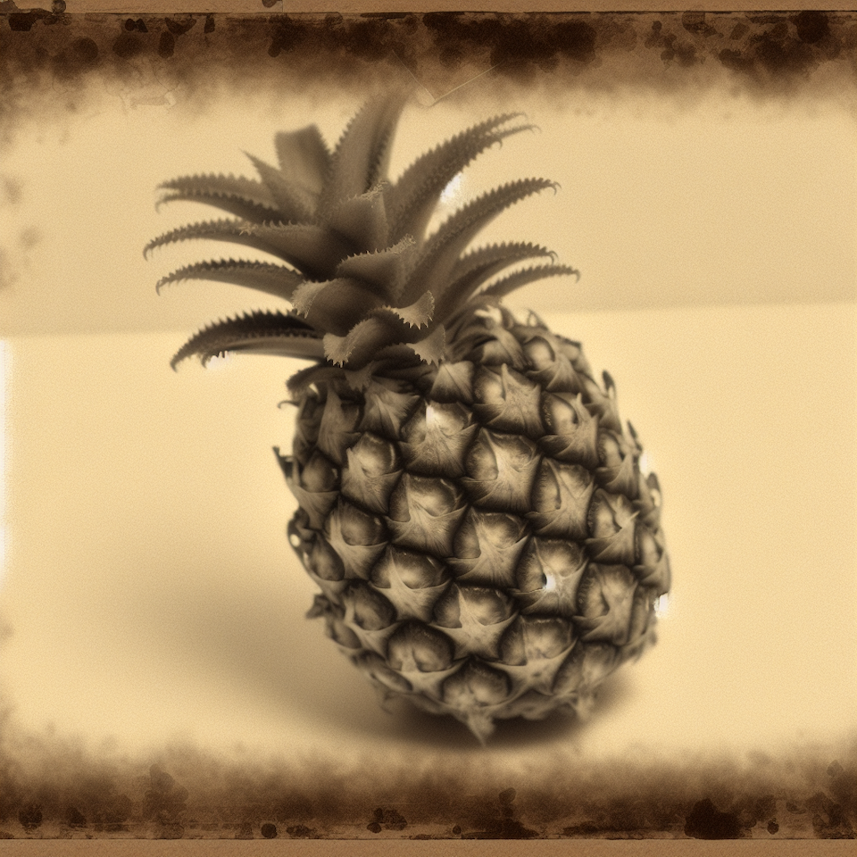

# DALL·E 3


## Overview
You've been creating images using DALL·E 3 in this course so far, but you've been using some basic attributes with the `OpenAiDalleImageGenerationDriver`. Let's take a look at some of the other attributes available in Griptape.

Here's an example of calling driver with various attributes set:

```python
image_driver = OpenAiDalleImageGenerationDriver(
    model="dall-e-3", 
    api_type="open_ai", 
    image_size="1024x1024", 
    style="natural", 
    quality="hd"
)

```
## Finding the attributes

Drivers may change over time. At the time of this writing, certain attributes are available - but this is guaranteed to evolve. To stay up to date, it's recommended to review the Driver Classes periodically to see what the attributes are.

To see them, simply hover over the `OpenAiDalleImageGenerationDriver` in Visual Studio Code and ++ctrl++ click, ++cmd++ click, or choose `Right Mouse Button --> Go to Definition..`. This will open the class in a new tab.

As of December 19, 2023 the attributes availaboe for the `OpenAiDalleeImageGenerationDriver` are:

```yaml
model: OpenAI DALLE model, for example 'dall-e-2' or 'dall-e-3'.
api_type: OpenAI API type, for example 'open_ai' or 'azure'.
api_version: API version.
base_url: API URL.
api_key: OpenAI API key.
organization: OpenAI organization ID.
style: Optional and only supported for dall-e-3, can be either 'vivid' or 'natural'.
quality: Optional and only supported for dall-e-3. Accepts 'standard', 'hd'.
image_size: Size of the generated image. Must be one of the following, depending on the requested model:
    dall-e-2: [256x256, 512x512, 1024x1024]
    dall-e-3: [1024x1024, 1024x1792, 1792x1024]
response_format: The response format. Currently only supports 'b64_json' which will return
    a base64 encoded image in a JSON object.

```

We will cover the most commonly edited attributes.

## Model Selection

Griptape provides access to two different OpenAI DALL·E models, DALL·E 2 and DALL·E 3. To choose them, you'll set `model` to either `dall-e-2` or `dall-e-3`.

There are different attributes available, depending on the model.

```python
OpenAiDalleImageGenerationDriver( model="dall-e-3" ) # DALL·E 3
```
```python
OpenAiDalleImageGenerationDriver( model="dall-e-2" ) # DALL·E 2
```

## Size

It's possible to specify the size of the resulting images. Depending on which model you choose, you have a different series of sizes.

When using DALL·E 3, you have access to 3 sizes: `1024x1024`, `1024x1792`, and `1792x1024`. DALL·E 2 allows for `256x256`, `512x512`, `1024x1024`.

Set the size using the `image_size` attribute:

```python
OpenAiDalleImageGenerationDriver( 
    model="dall-e-3",
    image_size: "1024x1024" 
    ) 
```

## Style

This attribute is _only supported for DALL·E 3_. It can be either 'vivid' or 'natural'. Vivid causes the model to lean towards generating hyper-real and dramatic images. Natural causes the model to produce more natural, less hyper-real looking images. Defaults to ‘vivid’. 

Here are two examples of pineapples created with the same prompt we've been using - a 1970s polaroid. The image on the left is the "natural" image, and the one on the right is "vivid".

<div class="grid-gallery" markdown>
- 
- 

</div>

```python
OpenAiDalleImageGenerationDriver( 
    model="dall-e-3",
    style="vivid"
    ) 
```

## Quality

Also only for DALL·E 3, you can specify the `quality` of the resulting image. ‘hd’ creates images with finer details and greater consistency across the image. Defaults to ‘standard’.

With the images below, the left is `standard`, right is `hd`.

<div class="grid-gallery" markdown>
- 
- 

</div>

```python
OpenAiDalleImageGenerationDriver( 
    model="dall-e-3",
    quality="hd"
    ) 
```


## API Type

You can choose which API you'd like to use. Griptape allows either `open_ai` or `azure` if you're using DALL·E on Microsoft Azure.

---

## Next Step
Learn more about using [Leonardo.ai](09_leonardo-ai.md) in the next section.