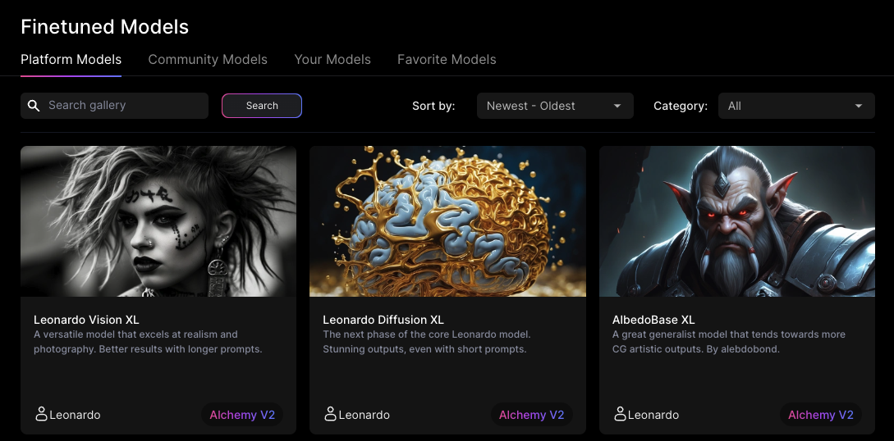
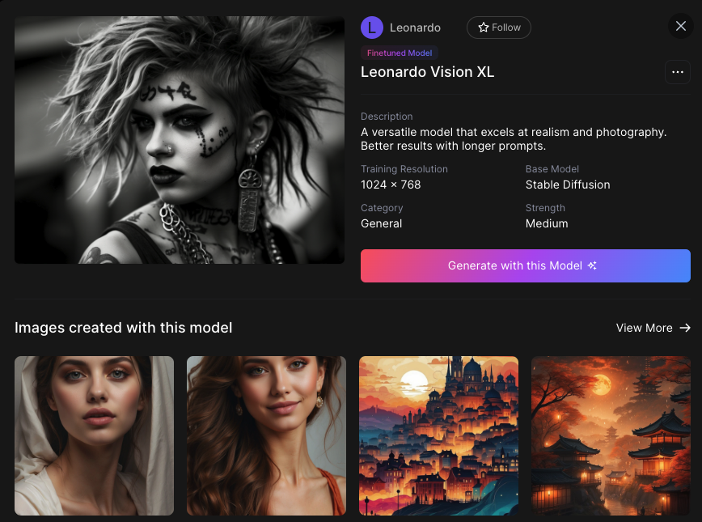
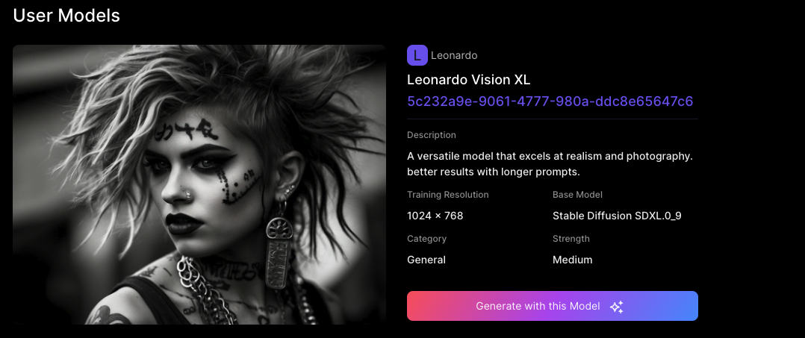
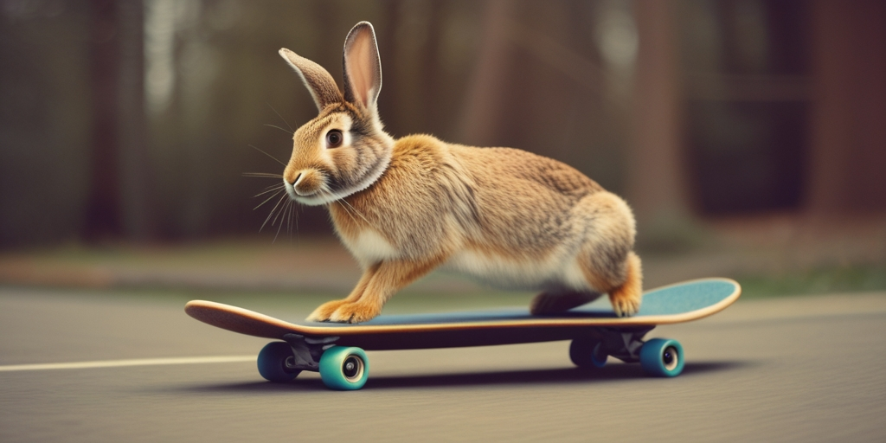
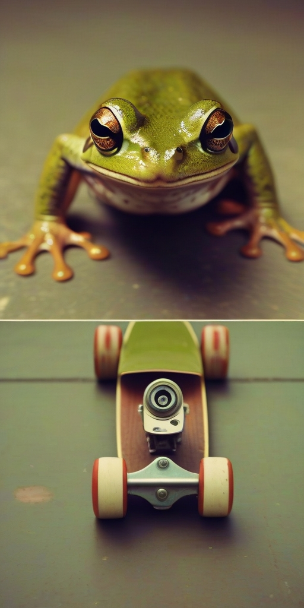

# Leonardo.AI

## Overview
[Leonardo.Ai](https://leonardo.ai){target="_blank"} is a powerful image generation model that offers some fantastic options. Two notable ones are the ability to train and utilize a model to achieve a specific graphic style. Another is the ability to set a `seed` value - providing more consistent output.

The following two images are from the same prompt, but using different models.

<div class="grid-gallery" markdown>
- 
- 

</div>

## Getting a Key

To use Leonardo.Ai you will need an API key.

* Sign up for a [Leonardo.Ai account](https://docs.leonardo.ai/docs){target="_blank"}
* Save your `LEONARDO_API_KEY` in your `.env` file.

## Importing

Update your `imports` section to import the `LeonardoImageGenerationDriver` and `os` so you can get the API Key environment variable.

```python
# ...
from griptape.drivers import LeonardoImageGenerationDriver
# ...

import os

```

## Create the Driver

When creating the driver, you can specify the `LeonardoImageGenerationDriver` instead of `OpenAiDalleImageGenerationDriver`. It has some similar attributes to the OpenAi driver, but there are a few notable differences.

At a minimum, you must specify the `model` and the `api_key`. This example uses the [Leonardo Vision XL model](https://app.leonardo.ai/models/5c232a9e-9061-4777-980a-ddc8e65647c6) - a versatile model that excels at realism and photography.

```python
# Create the driver
image_driver = LeonardoImageGenerationDriver(
    api_key=os.getenv("LEONARDO_API_KEY"),
    model="5c232a9e-9061-4777-980a-ddc8e65647c6", 
)
```

Below is the full list of attributes that are available.

```yaml
model: The ID of the model to use when generating images.
api_key: The API key to use when making requests to the Leonardo API.
requests_session: The requests session to use when making requests to the Leonardo API.
api_base: The base URL of the Leonardo API.
max_attempts: The maximum number of times to poll the Leonardo API for a completed image.
image_width: The width of the generated image in the range [32, 1024] and divisible by 8.
image_height: The height of the generated image in the range [32, 1024] and divisible by 8.
steps: Optionally specify the number of inference steps to run for each image generation request, [30, 60].
seed: Optionally provide a consistent seed to generation requests, increasing consistency in output.
```


## API Key

If you have set the `LEONARDO_API_KEY` in your `.env` file, and imported the `os` library, you can specify it when you load the driver:

```python
# Create the driver
image_driver = LeonardoImageGenerationDriver(
    api_key=os.getenv("LEONARDO_API_KEY"),
    # ...
)

```

## Model Selection

Leonardo.Ai's model selection is vast. To find a particular model, I highly recommend viewing their [Platform Model Library](https://app.leonardo.ai/finetuned-models). 



To choose a particular model, you'll need to find the model ID. To find the ID:

1. Click on the image of the model you're interested in.
2. A modal will appear with more information about the model. You'll see the Name, the Description, and more.

    

3. Click **View More -->** to open a more detailed page about this model.

    

4. Select the model ID and **copy** it. It's the long string of random characters located under the name of the model. It should look something like:
`5c232a9e-9061-4777-980a-ddc8e65647c6`.

5. Use that string in your code:

    ```python
    
    # Create the driver
    image_driver = LeonardoImageGenerationDriver(
        # ...
        model="5c232a9e-9061-4777-980a-ddc8e65647c6", 
    )

    ```

## Size

It's possible to specify the size of the resulting images. Leonardo.Ai allows you to specify width and height directly using `image_width` and `image_height`. Important - values must be between `32` and `1024`, and be a multiple of `8`.

Examples: `32`, `64`, `128`, `512`, `1024`

```python
LeonardoImageGenerationDriver( 
    model="5c232a9e-9061-4777-980a-ddc8e65647c6",
    image_height: 1024,
    image_width: 512,
    ) 
```


## Seed

The seed attribute is great for ensuring consistent results. For example, here are 3 images created with the same seed. Note the consistent quality:





```python
image_driver = LeonardoImageGenerationDriver(
    seed="42",
    # ...
)
```

## Steps

The steps allow you to identify the number of inference steps (iterations) to run for each image generation request. The number of steps often correlates with the quality and coherence of the final image.

Here are three images of a frog on a skateboard, with inference steps set to `10`, `30`, and `60`

<div class="grid-gallery grid-3" markdown>
- 
- 
- 

</div>

```python
image_driver = LeonardoImageGenerationDriver(
    steps=60,
    # ...
)
```


```

## Next Step
You now have a working pipeline for creating and displaying an image. Now we'll start taking a look at some of the options available to us with each of the Image Generation Drivers available in Griptape. 