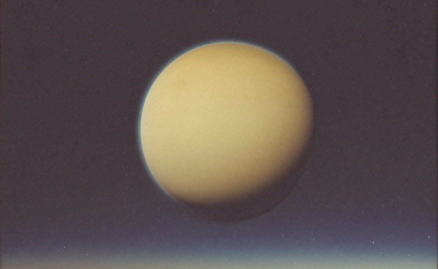
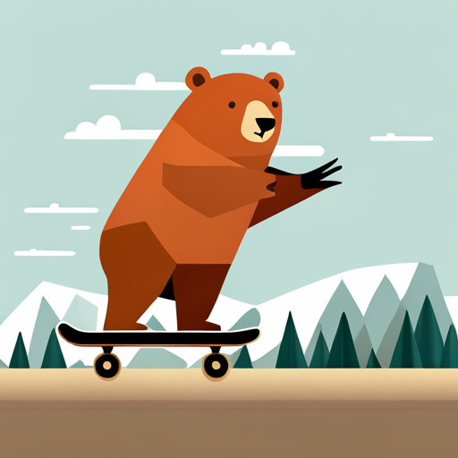
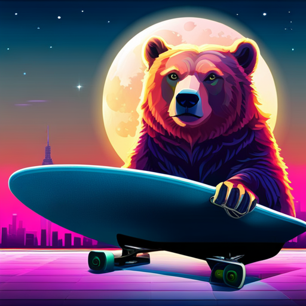
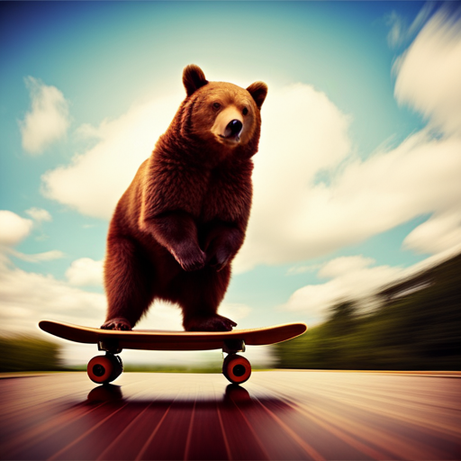
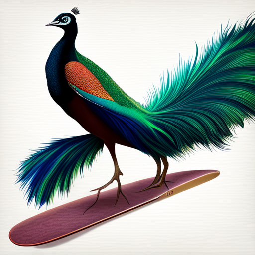
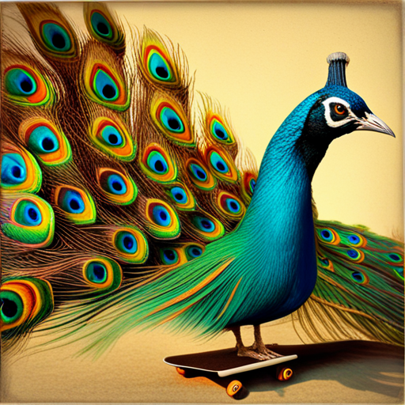

# Amazon Bedrock



## Overview

Amazon Bedrock offers a couple of different image generation models, and thus the method of using them is slightly different than DALL·E 3 and Leonardo.Ai.

Instead of just importing one driver, you import `AmazonBedrockImageGenerationDriver` and then the model driver: `AmazonBedrockStableDiffusionImageGenerationModelDriver` or `AmazonBedrockTitanImageGenerationModelDriver`.

When specifying which model driver, you _also_ will need to specify the `model` in the `AmazonBedrockImageGenerationDriver`.

It looks something like:

```python
image_driver = AmazonBedrockImageGenerationDriver(
    model="stability.stable-diffusion-xl-v0", # Model Definition
    image_generation_model_driver=AmazonBedrockStableDiffusionImageGenerationModelDriver(), # Driver
    # ...
)
```

We'll get into the specifics, but first it's important to ensure you have access to Amazon Bedrock, as it's a requirement to use either of these two models.

### AWS Access

* Ensure you have an AWS account
* Ensure you have access to the appropriate model by following the [Amazon Documentation](https://docs.aws.amazon.com/bedrock/latest/userguide/model-access.html){target="_blank"}
* Add the following environment variables to your `.env` file:
    * `AWS_REGION_NAME`
    * `AWS_ACCESS_KEY_ID`
    * `AWS_SECRET_ACCESS_KEY`

### boto3

You'll need to use `boto3` to access Amazon Bedrock. 

To install `boto3` by going to your terminal inside Visual Studio Code and:

* If using `pip`, type:
    ```bash
    pip install boto3
    ```
* If using `poetry` type:
    ```bash
    poetry add boto3
    ```

## Import

Let's import boto3, os, and all three drivers, and then we'll discuss their differences.

In your `app.py` imports section, add the three drivers:

```python
# ...

import boto3
import os

# ...

from griptape.drivers import (
    AmazonBedrockImageGenerationDriver,
    AmazonBedrockStableDiffusionImageGenerationModelDriver,
    AmazonBedrockTitanImageGenerationModelDriver
)

# ...

```

## Create a session

You will need a `boto3` session to pass to `AmazonBedrockImageGenerationDriver`. I recommend you create this after the `# Variables` section of your code:

```python
# ...

# Boto3
session = boto3.Session(
    region_name=os.getenv("AWS_REGION_NAME"),
    aws_access_key_id=os.getenv("AWS_ACCESS_KEY_ID"),
    aws_secret_access_key=os.getenv("AWS_SECRET_ACCESS_KEY"),
)

# ...
```

## Image Driver

To create the Image Driver, you're going to specify three attributes:

* `session` : This is the boto3 session you created earlier.
* `model` : This is the particular model you will be using. The list of models you have available to your account is in the AWS Console [here](https://us-east-1.console.aws.amazon.com/bedrock/modelaccess). Here are some examples you may have access to:
    * `amazon.titan-image-generator-v1`
    * `stability.stable-diffusion-xl-v0`
    !!! tip
        To get a list of all the models you have access to, you can add the following code after you defined `session`:
        ```python
        bedrock = session.client("bedrock")
        models = bedrock.list_foundation_models()
        for model in models["modelSummaries"]:
            if model["outputModalities"] == ["IMAGE"]:
                print(model["modelId"])    
        ```

        This will print a list of all models you should be able to use. 
* `image_generation_model_driver` : This is the specific Model Driver Class you imported above.

    !!! important
        You must specify the correct `model` for the `image_generation_model_driver` you're using. Specifying a `titan` model with `StableDiffusion` won't work.

### Attributes

Below is the full list of attributes available.

```yaml
model: Bedrock model ID.
session: boto3 session.
bedrock_client: Bedrock runtime client.
image_width: Width of output images. Defaults to 512 and must be a multiple of 64.
image_height: Height of output images. Defaults to 512 and must be a multiple of 64.
seed: Optionally provide a consistent seed to generation requests, increasing consistency in output.
image_generation_model_driver: Image Generation Model Driver to use.
```

## Stable Diffusion

Here's an example of a simple driver using Stable Diffusion. Notice the `model` and the `image_generation_model_driver` are both set.

```python hl_lines="3 4"
image_driver = AmazonBedrockImageGenerationDriver(
    session=session,
    model="stability.stable-diffusion-xl-v0",
    image_generation_model_driver=AmazonBedrockStableDiffusionImageGenerationModelDriver(),
)
```

There are a number of attributes available for Stable Diffusion. We'll cover details of a few key ones.

```yaml
cfg_scale: How strictly the diffusion process adheres to the prompt text (higher values keep your image closer to your prompt). The default is 7. 
style_preset: Pass in a style preset to guide the image model towards a particular style. 
clip_guidance_preset: CLIP Guidance is a technique that uses the CLIP neural network to guide the generation of images to be more in-line with your included prompt, which often results in improved coherency.
sampler: Which sampler to use for the diffusion process. If this value is omitted it automatically selects an appropriate sampler.
steps: The number of diffusion steps to run. The default is 30.
```

### style_preset

The `style_preset` is a fun one to work with. Instead of modifying the prompt, you can try various styles. Here are some variations of `bear on a skateboard` - still with the 1970s polaroid theme, but passing different `style presets`. 

In order they're: `line-art`, `neon-punk`, `photographic`.

<div class="grid-gallery grid-3" markdown>
- 
- 
- 

</div>

```python hl_lines="5"
image_driver = AmazonBedrockImageGenerationDriver(
    session=session,
    model="stability.stable-diffusion-xl-v0",
    image_generation_model_driver=AmazonBedrockStableDiffusionImageGenerationModelDriver(
        style_preset="neon-punk",
    ),
)

```

The full options available are: `3d-model` `analog-film` `anime` `cinematic` `comic-book` `digital-art` `enhance` `fantasy-art` `isometric` `line-art` `low-poly` `modeling-compound` `neon-punk` `origami` `photographic` `pixel-art` `tile-texture`

### Sampler

Which sampler to use for the diffusion process. The default is `K_DPMPP_2M`. This can be quite confusing, so there's a helpful guide here about which samplers to use: [https://stable-diffusion-art.com/samplers/](https://stable-diffusion-art.com/samplers/){target="_blank"}.

```python hl_lines="5"
image_driver = AmazonBedrockImageGenerationDriver(
    session=session,
    model="stability.stable-diffusion-xl-v0",
    image_generation_model_driver=AmazonBedrockStableDiffusionImageGenerationModelDriver(
        sampler="K_DPM_2",
    ),
)
```

The options available are: `DDIM` `DDPM` `K_DPMPP_2M` `K_DPMPP_2S_ANCESTRAL` `K_DPM_2` `K_DPM_2_ANCESTRAL` `K_EULER` `K_EULER_ANCESTRAL` `K_HEUN` `K_LMS`

### CLIP guidance

The `clip_guidance_preset` uses a neural network to guide the generation of images. You can see more information about it in the [Stable Diffusion documentation](https://platform.stability.ai/docs/features/clip-guidance){target="_blank"}.

CLIP guidance only works when using an ANCESTRAL sampler.

```python hl_lines="5"
image_driver = AmazonBedrockImageGenerationDriver(
    session=session,
    model="stability.stable-diffusion-xl-v0",
    image_generation_model_driver=AmazonBedrockStableDiffusionImageGenerationModelDriver(
        clip_guidance_preset="SLOWEST",
    ),
)
```
The full options available are: `FAST_BLUE` `FAST_GREEN` `NONE` `SIMPLE` `SLOW` `SLOWER` `SLOWEST`.

Try out different options to see what works best for your use case. Here are three examples using `NONE`, `FAST_BLUE`, and `SLOWEST`.

<div class="grid-gallery grid-3" markdown>
- 
- 
- 

</div>


## Bedrock Titan

The `AmazonBedrockTitanImageGenerationModelDriver` utilizes [Amazon Titan](https://aws.amazon.com/bedrock/titan/){target="_blank"} for image generation. 

It currently has a few options, with more being added soon. The current list is:

```yaml
task_type: The default is TEXT_IMAGE. 
quality: 'standard' or 'premium'.
cfg_scale: How strictly the diffusion process adheres to the prompt text (higher values keep your image closer to your prompt). The default is 7.
```

Here's an example, of using it while setting `quality` and image height/width.

```python
image_driver = AmazonBedrockImageGenerationDriver(
    session=session,
    model="amazon.titan-image-generator-v1",
    image_generation_model_driver=AmazonBedrockTitanImageGenerationModelDriver(
        quality='premium'
    ),
    image_height=1024,
    image_width=1024,
)
```

## Finished

!!! success
    Congratulations! You have created a successful Griptape Image Generation Pipeline!

Fantastic work, you've successfully created a Griptape Pipeline that allows you to consistently execute a series of steps to generate an image.

You have learned how to:

* Create tasks that can handle prompts and tools.
* Learned a bit about Jinja2 templates.
* Create parent/child relationships.
* Use Image Generation Tasks.
* Create your own Custom Tools.

We hope you enjoyed this course, and look forward to seeing what you're able to create with these new skills. If you'd like to take things further, try and see how you can implement pipelines into your existing workflows! Share your results in our [Discord](https://discord.gg/tTWjcjxFv9){target="_blank"}!
