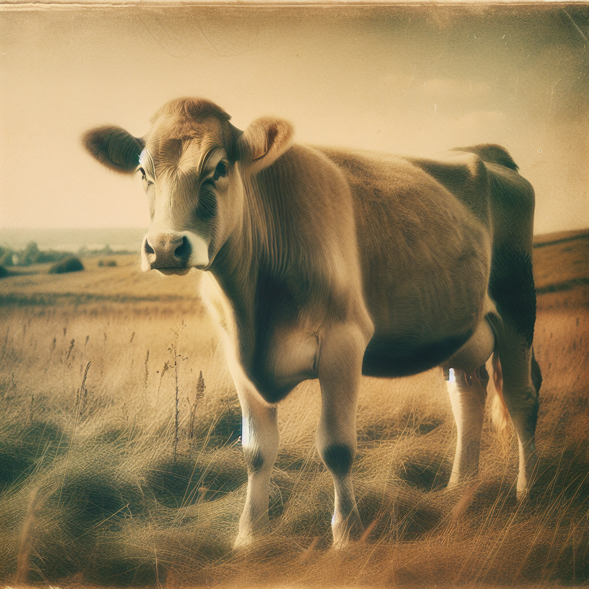
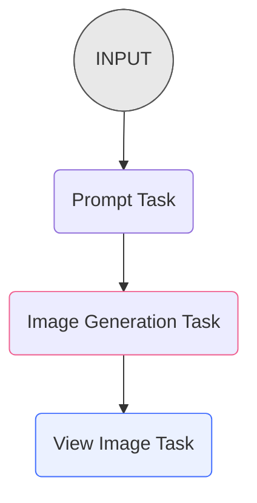

# Image Generation Pipeline

-  
- 
- 
- 

## Course Description

Welcome to our course on Griptape Pipelines, where we'll be exploring this powerful feature through the practical example of image generation. In this course, you'll learn how to use Griptape Pipelines to seamlessly link together various tasks to create a cohesive workflow.

Our focus will be on how to set up a pipeline that can take a concept, apply a specific style, and incorporate a description to generate an image. Plus, we'll show you how to use a CodeExecutionTask to display the image after it's created.

This course is designed to be approachable and informative, ideal for anyone looking to understand the fundamentals of Griptape Pipelines. Whether you're a developer, a hobbyist, or just curious about how pipelines can enhance your projects, this course will provide you with the practical skills and knowledge needed to get started. So let's jump in and explore the exciting possibilities that Griptape Pipelines have to offer!

## Who is this course for
This course is aimed at **intermediate** level Python developers who are interested in learning about Griptape Pipelines and how to handle parent/child task relationships, Griptape Tools, and image generation. 

## Prerequisites
Before beginning this course, you will need:

- An OpenAI API Key (available here: [OpenAI](https://beta.openai.com/account/api-keys){target="_blank"})
- Python 3.9+ installed on your machine
- An IDE (such as Visual Studio Code or PyCharm) to write and manage your code

If you don't have those items available, it's highly recommended you go through the [Griptape Setup - Visual Studio Code](../../setup/index.md) course to set up your environment.

It's also recommended to view the [Compare Movies Workflow](../compare-movies-workflow/index.md) course if you haven't viewed it before, as it contains some similar concepts to the Pipeline course.

## Image Generation Engines
The course will cover some of the Image Generation Engines available for Griptape, including [OpenAI DALL·E 3](https://openai.com/dall-e-3){target="_blank"}, [Leonardo.AI](https://leonardo.ai/){target="_blank"}, and [Image Generation Engines running on Amazon Bedrock](https://aws.amazon.com/bedrock/stable-diffusion/){target="_blank"} 

### DALL·E 3
* DALL·E 3 is available with an OpenAI API key.

### Leonardo.ai
* Sign up for a [Leonardo.Ai account](https://docs.leonardo.ai/docs){target="_blank"}
* Save your `LEONARDO_API_KEY` in your `.env` file.

### Amazon Bedrock
* Ensure you have an AWS account
* Ensure you have access to the appropriate model by following the [Amazon Documentation](https://docs.aws.amazon.com/bedrock/latest/userguide/model-access.html){target="_blank"}
* Add the following environment variables to your `.env` file:
    * `AWS_REGION_NAME`
    * `AWS_ACCESS_KEY_ID`
    * `AWS_SECRET_ACCESS_KEY`

## Course Outline
The course will cover:

* Creating Griptape Pipelines
* Creating Griptape Tasks
* Investigate Image Generation Engines
* Using a `CodeExecutionTask` to display the resulting image

## Useful Resources and Links

- [Griptape Documentation](https://github.com/griptape-ai/griptape){target="_blank"}
- [Visual Studio Code](https://code.visualstudio.com/){target="_blank"}
- [Jinja2 Documentation](https://jinja.palletsprojects.com/en/3.1.x/){target="_blank"}
- [Amazon Image Generation Documentation](https://docs.aws.amazon.com/bedrock/latest/userguide/model-access.html){target="_blank"}
- [Leonardo.Ai](https://docs.leonardo.ai/docs){target="_blank"}
- [Compare Movies Workflow](../compare-movies-workflow/index.md)

---
## Next Steps

Get yourself all set up and ready by moving on to [Setup](01_setup.md).

