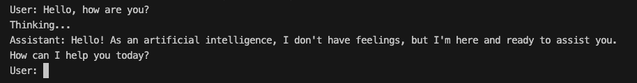
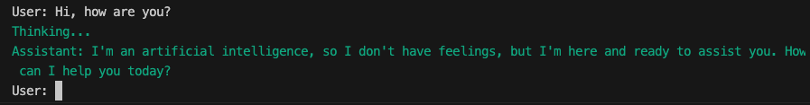
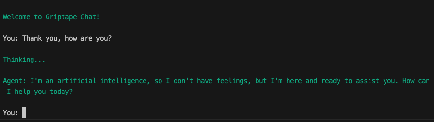

# Starting with a Chatbot

To create a user-friendly Griptape Agent that can chat effectively, we'll be making some specific tweaks to the chat utility, as laid out in the [Chatbot Ruleset course](https://learn.griptape.ai/latest/courses/chatbot-rulesets/). These changes aim to enhance readability and user interaction. Instead of spewing out generalized how-tos – I’ll give you a step-by-step guide, explaining each component and its purpose. 

## Setting up the Agent and Chat
This is where we will make our script as smooth as a well-executed skateboard trick – clean, dynamic, and visually appealing. This is assuming it’s attempted by someone who can actually skate – I’m most definitely not referring to myself. 

First up, we’ll set up our `Agent` and `Chat` from the `griptape` libraries. Think of it like the griptape on a skateboard – it helps you keep your balance in the world of chat agents. Let’s start by importing `Agent` from `griptape.structures` and `Chat` form `griptape.utils`. 

Setting up this agent with `logger_level=0` ensures that all logging output is suppressed. This keeps our chat interface super clean, with no unwanted logs cluttering it up. 

Then finally we'll use the Chat utility to start chatting.

Here is how you set this up in your Python script:

```py title="app.py" hl_lines="3-5 9-13"
# ... previous content

# Griptape Items
from griptape.structures import Agent
from griptape.utils import Chat

load_dotenv() # Load your environment

# Create the Agent
agent = Agent(logger_level=0)

# Begin Chatting
Chat(agent).start()
```

If you run this now, you'll have a simple chat interface with the agent.



## Enable Streaming and Color Formatting

Let’s spice up our chat interface by introducing streaming responses and adding a touch of color with the `rich` library. This will not only make our chat feel more interactive but also visually distinct and appealing. Who says your code can’t be both functional and stylish?

By configuring our agent to stream its responses, we mimic the feel of a real-time conversation. This streaming setup makes interactions appear more dynamic and immediate, which is especially useful in environments where engagement and responsiveness are crucial. Here's how we integrate this into our Python code:

### Streaming

After you instantiate the agent, add the following line:

```py title="app.py" hl_lines="5"
# ...

# Create the Agent
agent = Agent(logger_level=0)
agent.config.global_drivers.prompt_driver.stream=True

# ...
```

### Color

Next, let’s add some color to our text outputs to make our interface not just functional but also visually engaging. We use the ‘rich’ library to add a color theme to the responses. In this case, we'll go with ‘dark_cyan’ which gives a cool, soothing visual cue and helps differentiate the agent’s responses from other text.

Here’s how to set up a function to format and print responses in dark cyan. 

First, import the `rich` library.

```py title="app.py" hl_lines="2"
# ...
from rich import print as print # Modifies print to use the Rich library
# ...
```

Then, create a function to format and print responses from the agent in dark cyan. Add this code before you start the Chat function, passing it the function with the `output_fn` parameter.

```py title="app.py" hl_lines="3-5 9"

# ...

# Modify the Agent's response to have some color.
def formatted_response(response: str) -> str:
    print(f"[dark_cyan]{response}", end="", flush=True)

# Begin Chatting
Chat(
    agent,
    output_fn=formatted_response, # Uses the formatted_response function
).start()

```

In this setup, we replace the traditional `print` function with `rich_print`, which supports rich text and color formatting. The function `formatted_response` takes a string, wraps it in a dark cyan color tag, and outputs it without any newline at the end, maintaining the streaming effect.

Now, every time you want to display a message from the agent, just call `formatted_response`('Your message here'), and it will appear in a dark cyan. This method not only enhances the readability of the agent’s communications but also adds a professional touch to your chat interface. Besides, organized people always color code things. ;) Let me pretend.



## Making it friendly

Continuing this journey in enhancing the chat interface with Griptape, let’s focus on making the chat experience not only interactive but also inviting and personalized. Configuring the ‘Chat’ utility correctly can significantly impact the user's experience, making it feel more tailored and engaging.

Here’s how we can make it welcoming and structured:

1. We start with a friendly welcome message that greets users as soon as they enter the chat session. This sets a positive tone right from the get-go. It’s polite, and I’m sure the moms of the Python world would approve. 

2. To keep the conversation organized, we use custom prefixes for both the user and the agent. This helps users easily distinguish between who's speaking at a glance, adding to the clarity of the chat.

3. While the agent processes the user's input, a message like "Thinking..." appears. This small detail enhances the interactive feel of the chat, letting users know that their input is being processed and the agent isn't just stalling. It’s very helpful for my impatience too – does anyone else get bored easily?

4. Finally, we ensure all agent messages are visually differentiated by using our previously defined formatted_response function to print messages in dark cyan. Yay for pretty colors. (Note, we did this earlier, I'm just calling it out again in case having longer tutorials improves our SEO rankings.)

Here's how to put all those pieces together when calling the Chat

```py title="app.py" hl_lines="6-9"
# ...

# Begin Chatting
Chat(
    agent,
    intro_text="\nWelcome to Griptape Chat!\n",
    prompt_prefix="\nYou: ",
    processing_text="\nThinking...",
    response_prefix="\nAgent: ",
    output_fn=formatted_response,  # Uses the formatted_response function
).start()

```

## Try it out

Give it a go! You'll notice a much more enjoyable chat experience.



## Code Review

Here's the final code with the updates from this section.

```py title="app.py" linenums="1" hl_lines="3-5 7 11-12 14-15 17-19 21-29"
from dotenv import load_dotenv

# Griptape Items
from griptape.structures import Agent
from griptape.utils import Chat

from rich import print as print  # Modifies print to use the Rich library

load_dotenv()  # Load your environment

# Create the Agent
agent = Agent(logger_level=0)

# Configure the agent to stream it's responses.
agent.config.global_drivers.prompt_driver.stream = True

# Modify the Agent's response to have some color.
def formatted_response(response: str) -> str:
    print(f"[dark_cyan]{response}", end="", flush=True)

# Begin Chatting
Chat(
    agent,
    intro_text="\nWelcome to Griptape Chat!\n",
    prompt_prefix="\nYou: ",
    processing_text="\nThinking...",
    response_prefix="\nAgent: ",
    output_fn=formatted_response,  # Uses the formatted_response function
).start()
```

---
## Next Steps
Now that you have a fancy little chatbot, it's time to move to the next section where we'll give the Agent the ability to understand and describe images. Head to the [Image Query Tool](03_image_query_tool.md) section.
