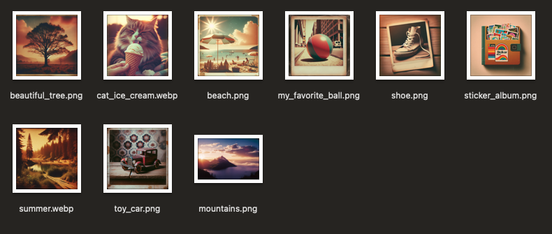
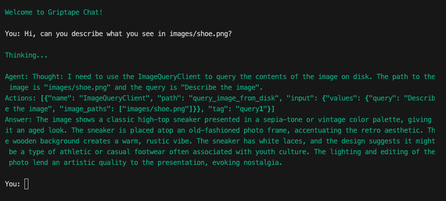

# The ImageQuery Tool

To supercharge our Griptape Agent with the ability to understand and describe images, we need to ensure it's equipped with the right tools. This involves integrating image processing capabilities that can load, analyze, and interpret images from disk. Let’s walk through how to set this up step-by-step, ensuring your agent is not just seeing things but understanding them too. 

## Installing Necessary Extras

Before we can start processing images, we need to make sure that our Griptape installation includes the necessary extras for image loading. These extras are part of a specialized set of tools within Griptape designed to handle image data effectively. By installing these, you enable your agent to access and interpret images, making it significantly more powerful.

To get started, you’ll need to run the following command in your terminal. This command ensures that the Griptape library is updated with the 'loaders-image' extras, which are essential for the image processing functionalities we plan to implement:

```bash
pip install "griptape[loaders-image]" -U
```

This command tells your package manager to update the Griptape installation, specifically adding the image loaders required for our upcoming tasks. The `-U` flag ensures that all dependencies are updated to their latest versions, maintaining compatibility and security.

By executing this installation, you equip your agent with the necessary components to not just interact via text but also understand and respond to visual inputs, expanding the horizons of what your chatbot can achieve. 

## Import Required Components

Once you've ensured that the Griptape library is updated with the `loaders-image` extras, the next step is to integrate the specific modules required for handling image queries. This involves importing the classes responsible for querying images, managing image engines, and utilizing specific drivers designed to process image data.

Add the following to your `import` section:

```python title="app.py" hl_lines="3-5"
# ...

from griptape.tools import ImageQueryTool
from griptape.drivers import OpenAiChatPromptDriver

# ...
```

### ImageQueryTool
This component acts as the intermediary that will manage your interactions with images. It's responsible for sending image data to the engine and retrieving results.

### OpenAiChatPromptDriver
This driver leverages OpenAI's advanced vision capabilities to understand and analyze images. It's a powerful tool that enables your agent to not just see images but truly understand their content, like I said before.

An example of another ImageQueryDriver is Anthropic. Check out other available drivers in the [Griptape docs](https://docs.griptape.ai/stable/griptape-framework/drivers/image-query-drivers/)

By importing these components, you lay the foundation for a robust image processing system within your chatbot framework.

## Giving the Agent Abilities

### Create the Image Query Driver
The next task is to instantiate the Image Query Driver. This driver is crucial as it utilizes a specific model to analyze images. In our example, we’ll use the `gpt-4o` model from OpenAI, which is designed to handle a wide range of image processing tasks with high efficiency and accuracy. 

Add the following line after running `load_dotenv()` in your script:

```python title="app.py" hl_lines="4-7"
# ...
load_dotenv()

# Create an Image Query Driver
driver = OpenAiImageQueryDriver(
    model="gpt-4o"
)

# ...
```

With the driver and engine now set up, your agent is almost ready to start describing pictures as if it were an art critic at a gallery opening. But remember, even though it can now "see" images, don't expect it to understand why your dog looks at you like that—some mysteries remain unsolved even for the most advanced AI.

Next, we'll tie all these components together and create a client that can handle all the image querying magic.

### Create the Tool

First up, let’s create and configure the `ImageQueryTool`. This component uses the driver we set up earlier to process image queries. The `off_prompt` parameter is set to `False` to ensure that the image descriptions are not just processed but also sent back to the large language model for some insightful summarization. Here's how to do it:

```python title="app.py" hl_lines="3-6"
# ...

image_query_tool = ImageQueryTool(
    prompt_driver=driver, 
    off_prompt=False
)

# ...
```
### Assign the Tool to the Agent

Next, we integrate this `ImageQueryTool` into our agent’s toolbox. This allows our agent to effortlessly process image queries, turning it into a Renaissance bot that’s as comfortable discussing Da Vinci as it is creating silly haikus.

Modify the part of the code where you instantiate the agent to include a list of tools. In this case, we're only providing one tool - but it still must be a list.

```python title="app.py" hl_lines="4"
# ...

# Create the Agent
agent = Agent(tools=[image_query_tool])

# ...
```

## Give it a try

### Provide Images

To test this out, you'll need to give your agent something to look at besides your beautiful code. Create a new folder named `images` in your project directory. Drop several images into this folder--the more varied, the better, as it gives your agent more to talk about.



### Ask it questions

Then you get to fire up your application. Engage with your agent by asking it to describe the images. Make sure you specify the image files correctly in your queries so that your agent doesn’t end up describing last year’s holiday pics when you asked about that cool sunset photo you took last week.

In the following example, I'm asking the agent to describe what it sees in `images/shoe.png`.



Notice it describes it really well!

!!! quote
    { align=right width=256 } The image shows a classic high-top sneaker presented in a sepia-tone or vintage color palette, giving it an aged look. The sneaker is placed atop an old-fashioned photo frame, accentuating the retro aesthetic. The wooden background creates a warm, rustic vibe. The sneaker has white laces, and the design suggests it might be a type of athletic or casual footwear often associated with youth culture. The lighting and editing of the photo lend an artistic quality to the presentation, evoking nostalgia.

## Code Review

Here's the final code with the updates from this section.

```python title="app.py" linenums="1"
--8<-- "docs/courses/image-query/assets/code_reviews/03/app.py"
```

---
## Next Steps

By following these detailed steps, you've not only equipped your Griptape Agent with the ability to query and describe images, but you’ve also possibly created the most culturally savvy bot on the block.

In the [next section](04_seo_friendly.md), we'll tell the agent to give us output that is more SEO-friendly.
