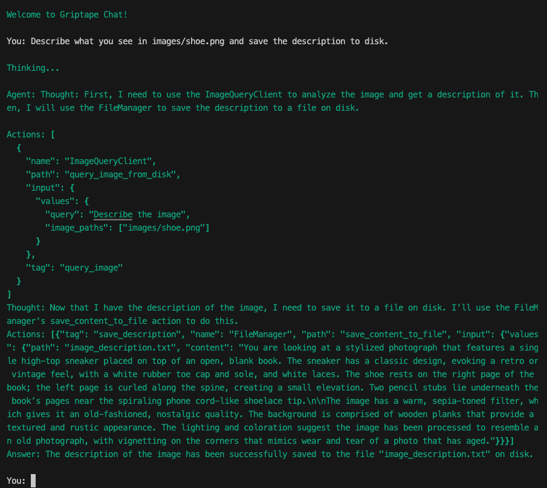

# Saving to Disk

Let's boost the capabilities of our Griptape Agent by giving it a job as a file manager. This upgrade is like handing a filing cabinet to your agent, so it can neatly store away all the SEO-optimized image descriptions it crafts.

## Adding the FileManagerTool Tool

First things first, we need to update our agent with the necessary tools for both querying images and managing files like a pro. Here’s how you can load up your toolbelt.

Add the `FileManagerTool` tool to the import section of your code:

```python title="app.py" hl_lines="2"
# ...
from griptape.tools import ImageQueryTool, FileManagerTool
# ...
```

## Configuring the Agent with FileManagerTool

Now, let's make sure our agent knows how to use its new tools. This is where we tell it that alongside being a chat maestro, it’s also in charge of the file room. 

Modify the part of the code where you instantiate the Agent by adding the `FileManagerTool` tool to the list of tools.

```python title="app.py" hl_lines="5"
# ...

# Create the Agent
agent = Agent(
  logger_level=0, tools=[image_query_tool, FileManagerTool(off_prompt=False)]
)
# ...

```

Setting ‘off_prompt=False’ allows the information flow back to the LLM, giving the agent the ability to perform file operations directly based on interactions, no need to micromanage!

## Try it out

With the `FileManagerTool` integrated, it’s time to put our agent to the test. Let’s ask it to describe an image and file away that description.



Notice how the agent has two thoughts. First, it needs to use the `ImageQueryTool` to analyze the image and get a description. Then, it'll use the `FileManagerTool` to save the description to a file on disk.

The resulting file looks like:

```txt title="image_description.txt"
You are looking at a stylized photograph that features a single high-top sneaker 
placed on top of an open, blank book. The sneaker has a classic design, evoking 
a retro or vintage feel, with a white rubber toe cap and sole, and white laces. 
The shoe rests on the right page of the book; the left page is curled along the 
spine, creating a small elevation. Two pencil stubs lie underneath the book’s 
pages near the spiraling phone cord-like shoelace tip.

The image has a warm, sepia-toned filter, which gives it an old-fashioned, 
nostalgic quality. The background is comprised of wooden planks that provide a 
textured and rustic appearance. The lighting and coloration suggest the image 
has been processed to resemble an old photograph, with vignetting on the corners 
that mimics wear and tear of a photo that has aged.
```

This command is like saying, "Draw me a picture with words and don’t forget to frame it!"

### Saving with YAML Format

Get control over where and how this precious artwork is stored, specify the filename, format, and the directory. Here’s how you can make sure your agent’s masterpiece is gallery-ready.

``` title="Prompt"
Describe what you see in images/shoe.png, in a way that would be SEO friendly. 
Include a description, key words, alt-description, a caption, and an example 
html element. Save it in YAML format in image_descriptions/filename.yml. 
Don't forget to use proper YAML formatting with lists.
```

``` title="image_descriptions/shoe.yml"
description: |
  'The image features a single high-top sneaker placed atop a vintage-style photograph. The sneaker, with its classic design, has prominent white laces and is situated against a dark background that is part of the photographic frame. The photo itself rests on a wooden surface, indicative of a rustic or old-fashioned setting. The image has a sepia-toned filter applied, giving it a warm, nostalgic feel and accentuating the vintage aesthetic.'
keywords:
  - Vintage
  - Sneaker
  - High-Top
  - Sepia
  - Photography
  - Retro
  - Wooden Surface
  - Fashion
  - Classic Shoe
  - Nostalgia
  - Style
alt-description: |
  'Vintage-style sepia-toned image of a classic high-top sneaker on a photographic frame placed on a wooden background.'
caption: 'Step into the past with this vintage high-top sneaker showcased in a nostalgic sepia-toned setting.'
example-html-element: |
  

```

This command not only gets your descriptions in order but also ensures they’re dressed to impress in YAML format.

This approach streamlines the workflow by automatically storing output in an organized, easy-to-access format. By reducing manual file management, the FileManagerTool tool boosts the agent's independence, enhancing its effectiveness in data processing and content management.

## Code Review

```python title="app.py" linenums="1"
--8<-- "docs/courses/image-query/assets/code_reviews/05/app.py"
```

---
## Next Steps
You’re doing amazing so far. We’re so close to reaching the end. 

In the [next section](06_querying_multiple_images.md), we'll scale up our ability to handle multiple images using Griptape Workflows.
