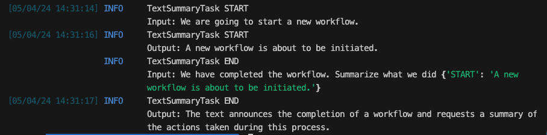
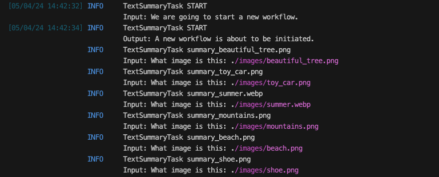
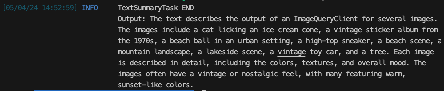

# Querying Multiple Images

Ready to scale up your image processing game with Griptape? Let’s move from a solo act to a full orchestra, handling multiple images with the grace of a conductor wielding a baton. Here’s how you can set up a robust, scalable workflow that processes multiple images simultaneously, ensuring each one gets the star treatment it deserves.

We could ask the agent to handle multiple images at once, and it can do a relatively good job of it if prompted correctly - but it may not be consistent.

For example, if we prompted with:

```
For each image in images, can you create an SEO safe description, 
define key words, create an alt-description, a caption, and an example html 
element? Save it as a YAML file in image_descriptions/filename.yaml
```

The agent would use the FileManager to get a list of files, and then start a series of actions to describe them. It may decide to do them in parallel (Yay!), or it may do them one at a time (Boo!). For some cases, this is fine - but if we want to turn this into a _consistent workflow_ that is reliable and can always operate in parallel, the best practice is to use a Griptape Workflow.
 
If you haven't explored Griptape Workflows or Pipelines previously, we highly recommend you check out these other TradeSchool courses:

  * [Compare Movies - Workflows](../../courses/compare-movies-workflow/index.md)
  * [Image Generation Pipeline](../../courses/create-image-pipeline/index.md)

## What's it going to do?

That's cool and all, but what exactly will the workflow do?

Our workflow will follow these steps:

1. Get a list of the images in the directory we pass it.

2. For each image:

    1. Clearly describe the image using the ImageQueryTask

    2. Based on the description, generate an SEO-friendly description, key words, an alt-description, a caption, and an example HTML image structure.

    3. Save the information to disk in YAML format in image_descriptions/filename.yaml
    
3. Tell us when it’s finished.

## Import Necessary Classes and Modules

Update your import statements to include all the necessary items. 

```py title="app.py" hl_lines="2 4-5"
# ...
import os
# ...
from griptape.structures import Agent, Workflow
from griptape.tasks import TextSummaryTask, ToolTask, ToolkitTask 
# ...

```

Here's a quick description of what each of these are for.

| Library             | Description          |
| ------------------- | -------------------- |
| `os`      | The Python `os` library - we will use this to get a list of files in the images directory. |
| `Workflow`  | Defines a dependency graph of tasks. |
| `TextSummaryTask` | A quick and simple text task that doesn't include Chain of Thought. |
| `ToolTask` | The task used to get information about an image. Also doesn't use Chain of Thought. _Note: We could also use the `ImageQueryTask` specifically to get information about the image, but in my testing the `ToolTask` executed in the same amount of time, and is easier to set up._|
| `ToolkitTask` | The task that will use FileManager to save the files to disk. This uses Chain of Thought to take the output from the Image Query and generate the proper formatting, then uses the tool to save to disk. |

### ToolkitTask

The task that will use FileManager to save the files to disk. This uses Chain of Thought to take the output from the Image Query and generate the proper formatting, then uses the tool to save to disk.

## Remove Agent Flow

We’re going to be creating a workflow, so we don't really need to use the Agent code anymore. We could delete it, but we might find it useful to reference while adjusting to our Workflow. To keep it around, we could comment it out - this would keep it in our code, but it wouldn't have any influence.

Another option, however, is to put the agent code in a conditional statement. We can say to the app "Hey, if TRUE then run the workflow code, but if FALSE run the agent code. It would look something like this:

```py title="example_flow.py" linenums="1"
if True:
  print ("This would be where the WORKFLOW code goes.")
else:
  print ("This is where the AGENT code would go.")
```

If you were to run this script right now, the output would be:

```
This is where the WORKFLOW code goes.
```

Conversely, if we set it to False..

```py title="example_flow.py" linenums="1"
if False:
  print ("This would be where the WORKFLOW code goes.")
else:
  print ("This is where the AGENT code would go.")
```

We would get:

```
This is where the AGENT code would go.
```

This is a great way to control the flow of execution in our program & make sure we can run via the agent if we need to.

Modify the code as follows:

```py title="app.py" hl_lines="5-25"
# ...
# Configure the ImageQueryClient
image_query_client = ImageQueryClient(image_query_engine=engine, off_prompt=False)

if True:
  # Create a workflow 
else:
  # Create the Agent
  agent = Agent(logger_level=0, tools=[image_query_client, FileManager(off_prompt=False)])

  # Configure the agent to stream it's responses.
  agent.config.prompt_driver.stream = True


  # Modify the Agent's response to have some color.
  def formatted_response(response: str) -> str:
      print(f"[dark_cyan]{response}", end="", flush=True)


  # Begin Chatting
  Chat(
      agent,
      intro_text="\nWelcome to Griptape Chat!\n",
      prompt_prefix="\nYou: ",
      processing_text="\nThinking...",
      response_prefix="\nAgent: ",
      output_fn=formatted_response,  # Uses the formatted_response function
  ).start()
```

## Set Up the Workflow

I lost the orchestra analogy here, but imagine setting up dominoes; each task in a Workflow is a domino. Before I show you how to line them up, you should know that Workflows must always have a start and end task – which is what we’re going to do here; create those around the Workflow.

Insert this code inside the workflow section of your conditional statement.

```py title="app.py"  hl_lines="5-18"
# ...

if True:
  # Create a Workflow
  workflow = Workflow()

  # Create the Start and End tasks.
  startTask = TextSummaryTask("We are going to start a new workflow.", id="START")
  endTask = TextSummaryTask(
      "We have completed the workflow. Summarize what we did {{ parent_outputs }}",
      id="END",
  )

  # Add the tasks to the workflow
  workflow.add_tasks(startTask, endTask)

  # Run the workflow
  workflow.run()
else:
  # ...
```

Give it a try, and you'll see the START and END tasks running.



## Getting the Images

Now, let’s get the data ready for the show. Yes, I’m back to the orchestra example again. Keep up. Using the `os` module, we’ll gather all images from a directory like a talent scout. This step is crucial as it feeds the workflow with the actual data (images) it needs to process.

Add the following code after the creation of the start/end tasks, and _before_ you run the workflow:

```py title="app.py" linenums="1" hl_lines="8-20"
# ...

if True:
  # ...
  # Add the tasks to the workflow
  workflow.add_tasks(startTask, endTask)

  # For each image in the directory
  image_dir = "./images"
  for image in os.listdir(image_dir):
      image_path = os.path.join(image_dir, image)
      filename = os.path.splitext(image)[0]

      # Create a temporary summary task
      image_summary_task = TextSummaryTask(
          f"What image is this: {image_path}", id=f"summary_{image}"
      )

      # Insert it to the workflow
      workflow.insert_tasks(startTask, [image_summary_task], endTask)

  # Run the workflow
  workflow.run()
else:
  # ...
```

Notice that we've added a fake task - the image_summary_task that's just another `TextSummaryTask`. This is just to demonstrate that the task is inserted and working as expected.

!!! tip
    If this section is confusing, please go review the other Workflow course mentioned earlier - [Compare Movies - Workflows](../../courses/compare-movies-workflow/02_concepts.md). The concepts are well covered there.

Go ahead and run the script - you should see a number of tasks being created based on the files in the images directory.



## Image Processing Tasks

Now we'll swap out this fake task, for a real one.

For each VIP (Very Important Picture), create a task that details their best angles. This task uses the `ImageQueryClient` to generate an SEO-friendly description, keywords, alt-description, caption, and HTML element for each image.

```py title="app.py" hl_lines="11-17"
# ...

if True:
  # ...
  # For each image in the directory
  image_dir = "./images"
  for image in os.listdir(image_dir):
      image_path = os.path.join(image_dir, image)
      filename = os.path.splitext(image)[0]

      # Create an Image Summary Task
      image_summary_task = ToolTask(
          "Describe this image in detail: {{image_path}}",
          context={"image_path": image_path},
          tool=image_query_client,
          id=f"{image}",
      )

      # Insert it to the workflow
      workflow.insert_tasks(startTask, [image_summary_task], endTask)

  # ...
else:
  # ...
```

If you execute the script now, you'll see that it provides descriptions for each of the images.



## Define SEO Output Task

After generating the image description, a `ToolkitTask` is used to format the SEO data and save it to disk. 

We use a `ToolkitTask` here instead of a `ToolTask` because the request we have requires a little bit of intelligence from the Agent. ToolkitTasks use Chain of Thought, whereas ToolTasks just use a tool directly. 

All in all, they’re just a tad more capable. 

So, this task takes the output from the ToolTask and uses the FileManager to save the information in YAML format in a designated directory.

Create the Image SEO Task right after the image summary task, and insert it into the workflow.

```py title="app.py" hl_lines="14-23 27"
# ...

if True:
  # ...
  for image in os.listdir(image_dir):

      # ...

      # Create an Image Summary Task
      image_summary_task = ToolTask(
        # ...
      )

      # Create an Image SEO Task
      image_seo_task = ToolkitTask(
          "Based on this image description, create the following:\n"
          + "SEO description, Caption, Alt-text, 5 keywords, an HTML snippet to "
          + "display the image. Save this to image_descriptions/{{ filename }}.yml\n"
          + "in YAML format.\n\n{{ parent_outputs }}",
          tools=[FileManager(off_prompt=False)],
          context={"image": image},
          id=f"seo_{image}",
      )

      # Insert it to the workflow
      workflow.insert_tasks(startTask, [image_summary_task], endTask)
      workflow.insert_tasks(image_summary_task, [image_seo_task], endTask)

  # Run the workflow
  workflow.run()
else: 
  # ...

```

If you try it out, you will see some YAML files in the `images_descriptions` folder. Here are a couple of examples based on these images:

{ align=right width=160}
```yaml title="my_favorite_ball.yml"
my_favorite_ball.png:
  SEO_description: 'This image features a colorful beach ball on an urban sidewalk with city buildings in the background. The photo has a vintage feel with its warm, slightly faded tones and vignette bordering.'
  Caption: 'A colorful beach ball on an urban sidewalk with a vintage feel.'
  Alt_text: 'Colorful beach ball on urban sidewalk with city buildings in the background.'
  Keywords: ['beach ball', 'urban sidewalk', 'city buildings', 'vintage feel', 'vignette bordering']
  HTML_snippet: ''
```

{align=right width=160}
```yaml title="beach.yml"
beach.png:
  SEO Description: 'A nostalgic beach scene with a vintage look featuring a striped beach umbrella, a sandcastle, and people enjoying various activities.'
  Caption: 'Vintage beach scene with a sandcastle under a striped umbrella.'
  Alt-text: 'Vintage beach scene with people enjoying various activities.'
  Keywords: ['vintage', 'beach', 'umbrella', 'sandcastle', 'activities']
  HTML Snippet: ''
```

{align=right width=160}
```yaml title="toy_car.yml"
toy_car.png:
  SEO_description: 'Vintage-looking toy car with a nostalgic feel on a wooden surface'
  Caption: 'Vintage toy car on a wooden table'
  Alt_text: 'Vintage toy car'
  Keywords: ['Vintage toy car', 'Classic car', 'Wooden surface', 'Antique look', 'Aged photo']
  HTML_snippet: ''
```


## Code Review

```py title="app.py" linenums="1" hl_lines="2 5-6 28-73"
from dotenv import load_dotenv
import os

# Griptape Items
from griptape.structures import Agent, Workflow
from griptape.tasks import TextSummaryTask, ToolTask, ToolkitTask
from griptape.utils import Chat
from griptape.tools import ImageQueryClient, FileManager
from griptape.engines import ImageQueryEngine
from griptape.drivers import OpenAiImageQueryDriver


from rich import print as print  # Modifies print to use the Rich library

load_dotenv()  # Load your environment

# Create an Image Query Driver
driver = OpenAiImageQueryDriver(model="gpt-4o")

# Create an Image Query Engine
engine = ImageQueryEngine(
    image_query_driver=driver,
)

# Configure the ImageQueryClient
image_query_client = ImageQueryClient(image_query_engine=engine, off_prompt=False)

if True:
    # Create a Workflow
    workflow = Workflow()

    # Create the Start and End tasks.
    startTask = TextSummaryTask("We are going to start a new workflow.", id="START")
    endTask = TextSummaryTask(
        "We have completed the workflow. Summarize what we did {{ parent_outputs }}",
        id="END",
    )

    # Add the tasks to the workflow
    workflow.add_tasks(startTask, endTask)

    # For each image in the directory
    image_dir = "./images"
    for image in os.listdir(image_dir):
        image_path = os.path.join(image_dir, image)
        filename = os.path.splitext(image)[0]

        # Create an Image Summary Task
        image_summary_task = ToolTask(
            "Describe this image in detail: {{ image_path }}",
            context={"image_path": image_path},
            tool=image_query_client,
            id=f"{image}",
        )

        # Create an Image SEO Task
        image_seo_task = ToolkitTask(
            "Based on this image description, create the following:\n"
            + "SEO description, Caption, Alt-text, 5 keywords, an HTML snippet to "
            + "display the image. Save this to image_descriptions/{{ filename }}.yml\n"
            + "in YAML format.\n\n{{ parent_outputs }}",
            tools=[FileManager(off_prompt=False)],
            context={"image": image},
            id=f"seo_{image}",
        )

        # Insert it to the workflow
        workflow.insert_tasks(startTask, [image_summary_task], endTask)
        workflow.insert_tasks(image_summary_task, [image_seo_task], endTask)

    # Run the workflow
    workflow.run()
else:
    # Create the Agent
    agent = Agent(
        logger_level=0, tools=[image_query_client, FileManager(off_prompt=False)]
    )

    # Configure the agent to stream it's responses.
    agent.config.prompt_driver.stream = True

    # Modify the Agent's response to have some color.
    def formatted_response(response: str) -> str:
        print(f"[dark_cyan]{response}", end="", flush=True)

    # Begin Chatting
    Chat(
        agent,
        intro_text="\nWelcome to Griptape Chat!\n",
        prompt_prefix="\nYou: ",
        processing_text="\nThinking...",
        response_prefix="\nAgent: ",
        output_fn=formatted_response,  # Uses the formatted_response function
    ).start()
```


---
## Next Steps
This workflow not only automates the process of generating and saving SEO-friendly image descriptions but also ensures that the tasks are performed in a consistent, reliable manner across multiple images.

Take a breather before we move onto the next step. We're so close, only one section left where we add a Template file to improve consistency with output. When you're ready, continue to [Part 7](07_template.md).
