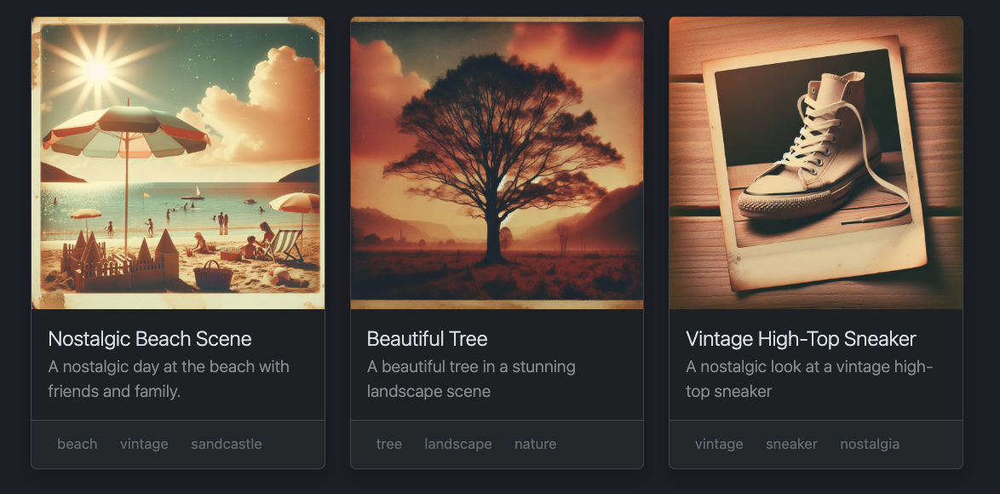

# Add a Template File

As we continue to enhance the output consistency and precision of our Griptape workflow, introducing a template file is like providing a blueprint for building the perfect house of data. If it wasn’t obvious yet, I love analogies like the Irish love potatoes. Which reminds me – I also love potatoes... Anyways, this template guides the LLM to ensure every piece of output fits the aesthetic and functional design we want. Here's a clear and structured approach to setting up this template.

## Create the Template File

First, we'll craft the master plan. The template will define exactly how each output file should look, ensuring every image description is polished. Here’s how to set up the template.

* Create a file called `template.yml` in your folder. 
* Specify the structure for your output files, with placeholders ready for image details. Here's an example:

```yaml title="template.yml"
image:
  title: { image title } # example: Vintage Mountain
  image_path: { image_path } # example: images/vintage-mountain.png
  description: |
    { A brief SEO safe description. }
  alt_text: { alt text }
  keywords: ["{keyword 1}", "{keyword 2}"]
  caption: { A short caption to display under the image. }
  example_html: |
    <div class="col">
      <div class="card shadow">
        
        <div class="card-body">
          <h5 class="card-title fw-light fs-5">{name}</h5>
          <p class="card-subtitle fw-light text-body-secondary opacity-75">{caption}</p>
        </div>
        <footer class="card-footer text-size-sm">
          <a href="#{keyword_1}" class="btn btn-outline btn-sm text-secondary">{keyword_1}</a>
          <a href="#{keyword_2}" class="btn btn-outline btn-sm text-secondary">{keyword_2}</a>
          <a href="#{keyword_3}" class="btn btn-outline btn-sm text-secondary">{keyword_3}</a>
        </footer>
      </div>
    </div>

```

!!! info
    The html snippet included in the template uses the [Bootstrap Card](https://getbootstrap.com/docs/5.3/components/card/){ target="_none" } component. You can use whatever format you like, but I'm rather fond of this one. Here's an example of how it looks in a layout:
    

## Modify the ToolkitTask

Next, let's configure the ToolkitTask to turn our template into a reality. The task will fill the placeholders with actual data from the images. We'll also modify the prompt a bit to help it use the template correctly.

Note, in the `context` parameter we're passing both the `image` and the `image_path`.

```py title="app.py" linenums="1" hl_lines="6-16"
    # ...

    # Create an Image SEO Task
    image_seo_task = ToolkitTask(
        "Based on this image description, create the following:\n"
        + "A nice title based on the image name, \n"
        + "The path to the image: {{ image_path }}, \n" 
        + "Brief SEO description, "
        + "alt-text, 5 keywords, caption, "
        + "and an HTML snippet to display the image.\n"
        + "To format the data, use the example in the "
        + "template file: 'template.yml',\n"
        + "and save the result to image_descriptions/{{ filename }}.yml\n"
        + "in YAML format.\n\n{{ parent_outputs }}",
        tools=[FileManager(off_prompt=False)],
        context={"image": image, "image_path": image_path},
        id=f"seo_{image}",
    )

    # Inssert it to the workflow
    # ...
```

## Try it out

Give it a run. You should end up with a series of YAML files that match the template.

```yaml title="beach.yml"
image:
  title: Nostalgic Beach Scene
  image_path: ./images/beach.png
  description: |
    A nostalgic beach scene with a vintage filter, featuring a large beach umbrella, a detailed sandcastle, and beachgoers engaged in typical seaside activities.
  alt_text: Vintage beach scene with beach umbrella and sandcastle
  keywords: ["beach", "vintage", "sandcastle"]
  caption: A nostalgic day at the beach
  example_html: |
    <div class="col">
      <div class="card shadow">
        
        <div class="card-body">
          <h5 class="card-title fw-light fs-5">Nostalgic Beach Scene</h5>
          <p class="card-subtitle fw-light text-body-secondary opacity-75">A nostalgic day at the beach</p>
        </div>
        <footer class="card-footer text-size-sm">
          <a href="#beach" class="btn btn-outline btn-sm text-secondary">beach</a>
          <a href="#vintage" class="btn btn-outline btn-sm text-secondary">vintage</a>
          <a href="#sandcastle" class="btn btn-outline btn-sm text-secondary">sandcastle</a>
        </footer>
      </div>
    </div>
```

If you'd like to use the Bootstrap layout, here's the HTML - just plop the card snipped in the section where it says `<!-- INSERT CARD SNIPPETS HERE -->`

```html title="webpage_example.html"  hl_lines="12"

<!DOCTYPE html>
<html lang="en" data-bs-theme="dark">
  <head>
    <meta charset="utf-8" />
    <meta name="viewport" content="width=device-width, initial-scale=1" />
    <title>Griptape Cards</title>
    <link href="https://cdn.jsdelivr.net/npm/bootstrap@5.3.3/dist/css/bootstrap.min.css" rel="stylesheet" integrity="sha384-QWTKZyjpPEjISv5WaRU9OFeRpok6YctnYmDr5pNlyT2bRjXh0JMhjY6hW+ALEwIH" crossorigin="anonymous" />
  </head>
  <body>
    <div class="container p-4">
      <div class="row row-cols-1 row-cols-md-3 gap-0 row-cols-sm-2">
       <!-- INSERT CARD SNIPPETS HERE -->
      </div>
    </div>
    <script src="https://cdn.jsdelivr.net/npm/bootstrap@5.3.3/dist/js/bootstrap.bundle.min.js" integrity="sha384-YvpcrYf0tY3lHB60NNkmXc5s9fDVZLESaAA55NDzOxhy9GkcIdslK1eN7N6jIeHz" crossorigin="anonymous" ></script>
  </body>
</html>


```

## Clean Up

* Remove Unnecessary Code: Once you confirm the workflow functions as expected, remove any redundant code, old imports, print statements, or bad jokes. 

* Finalize Setup: Ensure all changes are saved, and the workflow is properly documented to maintain clarity. This structured approach ensures that every image processed by the Griptape workflow adheres to a standardized format, enhancing both the consistency and usability of the generated data for SEO and web presentation purposes.

* Now most importantly, feel free to do a victory dance – because you just did that. You’re done!  

## Code Review

```py title="app.py" linenums="1"
from dotenv import load_dotenv
import os

# Griptape Items
from griptape.structures import Workflow, Agent
from griptape.tasks import TextSummaryTask, ToolTask, ToolkitTask
from griptape.tools import ImageQueryClient, FileManager
from griptape.engines import ImageQueryEngine
from griptape.drivers import OpenAiImageQueryDriver
from griptape.utils import Chat

from rich import print as print  # Modifies print to use the Rich library

load_dotenv()  # Load your environment

# Create an Image Query Driver
driver = OpenAiImageQueryDriver(model="gpt-4o")

# Create an Image Query Engine
engine = ImageQueryEngine(
    image_query_driver=driver,
)

# Configure the ImageQueryClient
image_query_client = ImageQueryClient(image_query_engine=engine, off_prompt=False)

if True:
    # Create a Workflow
    workflow = Workflow()

    # Create the Start and End tasks.
    startTask = TextSummaryTask("We are going to start a new workflow.", id="START")
    endTask = TextSummaryTask(
        "We have completed the workflow. Summarize what we did {{ parent_outputs }}",
        id="END",
    )

    # Add the tasks to the workflow
    workflow.add_tasks(startTask, endTask)

    # For each image in the directory
    image_dir = "./images"
    for image in os.listdir(image_dir):
        image_path = os.path.join(image_dir, image)
        filename = os.path.splitext(image)[0]

        # Create an Image Summary Task
        image_summary_task = ToolTask(
            "Describe this image in detail: {{ image_path }}",
            context={"image_path": image_path},
            tool=image_query_client,
            id=f"{image}",
        )

        # Create an Image SEO Task
        image_seo_task = ToolkitTask(
            "Based on this image description, create the following:\n"
            + "A nice title based on the image name, \n"
            + "The path to the image: {{ image_path }}, \n"
            + "Brief SEO description, "
            + "alt-text, 3 keywords, caption, "
            + "and an HTML snippet to display the image.\n"
            + "To format the data, use the example in the "
            + "template file: 'template.yml',\n"
            + "and save the result to image_descriptions/{{ filename }}.yml\n"
            + "in YAML format.\n\n{{ parent_outputs }}",
            tools=[FileManager(off_prompt=False)],
            context={"image": image, "image_path": image_path},
            id=f"seo_{image}",
        )

        # Insert it to the workflow
        workflow.insert_tasks(startTask, [image_summary_task], endTask)
        workflow.insert_tasks(image_summary_task, [image_seo_task], endTask)

    # Run the workflow
    workflow.run()

else:
    # Create the Agent
    agent = Agent(
        logger_level=0, tools=[image_query_client, FileManager(off_prompt=False)]
    )

    # Configure the agent to stream it's responses.
    agent.config.prompt_driver.stream = True

    # Modify the Agent's response to have some color.
    def formatted_response(response: str) -> str:
        print(f"[dark_cyan]{response}", end="", flush=True)

    # Begin Chatting
    Chat(
        agent,
        intro_text="\nWelcome to Griptape Chat!\n",
        prompt_prefix="\nYou: ",
        processing_text="\nThinking...",
        response_prefix="\nAgent: ",
        output_fn=formatted_response,  # Uses the formatted_response function
    ).start()
```

---
## Summary
Congratulations on mastering the use of Griptape's ImageQuery functionality and Workflow management to handle and optimize a folder full of images! 

Throughout this journey, you've learned how to enhance a basic chatbot utility, automate the generation of SEO-friendly descriptions for images, and ensure consistent output by using templates. These skills are crucial for efficiently managing large volumes of digital content and enhancing web visibility through structured, search-optimized metadata. 

You've also gained proficiency in structuring workflows that ensure reliability and consistency in batch processing tasks, which is essential for scaling operations in data-intensive environments.

Moving forward, a great next step would be to explore deeper customization of the output templates based on different types of images or content requirements. You might also consider integrating these workflows with web development projects, where automated image and metadata management can significantly streamline content deployment.

Additionally, experimenting with other Griptape functionalities, such as different querying tools or advanced task management features, could further expand your capabilities, allowing you to tackle more complex projects and enhance your application's functionality.

Go check out more courses from Griptape if you enjoyed this one. Until next time – Griptape out. 
