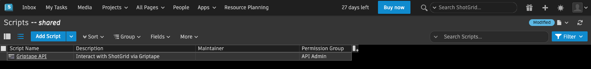

# Creating the ShotGrid Tool

## Overview
In this section, we'll create our first ShotGrid Tool. It won't do much yet, just connect to ShotGrid and validate that it's got a valid connection by returning the session token.

## Authenticating with ShotGrid

There are two ways that ShotGrid allows you to authenticate when working with the API. Through an Application Key, or with User Credentials.


### API Key Authentication

* Uses a unique key linked to a 'script' user.
* Ideal for automated tasks not tied to specific users.
* Advantages: Secure, controlled, and suitable for general actions.
* Best for background tasks and general automation.

### Username/Password Authentication

* Utilizes real user credentials.
* Suitable for actions needing user attribution.
* Advantages: Tracks user-specific actions, and respects user permissions.
* Ideal for user-specific tasks and where precise permissions are crucial, triggers WebHooks.


### How to choose?

API key authentication is easier to set up, but Username/Password authentication is more powerful. So which should we set up? Considering they both have their uses, we'll do both. First, we'll start with the API key and validate the process works. Then we'll go through the Username/Password method.

## API Key

### Getting a key

Before we create the Tool, we'll need a ShotGrid Application Key. Autodesk handles this by allowing you to create an API script in the ShotGrid UI. It will return an API key for you. You can review the [official ShotGrid documentation](https://help.autodesk.com/view/SGDEV/ENU/?guid=SGD_py_python_api_create_manage_html){target="_blank"}, but as of December 2023, this is the process:

1. Open the **Admin Menu** by clicking on your user in the upper right corner of ShotGrid
2. Choose **Scripts**.
3. Create a new Script by using the `Add Script` button.
4. Give the script a **Name**. Example: `Griptape API`.
5. Give the script a **Description**. Example: `Interact with ShotGrid via Griptape`.
6. Optional - your email.
7. Grab the value from the Application Key. You'll need this to initiate a connection to ShotGrid. I recommend you put it in your `.env` file as `SHOTGRID_API_KEY`.


    Here is an example of what your `.env` should look like. Note: These are fake API keys - use your real one.

    ``` shell title=".env"
    OPENAI_API_KEY=OP3NAI4PI-K3Y-1234567890ABCDEFG
    SHOTGRID_API_KEY=SGAPI-K3Y-0987654321ZYXWVUTS

    ``` 

    !!! tip "Important"
        You must copy this key and save it before continuing. The API key will only appear this one time.

8. Choose **Create Script**

ShotGrid will create the script for you. This may take a minute. When finished, you'll be taken to your Scripts page, with the list of API scripts available.



### Add URL to `.env`

I also highly recommend you add the URL for your ShotGrid site to your `.env` file. This will make it easy to access from your script.


``` shell title=".env" hl_lines="3"
OPENAI_API_KEY=OP3NAI4PI-K3Y-1234567890ABCDEFG
SHOTGRID_API_KEY=SGAPI-K3Y-0987654321ZYXWVUTS
SHOTGRID_URL=https://your-shotgrid-name.shotgrid.autodesk.com
``` 

## Create ShotGrid Tool

Now comes the fun part - the actual ShotGrid tool! We'll copy the Reverse String Tool as a template and modify it to suit our needs.

### Copy `reverse_string_tool`

1. In Visual Studio Code, select the folder `reverse_string_tool` and choose ++cmd+c++, ++cmd+v++ on Mac, or ++ctrl+c++, ++ctrl+v++ on Windows.

2. Rename the new folder as `shotgrid_tool` by selecting it and choosing **Right Mouse Button** -> **Rename...** (or just select it and hit the ++return++ key)

    

### Delete `__pycache__`

The `__pycache__` folder is a directory used by Python to store compiled compiled files. When you run a Python program it saves a 'shortcut' version of the program in this folder. The next time you run the same program, Python uses these shortcuts to start the program more quickly.

In this case, you don't want it because it holds the compiled code for the `reverse_string_tool`.

3. Delete the `__pycache__` folder that is inside `shotgrid_tool` by choosing **Right Mouse Button** -> **Delete** (or select it and hit ++cmd+delete++ on Mac, ++ctrl+delete++ on Windows.)

### Modify `__init__.py`

Remember from earlier, that the `__init__.py` file in Python is used to mark a directory as a Python package. In our current `__init__.py` file, it's being used to import the `ReverseStringTool` class. We're going to be replacing that class with our own: `ShotGridTool`. So we'll need to update this file.

Replace all instances of `ReverseStringTool` with `ShotGridTool` in the file. _Note: we haven't created that class yet, we'll do that in a couple of steps._

```python title="shotgrid_tool/__init__.py"
from .tool import ShotGridTool

__all__ = ["ShotGridTool"]

```

### Modify `manifest.yml`

The `manifest.yml` file provides information for people and other downstream systems to understand what this Tool is about. At the moment it contains information about the `Reverse String Tool`. Modify it to look like the following (don't forget to include your own contact email and legal details).

```yaml title="shotgrid_tool/manifest.yaml"
version: "v1"
name: Autodesk ShotGrid Tool
description: Tool for using the Autodesk ShotGrid API
contact_email: contact@example.com
legal_info_url: https://www.example.com/legal

```

### Create `requirements.txt`

Some Tools you create for Griptape will require various Python dependencies - other libraries that they need to operate correctly. ShotGrid is one of those Tools - it requires the [ShotGrid library](git+https://github.com/shotgunsoftware/python-api.git){target="_blank"}, available from GitHub.  

Griptape allows you to easily include these requirements by adding them to a `requirements.txt` file, located inside your tool folder. You will then import the required dependency _inside the method where it's used_. We'll cover that in more detail later.

1. Select the `shotgrid_tool` folder and choose **Right Mouse Button** -> **New File..**
2. Name the new file `requirements.txt`
3. Add the ShotGrid GitHub path to `requirements.txt`

```text title="shotgrid_tool/requirements.txt"
git+https://github.com/shotgunsoftware/python-api.git
```

!!! question "What's shotgun?"
    You may notice that the ShotGrid API is called "shotgunsoftware". That's because ShotGrid _used_ to be named Shotgun before Autodesk renamed it in 2021. The API is still referenced by its original name in order to reduce breaking changes.

## Update `tool.py`

### Description

Now we're at the part where we update the ShotGrid Tool itself. In this first example of the Tool, we're simply going to use the `Shotgun.get_session_token()` method to verify that we can connect and have a valid session. So we'll be modifying `tool.py` with the following steps:

* Rename the class
* Define parameters
* Update the activity
* Rename the method to `get_session_token`
* Import ShotGrid
* Connect to ShotGrid
* Select second activity


### Rename the Class

Rename the class definition from `ReverseStringTool` to `ShotGridTool`.

```python title="shotgrid_tool/tool.py" hl_lines="4"
# ...

@define
class ShotGridTool(BaseTool):
        @activity(
            # ...
        )
        #...
# ...
```


### Define parameters

When using the ShotGrid API there are some parameters that are required to authenticate. Reviewing the [documentation](https://developers.shotgridsoftware.com/python-api/reference.html#shotgun){target="_blank"}, we can see that there are at least three parameters we will always require:

* **base_url** - The URL for your ShotGrid site
* **script_name** - The name for your script
* **api_key** - The script API key, given to you by ShotGrid

We're going to add these to our Class, giving us access to them from the various methods. In addition, we'll take advantage of the `attr.field` function, which will allow us to define attributes with default values, validators, converters and various other options.

First, let's make sure we're importing the `field` function properly. In `shotgrid_tool/tool.py` find the line that contains `from attr` import define`, and then modify to add `, field` at the end.

```python title="shotgrid_tool/tool.py" hl_lines="3"
# ...
from schema import Schema, Literal
from attr import define, field

# ...
```

Then, add the definitions in the top section of the Class:

```python title="shotgun_tool/tool.py" hl_lines="5-14"
# ...

@define
class ShotGridTool(BaseTool):
    """
    Parameters:
        base_url: Base URL for your ShotGrid site
        script_name: The name for your script
        api_key: The script API key, given to you by ShotGrid
    """

    base_url: str = field(default=str, kw_only=True)
    script_name: str = field(default=str, kw_only=True)
    api_key: str = field(default=str, kw_only=True)
    
    @activity(
        # ...
    )
    #...

# ...
```

### Update the Activity

The method we're going to create will allow us to connect to the ShotGrid API. We need to describe that method in the `@activity` section. The description itself should be pretty straightforward.. something like "Can be used to get the session token from ShotGrid". We won't need any parameters for this activity, as the URL, script_name, and api_keys will come from the class itself. 

* Change the `description`
* Remove the `schema` section of the activity. 

```python title="shotgrid_tool/tool.py" hl_lines="6-8"
# ...
@define
class ShotGridTool(BaseTool):
    # ...
    @activity(
        config={
            "description": "Can be used to get the active session token from ShotGrid",
        }
    )
    # ...

#...
```

### Rename the method

The method is still named `reverse_string`. Let's rename it to what we're actually doing - getting the session token from the API. We won't need any parameters, so we can just replace the params section with `_:dict` as we saw in the `DateTime` [get_current_datetime](03_understanding_tools.md/#methods_1) method.

```python title="shotgrid_tool/tool.py" hl_lines="7"
# ...
@define
class ShotGridTool(BaseTool):
    @activity(
            #..
    )
    def get_session_token(self, _: dict) -> TextArtifact | ErrorArtifact:
        # ...
#...

```

### Import ShotGrid
To use the ShotGrid API, we'll need to import the library. This is the library we added in `requirements.txt`. The unique spin on this is that instead of importing it at the beginning of our file, we'll import it _inside the method_. This will tell Griptape to install the requirement automatically.

Add the following `import` after the definition of the method:

```python title="shotgrid_tool/tool.py" hl_lines="8"
# ...
@define
class ShotGridTool(BaseTool):
    @activity(
            #..
    )
    def get_session_token(self, _: dict) -> TextArtifact | ErrorArtifact:
        import shotgun_api3
        # ...
#...

```

### Connect to ShotGrid

Now we can use the ShotGrid API to attempt to get a session key. This is where we get to use the official `get_session_token` method from the API and the base_url, script_name, and api_keys.

Inside the `try:` statement for the `get_session_token` method, create an instance of `Shotgun` class, and then return the result of the `get_session_token` method. Don't forget to include the `base_url`, `script_name`, and `api_key` we defined at the beginning of the Class. We will access them using the `self` parameter.
Delete the second activity and method

Lastly, we'll remove the second activity and method, as those are from our original version of the Tool. Delete the method `reverse_sentence` and the activity associated with it.

### Final `tool.py`

Let's look at the resulting `tool.py` and make sure all the changes are present.

```python title="shotgrid_tool.py" linenums="1"
from __future__ import annotations
from griptape.artifacts import TextArtifact, ErrorArtifact
from griptape.tools import BaseTool
from griptape.utils.decorators import activity
from schema import Schema, Literal
from attr import define, field


@define
class ShotGridTool(BaseTool):
    """
    Parameters:
        base_url: Base URL for your your ShotGrid site
        script_name: The name for your script
        api_key: The script API key, given to you by ShotGrid
    """

    base_url: str = field(default=str, kw_only=True)
    script_name: str = field(default=str, kw_only=True)
    api_key: str = field(default=str, kw_only=True)

    @activity(
        config={
            "description": "Can be used to get the active session token from ShotGrid",
        }
    )
    def get_session_token(self, _: dict) -> TextArtifact | ErrorArtifact:
        import shotgun_api3

        try:
            sg = shotgun_api3.Shotgun(
                self.base_url,  # ShotGrid url
                script_name=self.script_name,  # Name of the ShotGrid script
                api_key=self.api_key,  # ShotGrid API key
            )
            return TextArtifact(sg.connect()) # Return the results of the connection

        except Exception as e:
            return ErrorArtifact(str(e))
```

## Add ShotGridTool to `app.py`

We are almost at the point where we can give the Agent access to the ShotGridTool. In the next steps we will:

* Import the `ShotGridTool`
* Get the url, api_key, and script_name
* Instantiate the Tool
* Give it to our Agent

### Import ShotGridTool

Just like we've imported the `ReverseStringTool`, we will do the same with the `ShotGridTool`.

Add the following line to your `app.py` in the `imports` section:

```python title="app.py" hl_lines="3"
# ...
from reverse_string_tool import ReverseStringTool
from shotgrid_tool import ShotGridTool

# ...
```

### Import `os`

We stored the URL and API key in our `.env` file. To access them, we're going to use the `os.getenv` function. But to do that, we need the `os` library.

Add `import os` to the `imports` section of `app.py`.

```python title="app.py" hl_lines="2"
from dotenv import load_dotenv
import os

# ...
```

### Get the parameters

Now, after we use the function `load_dotenv()`, we can pull the two parameters from our `.env` file and also set the script name.

```python title="app.py" hl_lines="4-6"
# ...
load_dotenv()

SHOTGRID_URL = os.getenv("SHOTGRID_URL")
SHOTGRID_API_KEY = os.getenv("SHOTGRID_API_KEY")
SHOTGRID_SCRIPT = "Griptape API" # The name of your script when you created your key

# ...
```

### Instantiate the Tool

Now we'll instantiate the Tool, passing it the required fields. Add the highlited lines to your `app.py`, and make sure to include the parameters we specified in the ShotGridTool:

```python title="app.py" hl_lines="7-13"
# ...

SHOTGRID_URL = os.getenv("SHOTGRID_URL")
SHOTGRID_API_KEY = os.getenv("SHOTGRID_API_KEY")
SHOTGRID_SCRIPT = "Griptape API"

# Instantiate the tool
shotgrid_tool = ShotGridTool(
    base_url=SHOTGRID_URL,
    api_key=SHOTGRID_API_KEY,
    script_name=SHOTGRID_SCRIPT,
    off_prompt=False,
)

# Instantiate the agent
agent = Agent(
    # ...
)
```

### Give ShotGridTool to Agent

Lastly, let's give the Agent access to the Tool! We no longer need the `ReverseStringTool``, so you can comment that out.

```python title="app.py" hl_lines="7-8"
# ...

# Instantiate the agent
agent = Agent(
    tools=[
        DateTime(off_prompt=False),
        shotgrid_tool,
        # ReverseStringTool(off_prompt=False),
    ]
)

# ...
```

### Final `app.py`

Let's take a look at the final `app.py` now that we've added the ShotGridTool.

```python title="app.py" linenums="1"
from dotenv import load_dotenv
import os

from griptape.structures import Agent
from griptape.utils import Chat
from griptape.tools import DateTime

from reverse_string_tool import ReverseStringTool
from shotgrid_tool import ShotGridTool

load_dotenv()

SHOTGRID_URL = os.getenv("SHOTGRID_URL")
SHOTGRID_API_KEY = os.getenv("SHOTGRID_API_KEY")
SHOTGRID_SCRIPT = "Griptape API"

# Instantiate the tool
shotgrid_tool = ShotGridTool(
    base_url=SHOTGRID_URL,
    api_key=SHOTGRID_API_KEY,
    script_name=SHOTGRID_SCRIPT,
    off_prompt=False,
)

# Instantiate the agent
agent = Agent(
    tools=[
        DateTime(off_prompt=False),
        shotgrid_tool,
        # ReverseStringTool(off_prompt=False),
    ],
)
agent.config.prompt_driver.stream=True

# Start chatting
Chat(agent).start()

```

## Try it out

### Successful Connection

Now that you've got the ShotGridTool and `app.py` updated, let's give this a try. Go ahead and run `app.py`. The first time you run it, it will take a minute to install the Shotgun library, but as soon as it the prompt appears you can ask if you're connected.

```text
User: Am I connected to ShotGrid?
processing...
[12/05/23 11:20:13] INFO     ToolkitTask 0591d3c40f38422abb1b2abc0a7c2761                                                                                       
                             Input: Am I connected to ShotGrid?                                                                                                 
[12/05/23 11:20:16] INFO     Subtask cbf178a93cbe448580e73c94336bfd1a                                                                                           
                             Thought: To check if the user is connected to ShotGrid, I need to use the ShotGridTool action to get the active session token. If  
                             the action is successful, it means the user is connected to ShotGrid.                                                              
                                                                                                                                                                
                             Action:                                                                                                                            
                             {                                                                                                                                  
                               "name": "ShotGridTool",                                                                                                          
                               "path": "get_session_token",                                                                                                     
                               "input": {}                                                                                                                      
                             }                                                                                                                                  
[12/05/23 11:20:19] INFO     Subtask cbf178a93cbe448580e73c94336bfd1a                                                                                           
                             Response: a71268be154c2b539d774aa864793882                                                                                         
[12/05/23 11:20:22] INFO     ToolkitTask 0591d3c40f38422abb1b2abc0a7c2761                                                                                       
                             Output: Yes, you are connected to ShotGrid.                                                                                        
Assistant: Yes, you are connected to ShotGrid.

```

If you've set up everything correctly, it will return your session ID and state that you're connected!

### Unsuccessful Connection

It's good to double-check that things are working correctly by knowingly providing incorrect credentials. Quit your application, and modify the `.env` file to change the `SHOTGRID_API_KEY` to something like "fake_key".

```text title=".env"
SHOTGRID_API_KEY=fake_key
```

Run the script again, and check to see if you're connected.

```text
User: Am I connected to ShotGrid?
processing...
[12/05/23 11:32:10] INFO     ToolkitTask 49b621b92b6c4da98496e90862b4e171                                                                                       
                             Input: Am I connected to ShotGrid?                                                                                                 
[12/05/23 11:32:16] INFO     Subtask 7dcaacb0124b4e6a85e143bf42777d36                                                                                           
                             Thought: To check if the user is connected to ShotGrid, I need to get the active session token from ShotGrid using the ShotGridTool
                             action.                                                                                                                            
                                                                                                                                                                
                             Action:                                                                                                                            
                             {                                                                                                                                  
                               "name": "ShotGridTool",                                                                                                          
                               "path": "get_session_token",                                                                                                     
                               "input": {}                                                                                                                      
                             }                                                                                                                                  
[12/05/23 11:32:19] INFO     Subtask 7dcaacb0124b4e6a85e143bf42777d36                                                                                           
                             Response: Can't authenticate script 'Griptape API'                                                                                 
[12/05/23 11:32:21] INFO     ToolkitTask 49b621b92b6c4da98496e90862b4e171                                                                                       
                             Output: No, you are not currently connected to ShotGrid. The authentication for the script 'Griptape API' failed.                  
Assistant: No, you are not currently connected to ShotGrid. The authentication for the script 'Griptape API' failed.

```

As you can see, the script wasn't able to authenticate and thus tells us the authentication failed. Congrats! Your failure means success!

Before continuing, change the `.env` file back.

!!! warning
    Don't forget to change your `.env` file back to your actual API key!

## Code Review

Congratulations, there was a lot of work in this section, but in the end, we now have an Agent that can authenticate with the ShotGrid API using a script-based API key! There are a number of files that have been updated throughout this section, so definitely review the work here.

### `app.py`

```python linenums="1" title="app.py"
--8<-- "docs/courses/shotgrid-client/assets/code_reviews/05/app.py"
```

### `.env`

```bash linenums="1" title=".env"
OPENAI_API_KEY=OP3NAI4PI-K3Y-1234567890ABCDEFG
SHOTGRID_API_KEY=SGAPI-K3Y-0987654321ZYXWVUTS
SHOTGRID_URL=https://your-shotgrid-name.shotgrid.autodesk.com
```

### `shotgrid_tool/__init__.py`

```python linenums="1" title="shotgrid_tool/__init__.py"
--8<-- "docs/courses/shotgrid-client/assets/code_reviews/05/shotgrid_tool/__init__.py"
```

### `shotgrid_tool/manifest.yml`

```yaml linenums="1" title="shotgrid_tool/manifest.yml"
--8<-- "docs/courses/shotgrid-client/assets/code_reviews/05/shotgrid_tool/manifest.yml"
```

### `shotgrid_tool/requirements.txt`

```text linenums="1" title="shotgrid_tool/requirements.txt"
--8<-- "docs/courses/shotgrid-client/assets/code_reviews/05/shotgrid_tool/requirements.txt"
```

### `shotgrid_tool/tool.py`

```python linenums="1" title="shotgrid_tool/tool.py"
--8<-- "docs/courses/shotgrid-client/assets/code_reviews/05/shotgrid_tool/tool.py"
```

---
## Next Steps
You now have the ability to connect to the ShotGrid API using an API key. In the [next section](06_shotgrid_user.md), we'll learn how to authenticate using a username/password, giving you the ability to decide how you want your ShotGrid application to be used.