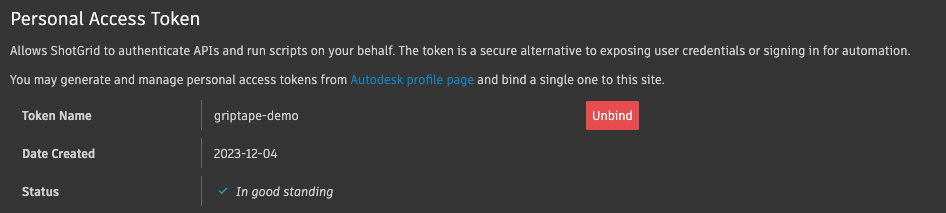

# User Authentication with ShotGrid

## Overview
We have our ShotGrid Tool that authenticates via API Key. However, there are times when it's more suitable to authenticate via Username/Password. In fact, *most* of the time you will work with the ShotGrid API, you'll want to do so as a user, since it simulates the user interacting via the UI.

In this section, we'll add authentication via Username/Password - and provide an option for you to choose which method of authentication you'd like when you instantiate the class.

## Setting up User Authentication

Authenticating as a user for ShotGrid requires a specific step by your users. They need to create a **Personal Access Token** on their [Autodesk profile page](https://profile.autodesk.com/security){target="_blank"}, and then _bind_ that token to their ShotGrid account.

Once they do that, then they can authenticate via the ShotGrid API with their username and password.

Both Username/Password _and_ the Personal Access Token _must be set up_ in order for authentication to work.

Autodesk has documentation on this on their [website](https://help.autodesk.com/view/SGSUB/ENU/?guid=SG_Migration_mi_migration_account_mi_end_user_account_html){target="_blank"}, however, I'll go through the steps here.

!!! tip "Important"
    These are steps the _user_ must take. You are not able to do this for them - any user you have in your studio must set up their own Personal Access Token and bind it to their ShotGrid account.

### Create a Personal Access Token

In this step, you will create a **personal access token** (PAT) and copy the token code. You will then use this and assign it to your ShotGrid account.

1. Have the user log into their [Autodesk profile page](https://help.autodesk.com/view/SGSUB/ENU/?guid=SG_Migration_mi_migration_account_mi_end_user_account_html){target="_blank"}

2. Scroll down to **Personal Access tokens****

3. Choose **Generate**

4. For **Product scope** choose **ShotGrid**

5. For the **Token name** choose **griptape-demo**

6. Choose **Generate**

7. :fire: Important - **Copy** the code and save it somewhere safe. This code will only display once. You will take this code and assign it to your ShotGrid account in the next step.

8. Choose **Done**

    

You now have a **personal access token**.

### Add PAT to ShotGrid

1. Log into your ShotGrid site.

2. In your User Menu on the upper right of your screen, choose **[Account Settings](https://griptape-demo.shotgrid.autodesk.com/page/account_settings){target="_blank"}**.

3. Choose **Legacy Login and Personal Access Token** in the left-hand sidebar.

    

4. Under **Personal Access Token**, paste the token code that was generated in the previous step.

5. Choose **Bind**

6. Once the token has been bound, you'll see the token name, the date it was created, and the status.

    


### Confirm Legacy Login

It's also important that the user has a **Legacy Login** username and password. Those should be set (and listed above the **Personal Access Token**). If they aren't set, have the user set them as they'll need them to log in.

## Add Username/Password to `.env`

In production, you will most likely have a method for having a user log in to ShotGrid, either through the ShotGrid Toolkit, or some other method.

For the purposes of this course, we're going to use Environment Variables to store the username and password for simplicity's sake. Please replace this method with your own favorite method at a later date.

Open your `.env` file and add the `SHOTGRID_USER` and `SHOTGRID_PASSWORD`.

```bash title=".env" hl_lines="4 5"
OPENAI_API_KEY=OP3NAI4PI-K3Y-1234567890ABCDEFG
SHOTGRID_API_KEY=SGAPI-K3Y-0987654321ZYXWVUTS
SHOTGRID_URL=https://your-shotgrid-name.shotgrid.autodesk.com
SHOTGRID_USER=your_username@email
SHOTGRID_PASSWORD=supersecretpassword123
```

## Modify `tool.py` 

Next, we'll modify `shotgrid_tool/tool.py` to be able to accept the username and password. We'll also add another parameter `login_method` to determine if we're going to authenticate with an API key, or with a username.

### Add parameters

Add the following three parameters to the `ShotGridTool` class:

* user_login
* user_password
* login_method

The new class should look something similar to:

```python hl_lines="10-12 18-20"
# ...

@define
class ShotGridTool(BaseTool):
    """
    Parameters:
        base_url: Base URL for your your ShotGrid site
        script_name: The name for your script if login_method is "api_key"
        api_key: The script API key, given to you by ShotGrid if login_method is "api_key"
        user_login: The user login name if login_method is "user"
        user_password: The user password if login_method is "user"
        login_method: "api_key" or "user" - depending on the mode of login we want
    """

    base_url: str = field(default=str, kw_only=True)
    script_name: str = field(default=str, kw_only=True)
    api_key: str = field(default=str, kw_only=True)
    user_login: str = field(default=str, kw_only=True)
    user_password: str = field(default=str, kw_only=True)
    login_method: str = field(default="api_key", kw_only=True)

# ...

```

### Add options

Next, we'll add the two different methods of instantiating Shotgun - one where we use the api_key as we have been, and the other where we use the username/login.

In the `try:` section of the `get_session_token` method, let's add an if/then statement, and the resulting logic:
At this point, if you run the code, everything should still work the same as before, except you'll see a print statement saying that you're logging in with the API Key. We haven't changed our method of sending data to the Tool yet, and we've set the default `login_method` to be `api_key`.

Go ahead and give it a try to make sure you're still connecting correctly.

## Update `app.py`

In this step, we'll modify `app.py` to instantiate the `ShotGridTool` with the user method of logging in. 

### Get user/password env

First, we'll make sure to grab the username and password environment variables. Add the following two lines to `app.py`:

```python title="app.py" hl_lines="6-7"
# ...

SHOTGRID_URL = os.getenv("SHOTGRID_URL")
SHOTGRID_API_KEY = os.getenv("SHOTGRID_API_KEY")
SHOTGRID_SCRIPT = "Griptape API"
SHOTGRID_USER = os.getenv("SHOTGRID_USER")
SHOTGRID_PASSWORD = os.getenv("SHOTGRID_PASSWORD")

# ...
```

### Instantiate Tool

Now we'll add those options to the part of the code where we Instantiate the Tool. Find the part of the code where we call `ShotGridTool`, and add the login, password, and login_method. Let's set the login method to "user" so we can test it's working as expected.

```python title="app.py" hl_lines="8-10"
# ...

# Instantiate the tool
shotgrid_tool = ShotGridTool(
    base_url=SHOTGRID_URL,
    api_key=SHOTGRID_API_KEY,
    script_name=SHOTGRID_SCRIPT,
    user_login=SHOTGRID_USER,
    user_password=SHOTGRID_PASSWORD,
    login_method="user",
    off_prompt=False,
)

# ...

```

### Test

Go ahead and run the code - asking again if you are connected to ShotGrid. All working correctly, the answer will be yes, yes you are!


## Code Review

You completed an incredible amount of work in this section - updating your Tool to handle both user and API key login credentials. Well done! Let's take a look at the latest versions of `app.py`, `.env`, and `shotgrid_tool/tool.py`. Note, that we're only displaying files that have been modified in this section. 

### `app.py`

```python linenums="1" title="app.py" hl_lines="16-17 25-27"
from dotenv import load_dotenv
import os

from griptape.structures import Agent
from griptape.utils import Chat
from griptape.tools import DateTime

from reverse_string_tool import ReverseStringTool
from shotgrid_tool import ShotGridTool

load_dotenv()

SHOTGRID_URL = os.getenv("SHOTGRID_URL")
SHOTGRID_API_KEY = os.getenv("SHOTGRID_API_KEY")
SHOTGRID_SCRIPT = "Griptape API"
SHOTGRID_USER = os.getenv("SHOTGRID_USER")
SHOTGRID_PASSWORD = os.getenv("SHOTGRID_PASSWORD")


# Instantiate the tool
shotgrid_tool = ShotGridTool(
    base_url=SHOTGRID_URL,
    api_key=SHOTGRID_API_KEY,
    script_name=SHOTGRID_SCRIPT,
    user_login=SHOTGRID_USER,
    user_password=SHOTGRID_PASSWORD,
    login_method="user",
    off_prompt=False,
)

# Instantiate the agent
agent = Agent(
    tools=[
        DateTime(off_prompt=False),
        shotgrid_tool,
        # ReverseStringTool(off_prompt=False),
    ],
    stream=True
)

# Start chatting
Chat(agent).start()

```

### `.env`

```bash title=".env" hl_lines="4 5"
OPENAI_API_KEY=OP3NAI4PI-K3Y-1234567890ABCDEFG
SHOTGRID_API_KEY=SGAPI-K3Y-0987654321ZYXWVUTS
SHOTGRID_URL=https://your-shotgrid-name.shotgrid.autodesk.com
SHOTGRID_USER=your_username@email
SHOTGRID_PASSWORD=supersecretpassword123
```

### `shotgrid_tool/tool.py`

```python linenums="1" title="shotgrid_tool/tool.py" hl_lines="16-18 25-27 38-52"
from __future__ import annotations
from griptape.artifacts import TextArtifact, ErrorArtifact
from griptape.tools import BaseTool
from griptape.utils.decorators import activity
from schema import Schema, Literal
from attr import define, field


@define
class ShotGridTool(BaseTool):
    """
    Parameters:
        base_url: Base URL for your your ShotGrid site
        script_name: The name for your script
        api_key: The script API key, given to you by ShotGrid
        user_login: The user login name if login_method is "user"
        user_password: The user password if login_method is "user"
        login_method: "api_key" or "user" - depending on the mode of login we want

    """

    base_url: str = field(default=str, kw_only=True)
    script_name: str = field(default=str, kw_only=True)
    api_key: str = field(default=str, kw_only=True)
    user_login: str = field(default=str, kw_only=True)
    user_password: str = field(default=str, kw_only=True)
    login_method: str = field(default="api_key", kw_only=True)

    @activity(
        config={
            "description": "Can be used to get the active session token from ShotGrid",
        }
    )
    def get_session_token(self, _: dict) -> TextArtifact | ErrorArtifact:
        import shotgun_api3

        try:
            if self.login_method == "api_key":
                print ('Logging in with API Key')
                sg = shotgun_api3.Shotgun(
                    self.base_url,  # ShotGrid url
                    script_name=self.script_name,  # Name of the ShotGrid script
                    api_key=self.api_key,  # ShotGrid API key
                )

            else:
                print ('Logging in as a User')
                sg = shotgun_api3.Shotgun(
                    self.base_url,  # ShotGrid url
                    login=self.user_login,  # User login
                    password=self.user_password,  # User password
                )

            return TextArtifact(
                sg.get_session_token()
            )  # Return the results of the connection

        except Exception as e:
            return ErrorArtifact(str(e))

```

---
## Next Steps
You are making fantastic progress. Connecting to the ShotGrid API is exciting - but what would be _really_ exciting would be to be able to start creating assets and manipulating data in ShotGrid. That's what we'll do in the [next section](07_method.md) - set up our first method to start working with actual data.
