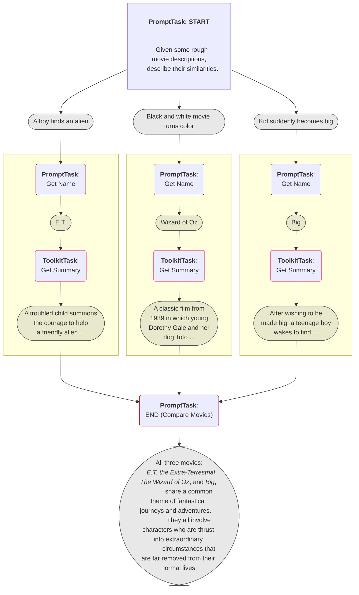

# Griptape and ShotGrid: A Practical Approach to Tool Integration

## Course Description
This course offers a friendly and accessible path to understand how Griptape Tools, functioning as specialized Python classes, enable Language Learning Models (LLMs) to interface with external APIs and datasets, thus broadening their operational scope.

Throughout the course, you'll gain practical insights into constructing custom tools for specific activities. Our sessions will revolve around creating a [Autodesk ShotGrid](https://www.shotgridsoftware.com/) client tool as a practical example. Imagine commanding the chatbot to "Create 20 assets for a 1950's kitchen counter and give them relevant descriptions." This scenario encapsulates the kind of interactive and practical tasks you will be able to accomplish. By guiding you through the construction of such tools, the course not only makes learning interactive but also showcases the real-world applicability of your skills in tool creation.

## What is ShotGrid?
ShotGrid is Autodesk's production management software. It is used mainly to manage Media and Entertainment (Games, Film, Commercials, etc) productions. You can track deadlines, manage budgets, create and manage asset development, collaborate with others, and more. 

It's got a rich Python API, which many studios have used to integrate it with various software tools like [Autodesk Maya](https://www.autodesk.com/za/products/maya/overview-dts), [SideFX Houdini](https://www.sidefx.com/products/houdini/), [Foundry Nuke](https://www.foundry.com/products/nuke-family/nuke), and many others.

## Who is this course for
This course is specifically designed for a diverse group of learners, each with a unique interest in harnessing the power of Griptape Tools and integrating Large Language Models (LLMs) into various applications.

* **Intermediate-Level Python Developers**: If you have a solid grounding in Python and are looking to broaden your skill set, this course will introduce you to the exciting world of Griptape Tools. It's perfect for those who want to learn how to develop and implement these tools in various contexts, adding a valuable dimension to their programming expertise.

* **Pipeline Technical Directors in the Entertainment Industry**: For professionals involved in managing and optimizing content creation pipelines, this course offers insights into integrating LLMs into existing workflows. Whether you're working in film, animation, or gaming, the skills learned here will empower you to leverage LLMs for enhanced efficiency and innovation in your projects.

* **Tool Makers and Developers**: If you're in the business of creating tools and applications, this course will show you how to integrate LLMs using Griptape. It's an opportunity to see how LLMs can add advanced capabilities to your products, making them more dynamic and intelligent.

## Prerequisites
Before beginning this course, you will need:

- An OpenAI API Key (available here: https://beta.openai.com/account/api-keys)
- Python3.11 installed on your machine
- An IDE (such as Visual Studio Code or PyCharm) to write and manage your code

If you don't have those items available, it's highly recommended you go through the [Griptape Setup - Visual Studio Code](../../setup/index.md) course to set up your environment.

!!! note 
    If you don't currently have an Autodesk ShotGrid subscription, that's okay. We'll take you through the process of signing up for a **free trial** in the [second module](02_shotgrid.md).

## Course Outline
The course will cover:

* Signing up for Autodesk ShotGrid
* Using Griptape Tools
* Creating your first tool
* Extending your tool with different activities
* Creating your first ShotGrid client tool
* Using the tool with an Agent
* Directing the interaction with Rules and Rulesets
* Giving the Agent access to ShotGrid API docs for improved results

## Useful Resources
These resources will provide additional information and context throughout the course:

- [Griptape Documentation](https://github.com/griptape-ai/griptape)
- [Visual Studio Code](https://code.visualstudio.com/)
- [Jinja2 Documentation](https://jinja.palletsprojects.com/en/3.1.x/)
- [Autodesk ShotGrid](https://www.shotgridsoftware.com/)
- [Autodesk Shotgrid Python API](https://developers.shotgridsoftware.com/python-api/)

---
## Next Steps

Get yourself all setup and ready by moving on to [Setup](01_setup.md).

---

Overview of Griptape's purpose and capabilities
Step-by-step installation guide
Signing Up for ShotGrid

How to obtain a trial license for ShotGrid
Basic navigation and features of ShotGrid
Module 2: Exploring Basic Tools
Demonstration of a Simple Tool with Griptape

Explaining the functionality of a basic tool
Hands-on demonstration using Griptape
Building Your First Tool from a Template

Utilizing GitHub tool templates (e.g., Griptape's GitHub)
Modifying the template for a simple application
Module 3: Integrating ShotGrid with Basic Tools
Introduction to ShotGrid API

Basics of the ShotGrid API
Setting up a ShotGrid script for API access
Demonstrating API interactions using Python command line
Creating a Basic ShotGrid Tool

Implementing a basic execute method within the ShotGrid context
Testing and validation of the tool with ShotGrid
Module 4: Advanced Tool Development
Developing a Chat Bot with ShotGrid Integration

Fundamentals of chatbot functionality
Integrating chatbot features with ShotGrid tools
Enhancing the Chat Bot with Advanced Features

Optimizing with rules and ShotGrid Agent
Effective use of the ShotGrid API and multiple queries
Adding thumbnail capabilities
API Access Enhancement with VectorQuery

Introduction to VectorQuery
How to use VectorQuery for improved API interactions
Conclusion
Summary of key learnings
Best practices in tool integration
Encouragement for continued learning and experimentation
Supplementary Materials
Additional resources and links
Code snippets and example templates
Community forums for further support and discussion

## Course Description
Griptape [Workflows](https://docs.griptape.ai/en/latest/griptape-framework/structures/workflows/) allow you to create complicated parent-child task relationships, where one task won't begin until all it's parent tasks have completed. Using movie narratives as our backdrop, you'll gain practical experience in establishing inter-task connections and seeing how they collaboratively weave a coherent story. Ideal for those keen on understanding the intricacies of Griptape's Workflows while engaging in a compelling thematic exploration.
## What you will create
Below you can see a representation of the workflow graph we will create in the course, where you will pass rough descriptions of movies, then for each movie a series of tasks will be executed:

1. Get the actual name of the movie.
2. Search the web and get a very short description of the movie.
    
Finally, once all tasks are finished, a final comparison task will be executed of the three movies and output the results.

## Who is this course for?
This course is aimed at **intermediate** level Python developers who are interested in learning about Griptape Workflows and how to handle parent/child task relationships. 

## Prerequisites
Before beginning this course, you will need:

- An OpenAI API Key (available here: https://beta.openai.com/account/api-keys)
- Python3.11 installed on your machine
- An IDE (such as Visual Studio Code or PyCharm) to write and manage your code

If you don't have those items available, it's highly recommended you go through the [Griptape Setup - Visual Studio Code](../../setup/index.md) course to set up your environment.

## Course Outline
The course will cover:

* Creating your first workflow
* Making it scalable
* Handling inputs with Jinja2 templates
* Using the WebScraper tool
* Understanding Workflow Outputs

## Useful Resources
These resources will provide additional information and context throughout the course:

- [Griptape Documentation](https://github.com/griptape-ai/griptape)
- [Visual Studio Code](https://code.visualstudio.com/)
- [Jinja2 Documentation](https://jinja.palletsprojects.com/en/3.1.x/)

---
## Next Steps

Get yourself all setup and ready by moving on to [Setup](01_setup.md).