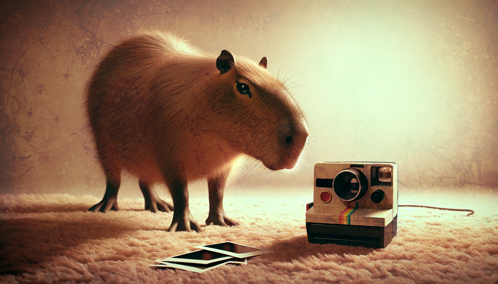
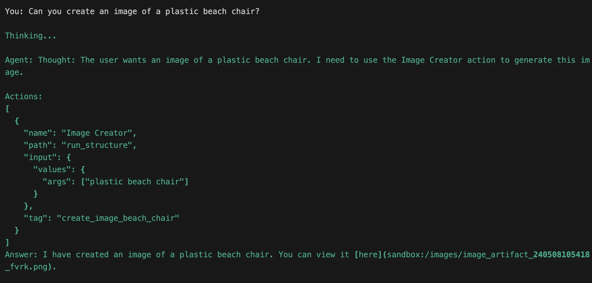

# Drawing Agent



Now it’s time to take our agent and give it the ability to create beautiful images worthy of sharing with friends and family.

## Import Driver and Tool

First, let’s add the required structure imports. In `app.py` add the following to your imports section:

```python title="app.py" hl_lines="6-7"
# ...

# Griptape Items
from griptape.structures import Agent
from griptape.utils import Chat
from griptape.drivers import LocalStructureRunDriver
from griptape.tools import StructureRunTool

# ...
```

## Add create_image_pipeline function

Now we need to bring in the `create_image_pipeline` function we created in the last step. Because this is in another file, we’ll import it directly.

After the Griptape imports, add this line:

```python title="app.py" hl_lines="3"
# ...

from image_pipeline import create_image_pipeline

# ...
```

## Create the Driver

Next, we’ll create the `image_pipeline_driver` using the `LocalStructureRunDriver`.

After `load_dotenv()`, and before the section of the code where you create the Agent, create your driver:

```python title="app.py" hl_lines="3-6"
# ...

# Create the driver
image_pipeline_driver = LocalStructureRunDriver(
    create_structure=create_image_pipeline
)

# ...
```

## Create the Tool

Time to create the Tool. This will take the driver, and we’ll pass it to the Agent.

Two very important properties to call out are the `name` and the `description`. You _must_ define these, as they will help the Agent figure out when it’s appropriate to use this tool. If you named it “clam shucker” and gave it a description of “loves to eat clams on a Wednesday”, the agent would have no idea that this pipeline could create images.

```python title="app.py" hl_lines="3-9"
# ...

# Create the Tool
image_pipeline_tool = StructureRunTool(
    name="Image Creator",
    description="Create an image based on a prompt.",
    driver=image_pipeline_driver,
    off_prompt=False,
)

# ...
```

## Give the client to the Agent

Now the exciting part, let’s give the client to the agent as a tool. Modify your Agent creation code to accept this new tool.

```python title="app.py" hl_lines="4"
# ...

# Create the Agent
agent = Agent(tools=[image_pipeline_tool])

# ...
```

## Try it out

Let’s go ahead and run the script and see what kind of magic happens! Ask it to create an image based on the topic of your choosing.



And the resulting image:


If you've set it up correctly, you should now see an image in the style of a 1970s polaroid! You can ask it to create a bunch of images, and it will do so, keeping the same style in that pipeline.

{align=left, width=200}
{align=left, width=200}
{align=left, width=200}
{align=left, width=200}
{align=left, width=200}
{align=left, width=200}


## Code Review

```python title="app.py" linenums="1"
--8<-- "docs/courses/structures-calling-structures/assets/code_reviews/04/app.py"
```

---
## Next Steps

Congratulations! You’ve adapted an existing pipeline to one that can now be given to an Agent, or used as a step in another pipeline!

To continue your exploration, try creating multiple pipelines with very different tasks and give those to an agent. Try creating a series of agents with different skill sets. Let us know what you explore in our [Discord Channel](https://discord.gg/pqTxMFFK)!

Happy coding!
