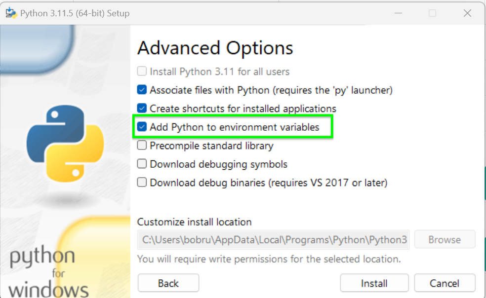
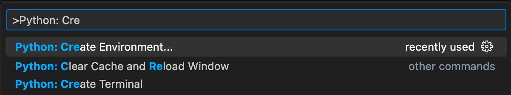
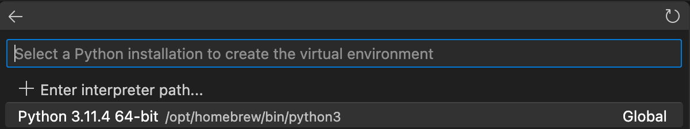

## Overview

Setting up our development environment correctly is vital for smooth and successful coding. In this stage, we'll go through all the necessary installations and configurations.
<!-- 
Temporarily disable video

<iframe src="https://www.youtube.com/embed/saFi2Hztb4o" title="YouTube video player" frameborder="0" allow="accelerometer; autoplay; clipboard-write; encrypted-media; gyroscope; picture-in-picture; web-share" allowfullscreen></iframe>
-->
## Installing Python 

{ align=right } Before getting started with Griptape, you'll need to install Python. We currently recommend a Python version *greater* than 3.9.

### Windows or Linux

1. Head over to the [official Python downloads page](https://www.python.org/downloads/){target="_blank"}
2. Click on the button that says "Python 3.12.x" (or the most recent 3.12 version) to download the installer
3. Run the installer, and make sure to check the box that says "Add Python to environment variables" before you click "Install"

   

### macOS

If you have [Homebrew](https://brew.sh){target="_blank"} installed:

1. Open your terminal
2. Run the command `brew install python@3.12`
3. After the installation is complete, run `brew link python@3.12`

!!! info

    If you don't have Homebrew, you can install Python from the official website as mentioned above.

!!! success "You did it!"
    Congratulations, you've got Python!

## Visual Studio Code

### Installing

Visual Studio Code (VS Code) provides the perfect environment for our Python coding.

1. Go to the [VS Code download page](https://code.visualstudio.com/Download){target="_blank"}
2. Download the version appropriate for your OS (Windows, Linux, or macOS)
3. Run the installer and follow the prompts

!!! success
    VS Code is now installed!

### Creating the Project Folder

Before we dive into coding, let's create a dedicated space for our project. Having a clean organized directory structure makes coding and managing your projects much easier.

First, you'll want to create a new folder on your computer where all the code for this project will live. You can create this folder anywhere you like. Here's how you can do it via your **Terminal**:

```bash
mkdir griptape-starter
cd griptape-starter
```

This creates a new folder called "griptape-starter" and moves into it.

Alternatively, feel free to open up **Visual Studio Code** and create a new folder:

1. Choose **File -> Open Folder..**
1. Choose **New Folder**
1. Enter the name of your new folder. Example: `griptape-starter`
1. Choose **Create**
1. Double-click on the newly created folder to open it.

## Python

### Installing VS Code Python Extension

The [Python extension](https://marketplace.visualstudio.com/items?itemName=ms-python.python){target="_blank"} for Visual Studio Code provides rich support for the Python language, including features like IntelliSense, linting, debugging, code formatting, and more. It really makes life easier for Python developers.

1. With VS Code open, go to the Extensions tab, or choose **View --> Extensions**
2. Search for `Python`, or go to [Python](https://marketplace.visualstudio.com/items?itemName=ms-python.python){target="_blank"} in your web browser.
3. Choose `Install`.
4. Open the command Palette (`Ctrl`+`Shift`+`P` on Windows/Linux, `Cmd`+`Shift`+`P` on macOS), or choose **View --> Command Palette..**
5. Type `Python` and you should see a list of specific commands for Python. This will confirm that the install was successful.

   

## Virtual Environments

### Using VS Code's Python Environment Manager

Python virtual environments are essential tools for keeping your projects organized and isolated. They allow each project to have its own set of dependencies, ensuring that different projects won't interfere with each other, which is vital when different projects require different versions of the same library. By using virtual environments, you can maintain a clean, conflict-free workspace for each project, making it easier to manage your code and troubleshoot any issues.

Many developers use their **terminal** to manage their Python virtual environments. As this is a beginner level course, we'll use an Extension inside VS Code instead because it makes this a little bit easier.

1. With VS Code open, go to the Extensions tab, or choose **View --> Extensions**
2. Search for `Python Environment Manager`, or go to [Python Environment Manager](https://marketplace.visualstudio.com/items?itemName=donjayamanne.python-environment-manager){target="_blank"} in your web browser.
3. Choose `Install`.
4. Open the Command Palette (`Ctrl`+`Shift`+`P` on Windows/Linux, `Cmd`+`Shift`+`P` on macOS), or choose **View --> Command Palette..**
5. Search for `Python: Create Environment` and you should see it come up at the top of the command list.
   

6. Hit **return** with that item selected and choose `.Venv: Creates a '.venv' virtual environment in the current workspace`

   

7. Then choose a python version.

   

   > Note: This will create the virtual environment for you within the current directory.

   - This creates a new virtual environment in a folder called `.venv` and activates the environment for you.

Now you've set up your Python environment for this project. This way, anything you install or change in Python won't affect other projects.

### Confirm it's working

To be sure that your virtual environment is set up correctly, we'll check by opening a Terminal. If everything is set correctly, you'll see `.venv` in your terminal prompt.

1. Open the terminal in VS Code by clicking on `Terminal -> New Terminal`


!!! note
    You should see `.venv` in your prompt. If you don't see it, please run through the previous documentation to try again, or check out the [TroubleShooting](#execution-policy) section of this tutorial.

## Troubleshooting

### Execution Policy

On some Windows systems, you may get an error that says something similar to:

!!! failure
    .venv\Scripts\Activate.ps1 cannot be loaded because running scripts is disabled on this system.

This is due to an execution policy. Don't worry, it's pretty easy to resolve.

1. With the Terminal open, execute the following command:

   ```
   Set-ExecutionPolicy -Scope CurrentUser Unrestricted
   ```

   - This will give the current user the ability to run scripts from within Visual Studio Code.

2. Verify this worked by closing the Terminal and re-opening it. You should be able to execute scripts now without any errors.

!!! info
    You can learn more about Windows Execution Policies in the [Set-ExecutionPolicy documentation](https://learn.microsoft.com/en-us/powershell/module/microsoft.powershell.security/set-executionpolicy?view=powershell-7.3){target="_blank"}.

---

## Next Step

You now have Python and VS Code installed, and you've got a working virtual environment! In the [next section](02_openai.md), we'll set up your OpenAI API key so you can communicate with their large language model.
